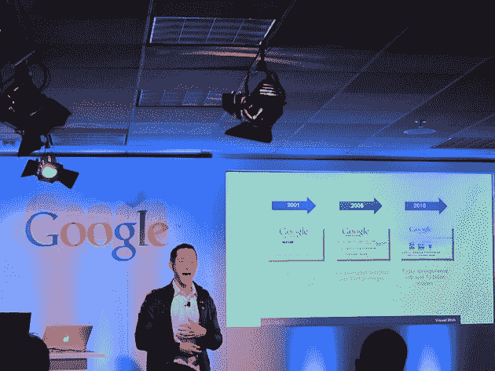
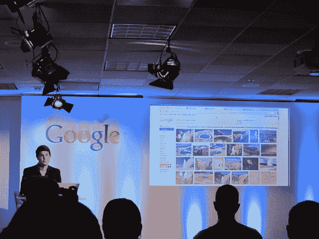
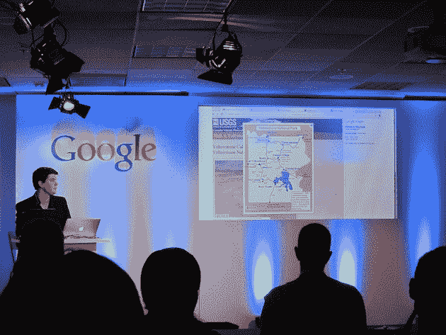

# 谷歌图片搜索:超过 100 亿张图片，每天 10 亿次页面浏览——第 38 页——TechCrunch

> 原文：<https://web.archive.org/web/https://techcrunch.com/2010/07/20/google-image-search/38/>

# 谷歌图片搜索:每天超过 100 亿张图片，10 亿次页面浏览

今天在旧金山举行的[谷歌搜索活动](https://web.archive.org/web/20200319213405/https://beta.techcrunch.com/2010/07/20/live-from-googles-image-search-event/)上，负责搜索产品和用户体验的副总裁[玛丽莎·梅耶尔](https://web.archive.org/web/20200319213405/http://www.crunchbase.com/person/marissa-mayer)宣布了谷歌图片的改版——该公司的图片搜索产品。梅耶尔说，这项服务每天为谷歌带来超过 10 亿的页面浏览量。

搜索产品总监[本玲](https://web.archive.org/web/20200319213405/http://www.crunchbase.com/person/ben-ling)随后上台展示了一些变化(这里[我们预告了](https://web.archive.org/web/20200319213405/https://beta.techcrunch.com/2010/07/20/google-images/))。首先，他给出了一些数据。当谷歌图片在 2001 年推出时，有 2.5 亿张图片被编入索引。到 2005 年，这个数字已经达到了 10 亿张。凌说，现在，在 2010 年，他们索引了超过 100 亿张图片。

人们使用谷歌图片搜索做各种事情，比如寻找产品。但凌表示，2010 年上升最快的图片搜索关键词是:海地、、、和阿凡达。

是的，贾斯汀比伯。不客气，互联网。

凌说，谷歌图片搜索拥有数亿用户。今天，谷歌正在对该产品进行自 2001 年推出以来最大规模的改造。

现在的主要重点是在单个(连续滚动的)页面上显示成百上千的图像。这些图像的缩略图更大。将鼠标悬停在它们上面会显示该图像的元数据。单击图像会将您带到图像所在的页面，但是图像被覆盖得非常大，页面在背景中变暗。现在全靠形象了。

谷歌表示，这种新的图片搜索将于今天开始向用户推出(目前约有 10%的用户已经开始使用)。推广将持续到本周。这款产品可以在“现代浏览器”上运行——这是谷歌对“所有 IE 6 浏览器”的可爱说法。

在今天的发布会上，谷歌还发布了一款新的谷歌图片搜索广告产品。

