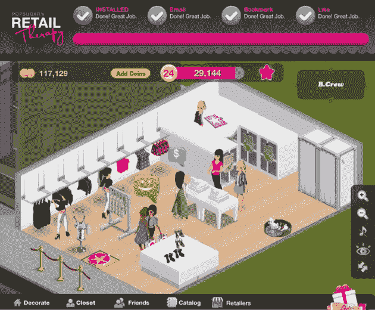

# PopSugar 推出零售疗法，一个购物狂的农场[视频]

> 原文：<https://web.archive.org/web/https://techcrunch.com/2010/07/20/popsugar-launches-retail-therapy-a-farmville-for-shopaholics-video/>

流行的以糖为中心的博客(PopSugar、[、FabSugar](https://web.archive.org/web/20221002225729/http://www.fabsugar.com/) 、 [BellaSugar](https://web.archive.org/web/20221002225729/http://www.bellasugar.com/) )背后的媒体公司 Sugar Inc. ，现在正通过推出 [PopSugar 的零售疗法](https://web.archive.org/web/20221002225729/http://www.playretailtherapy.com/)将其精心修剪的脚趾伸向虚拟游戏。顾名思义，这款脸书应用旨在成为购物的农场。

Sugar 的创始人兼首席执行官 Brian Sugar 说，经过上周的低调上线，该网站已经从 50 名用户增长到近 4000 名用户。

这与 Farmville 的数千万辛勤施肥的用户相去甚远，但 PopSugar 的零售疗法有潜力。该游戏拥有 Sugar 网络的力量和眼球(该联盟平均每月有 1600 万个 uniques ),零售疗法已经与几家知名时尚品牌建立了合作关系，包括 Diane Von Furstenberg、Gap、Barneys New York、Juicy Couture、Tory Burch 和 TopShop。

游戏的基本形式很简单。

每个用户拥有并管理一家精品店，并自下而上地建立商店。当用户注册时，她会收到 2500 美元的硬币(是的，总是她——在零售治疗的世界里，没有男性化身可用)。然后，她可以用这笔钱购买虚拟服装，设计带家具的精品店，并为商店采购库存。用户从虚拟商品目录中选择库存，这些虚拟商品实际上是现实生活的复制品，来自零售合作伙伴的当季产品(最终的产品植入)。

Sugar 说，这份清单将会经常更新，以反映任何真实世界的变化。

一旦用户取回并打开了库存，计算机生成的化身就会间歇地进入商店仔细阅读并购买商品。接受零售疗法的脸书朋友也可以去购物或注册成为你商店的销售代表(任何人都可以同时管理一家精品店和为朋友的商店工作)。每一次购买，你都可以赚取新的硬币，并进行各种活动(如订购存货、拆包等)。)，您还可以获得经验值，帮助您进入新的关卡。随着每一个新的水平-目前有超过 40 个-你解锁购买新产品。此外，如果你想获得额外的零售治疗硬币，你也可以选择通过脸书信用购买。

从根本上说，零售疗法与竞争对手脸书的游戏如[时尚世界](https://web.archive.org/web/20221002225729/http://www.facebook.com/apps/application.php?id=315888392043)和[购物世界](https://web.archive.org/web/20221002225729/http://www.facebook.com/MallWorldGame)没有根本的不同，但 PopSugar 的版本在虚拟和现实世界购物之间的桥梁方面做得最好。在游戏中，虚拟角色可以探索虚拟的 TopShop 和 Diane Von Furstenberg 商店，获得真实世界产品的附加信息，并找到实际购买的链接。

虽然脸书积分是一个明显的收入来源，但游戏的真正价值最终可能在于这些零售合作伙伴。根据这些合作关系的演变和网站的成功，主要供应商可能愿意签署利润丰厚的合同，以换取创造性的营销机会。

Sugar 表示，他目前专注于建立用户群，但他希望探索新的零售机会，比如在忠诚客户最喜欢的零售商那里提供折扣，或者进行特殊的内部样品销售。随着商业战略的有机发展，Sugar 表示，他肯定会通过交叉推广和围绕编辑内容创建特别活动，与 Sugar 的各种网站进行高度整合。例如，在奥斯卡报道期间，PopSugar 可能会在零售疗法上推广限量供应的红地毯商品。

尽管潜力巨大，但零售疗法仍面临巨大挑战。从目前的 4000 人开始，该网站需要达到数百万人才能在这个市场上占有一席之地。商城世界有 400 多万活跃用户，时尚世界有 200 多万。与 Zynga 或 IMVU 等其他虚拟世界游戏服务不同，Sugar 也在外国领域行走。该网络以创建有影响力的博客而不是病毒式的脸书游戏为业。Sugar 承认，他们必须扩大现有团队，增加游戏经理，为零售疗法建立足够的支持网络。

> “我们有一个非常棒的博客平台，成千上万的人在使用它，我们有……社区经理来帮助这些人……我们将不得不在这里快速地遵循这种模式，因为使用它的人们的采用率以及人们谈论他们所遇到的各种不同的问题。我们必须提供这种程度的支持。我想我们知道我们必须做，但我们不认为我们必须这么快，”Sugar 说。

**更新:**注册的 TechCrunch 读者可以通过这个[链接](https://web.archive.org/web/20221002225729/http://apps.facebook.com/retailtherapy?ref=techcrunch)额外获得 2500 美元的硬币。