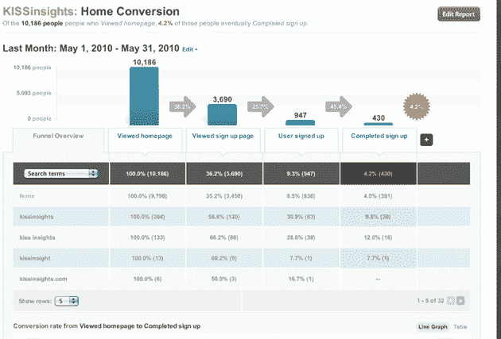

# KISSmetrics:一个转换漏斗工具，给你的网站一个记忆 TechCrunch

> 原文：<https://web.archive.org/web/http://techcrunch.com/2010/07/22/kissmetrics-conversion-funnel/>

 Analytics 是一个拥挤的空间，有大量的服务可以帮助你将你的访客转化为参与其中的付费客户。 [KissMetrics](https://web.archive.org/web/20230203040810/http://www.kissmetrics.com/) 是最新加入这一竞争的公司，它提供了一个既直接又强大的解决方案。当它走出秘密时，该公司也透露了它的资金来源:2008 年，它完成了由 True Ventures 牵头的 100 万美元的种子轮投资，2009 年年中，它完成了由 Polaris Ventures 牵头的 300 万美元的轮投资。该公司还获得了 SoftTechVC、Felicis Ventures 以及包括 Dave McClure、Mark Goines、Shervin Pishevar、Bobby Yazdani 和 Nils Johnson 在内的天使投资人的投资。

在这一点上，KissMetrics 是围绕一种类型的分析建立的:转换漏斗，它向您显示在您的注册流程中有多少用户正在流失(并有望帮助您找出原因)。你可以通过跟踪不同的变量来定制这些图表，但联合创始人 Hiten Shah 说，你不会找到令人眼花缭乱的其他选项。他说，目标是在扩展之前让这个关键工具很好地工作(尽管其他工具也会随之而来)。

大约两年前，KissMetrics 开始为脸书应用程序提供分析服务，但在注意到许多公司都在内部构建自己的分析工具后，它转向了更广泛的现有模式。这个故事听起来可能很熟悉:另一家分析公司 [Mixpanel](https://web.archive.org/web/20230203040810/http://www.mixpanel.com/) 的创始人从他们在 Slide 的时光中汲取了类似的灵感。

那么 KissMetrics 与 Mixpanel 和其他已经存在的分析服务有什么不同呢？Shah 说，其他服务通常跟踪点击和事件，但他们不跟踪用户。另一方面，KissMetrics 可以用来跟踪用户的活动，甚至在他们加入你的网站之前——它基本上为每个用户建立了一个匿名历史，然后在他们创建帐户后将该历史与他们的用户名相关联。例如，如果你访问了一个网站五次而没有转换，但第六次访问时*转换了*，网站的所有者可以使用 KissMetrics 来回顾前五次访问的历史，试图找出他们哪里出错了。

虽然这项技术有可能被用于跨网站广告之类的事情，Shah 说 KissMetricsonly 在每个网站的基础上创建这些用户历史(他解释说这将隐私问题最小化)。他说，在未来，KissMetrics 产品将朝着帮助优化营销和客户获取的方向发展。

这项服务在最初的三十天是免费的，然后根据你要跟踪的事件数量提供分层的每月定价计划。这些套餐起价为每月 149 美元，最高可达 699 美元，特别是大型网站的定制套餐。

KissMetrics 的顾问包括[埃里克·里斯](https://web.archive.org/web/20230203040810/http://www.crunchbase.com/person/eric-ries)、[肖恩·埃利斯](https://web.archive.org/web/20230203040810/http://www.linkedin.com/in/seanellis)、[杰夫·维恩](https://web.archive.org/web/20230203040810/http://www.crunchbase.com/person/jeffrey-veen))、[杰夫·哈默巴赫尔](https://web.archive.org/web/20230203040810/http://www.crunchbase.com/person/jeff-hammerbacher)和埃德·贝克(Friend.ly 的首席执行官)，他们中的许多人都有丰富的分析经验。

