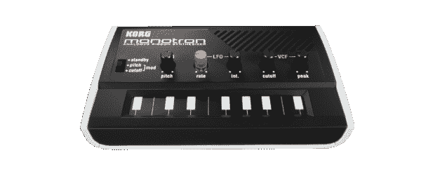

# 点评:Korg Monotron TechCrunch

> 原文：<https://web.archive.org/web/https://techcrunch.com/2010/07/23/review-korg-monotron/>

自从我有了 Monotron，它就成了我噪音和乐趣的终极来源。我能用它让人们在 6 秒钟内尖叫。它是合成器朋友的游戏机。让我们看看 59 美元的 Monotron 能做什么，不能做什么。

当我第一次看到 [Monotron](https://web.archive.org/web/20230121235607/http://www.korg.com/monotron) 时，我立刻意识到我必须为自己买一台。我认为这将是一个很好的补充我的装备。这款设备的构造非常好，而且非常轻，而旋钮和按钮给人的感觉并不廉价。总共有五个:VCO 音调、LFO 速率、LFO 强度、滤波器截止和滤波器峰值。此外，还有一个按钮，用于打开和关闭 Monotron，并选择您想要分配 LFO 的位置(音高或截止)。音量控制、输入/输出位于背面，扬声器位于右前侧。没有电源连接器 Monotron 由 2 节 AAA 电池供电。合成器拥有一个压控振荡器(VCO)、一个压控滤波器(VCF 来自传说中的 [Korg MS-10](https://web.archive.org/web/20230121235607/http://www.vintagesynth.com/korg/ms10.php) )和一个低频振荡器(LFO)。这可能看起来不多，但这种小动物的声音能力是巨大的。这是非常容易的(和有趣的)创造伟大的 synth 声音字面上的移动。这东西适合我的口袋，有一个扬声器；当我无聊的时候，我会插上耳塞，沉浸在音乐的乐趣中。LFO 会随着你设定的速度闪烁，这有利于你为自己创造图案，因为没有东西可以记录，你会立刻忘记。过滤器听起来就像它应该的那样神奇。

现在是坏消息。输出和输入为 1/8”立体声插孔。就基本的带装置兼容性而言，这不是好消息。所以，是的，你可以毫无困难地插入耳机，但为什么不包括一个 1/4 插孔呢？Korg 声称 Monotron 是“可修补的”。具体用什么？所有档位我都有 1/4 输出。这是一个不利于高级用户的糟糕举措。色带控制器很有趣，但它太小了，以至于敲击一个音符对我来说很麻烦——而且我的手指相对较小。没有 midi 输入/输出会使设备功能更差。这些小的缺失对我来说很重要。请包括一个 1/4 英寸的进出，midi 输出，自动琶音器和一个更大的丝带控制器，我付双倍的钱。Korg Monotron 是一款非常有趣的设备，对那些对它不感兴趣的人来说有着巨大的价值。零售价 59 美元，我肯定会买它。然而，由于所有缺失的功能，它将永远不会超过一个玩具。