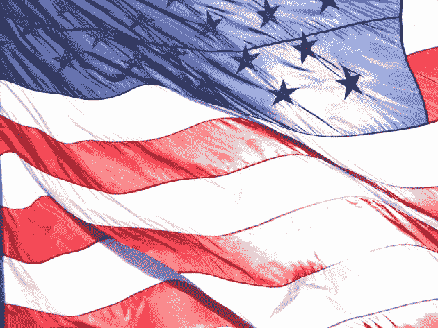

# 现在在美国是合法的:越狱你的 iPhone，为教育目的翻录 DVD TechCrunch

> 原文：<https://web.archive.org/web/https://techcrunch.com/2010/07/26/now-legal-in-the-u-s-jailbreaking-your-iphone-ripping-a-dvd-for-educational-purposes/>

# 现在在美国是合法的:越狱你的 iPhone，为教育目的翻录 DVD

 
[扬鞭](https://web.archive.org/web/20221210051611/http://www.flickr.com/photos/jcolman/441030585/)

根据 DMCA，为了获得用于教育目的或批评的合理使用镜头而越狱你的 iPhone 或绕过 DVD 的 CSS 不再是非法的。这些是美国版权局不久前公布的新规则。这真的很大。很大很大。

该办公室每三年审查一次版权法，以便进行修订或豁免。根据《DMCA 》,现在免于起诉的六个“类别”是:

1.为了在教育环境中短期、合理使用或批评的唯一目的，破解合法获得的 DVD 加密

2.允许你在手机上运行合法获得的软件的计算机程序，否则你将无法在你的 iPhone 上运行谷歌语音

3.允许你在另一个网络上使用手机的电脑程序，也就是越狱，在 T-Mobile 上使用你的 iPhone

4.出于合法的安全测试或调查的目的而规避视频游戏加密(DRM)

5.当加密狗过时或不再生产时，破解加密狗保护的计算机程序

6.让人们大声朗读电子书(即给盲人)，即使这本书内置了防止这种事情发生的控制措施。

这是我很久以来遇到的最大的科技新闻——我们在这里谈论了好几年。实际上我需要一些时间来消化这一切。