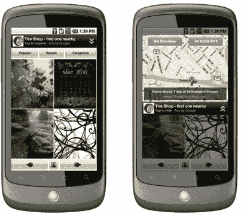

# 谷歌推出位置感知移动显示广告 TechCrunch

> 原文：<https://web.archive.org/web/https://techcrunch.com/2010/07/29/google-location-mobile-display-ads/?utm_source=feedburner&utm_medium=feed&utm_campaign=Feed%3A+Techcrunch+%28TechCrunch%29&utm_content=Google+Reader>

# 谷歌推出位置感知移动显示广告

谷歌的移动广告变得越来越有位置意识。今天，谷歌为 iPhone 和 Android 手机推出了可以定位地理位置的移动显示广告。广告客户将能够勾选“显示位置扩展”框，当在移动浏览器或应用程序中查看时，他们的广告将成为地理启用的。一个小的双箭头将打开广告，并显示该企业钉在地图上的两个大的蓝色按钮，以获得方向或致电该企业。谷歌将只对通话或点击收费。

谷歌已经为移动搜索提供了所谓的[“位置扩展”广告，但这是它第一次将这一概念扩展到移动显示广告。谷歌表示，提供位置的移动广告的点击率通常比普通的移动广告平均增加 8%，点击呼叫移动广告的点击量增加 6%。](https://web.archive.org/web/20221207181759/http://adwords.blogspot.com/2009/07/location-extensions-new-way-to-run.html)

诸如此类的移动广告可能会带来新的营销机会。在地图上看到一家企业会让它变得不那么抽象。它确实为消费者奠定了广告的基础。点击呼叫选项是关键。当地商人喜欢接到顾客的电话。当然，除了定位之外，谷歌还根据背景和设备[定位移动显示广告](https://web.archive.org/web/20221207181759/https://beta.techcrunch.com/2010/01/20/google-mobile-adwords-target-device/)[。](https://web.archive.org/web/20221207181759/https://beta.techcrunch.com/2009/06/24/googles-mobile-adsense-for-iphone-and-android-apps-now-in-public-beta/)