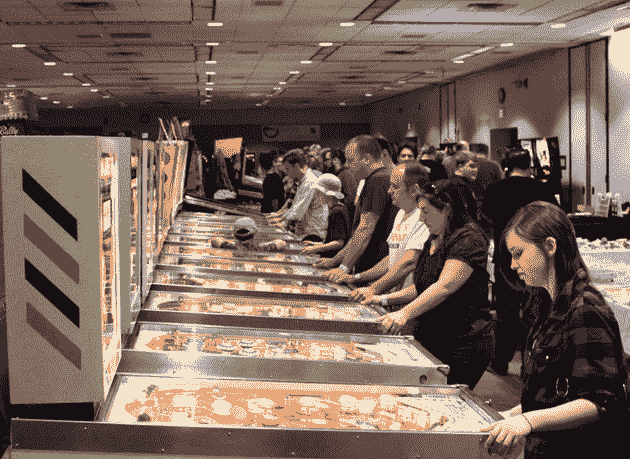

# 人们玩的新游戏:社交时代游戏机制如何变化

> 原文：<https://web.archive.org/web/https://techcrunch.com/2010/08/01/the-new-games-people-play-game-mechanics-in-the-age-of-social/>

游戏机制背后的症结是你完成了某件事的感觉；*“无论你点击的是一块土地还是一个音符，那都是一种成就”*说[社交游戏网络的](https://web.archive.org/web/20230304115416/http://sgn.com/)谢文·皮舍瓦。社交游戏让你有机会在你的社交图上分享这些目标，让很多人看到它们，也让你有机会合作完成这些成就。

在周五的[社交货币峰会](https://web.archive.org/web/20230304115416/https://techcrunch.com/2010/07/30/social-currency-crunchup-live/)上，来自社交游戏领域的领导者们，包括[皮什瓦尔](https://web.archive.org/web/20230304115416/http://www.crunchbase.com/person/shervin-pishevar)、迪士尼移动 SVP [巴特法令](https://web.archive.org/web/20230304115416/http://www.crunchbase.com/person/bart-decrem)、斯坦福商学院教授[詹妮弗·阿克](https://web.archive.org/web/20230304115416/http://www.crunchbase.com/person/jennifer-aaker)和 SCVNGR 首席执行官[塞斯·普里巴茨](https://web.archive.org/web/20230304115416/http://www.crunchbase.com/person/seth-priebatsch)坐在一起，讨论游戏的最新化身。

**上瘾游戏需要哪些要素？**

巴甫洛夫力学至关重要。作为一个用户，重要的是要感觉到你花的时间有了结果，社交元素像是能够看到你和其他人一起做了什么，并且能够和其他人一起玩。与音乐的融合也创造了一种情感联系，T21 成功的一个原因是将贾斯汀比伯等艺术家的多首歌曲应用于 Lady Gaga 的功能。

Decrem 阐述道，*“有一门真正的科学围绕着如何吸引用户并使其货币化，例如[Farmville harvest mechanic](https://web.archive.org/web/20230304115416/http://hottub.hotstudio.com/2010/07/game-mechanics-in-farmville-and-foursquare/)。在手机上，它的“x 因素”游戏有魔力吗？”我们现在看到的是，当社交游戏中的游戏机制科学与你在 iPhone 平台上看到的古怪事物相结合时会发生什么。*

根据 Seth Priebatsch 的说法，SCVNGR 的新员工会记住一套 50 个游戏动态，如 progression dynamic，或赚取点数以取得进展。然后他们可以将这些元素融入到游戏中，“人类喜欢进度条，如果你看到进度条，你就会想完成它。”

**游戏将如何与现实世界越来越方？**

目前，所有的价值创造大多发生在脸书，但这种情况很快就会改变。小组成员一致认为，最近社交和移动的整合是一个新计算平台的开端，这主要归功于 iOS 引入的功能。为了生存，这个新平台上的黑仔应用程序将需要结合社交元素和娱乐元素。

根据 Pishevar 的说法，SGN 正在做一些事情，你可以把手机放在现实世界中，看到 3D 人物在街上行走，游戏中你在自己的实际院子里有一个花园，你实际上正在照料它，它正在生长，你可以在 iPhone 上看到它。”

Decrem 阐述了*“对我来说，在 iPhone 上玩 Tapulous 和早上用我的星巴克卡，想要得到 15 颗星，这样我就可以得到一杯免费咖啡，这没有什么区别…”*

现实生活中对在线行为的奖励是一股不可忽视的力量，随着开发人员不断体验成功，这种奖励将变得越来越普遍。例如 Yelp，当他们加入了签到元素后，他们的使用率直线上升。*“你用的是实体卡，而不是手机。我们没有发明任何新东西。”*

Priebatsch 说*“我们给游戏框架带来了一个非常新的东西，开放图形 API。社交流量在于联系，游戏流量在于影响力。通过将其应用于现实世界，我们正在建立一个交易动机和回报的平台。”*

**这些游戏机制在未来可以以什么新的方式应用？**

*“我们在移动方面真的处于第一或第二局，*”皮什瓦尔说，*“即将到来的创造力和乐趣的水平令人难以置信。”*

企业是否应该急于应用社会力学？*“这只是自然进化，”*DeCrem 说。开发产品的企业应该问自己，如果你能和你的朋友联系上呢？我们让它变得有趣怎么样？

Piveshar 的一个批评是，游戏行业可以做得更多。“由于社交网络，许多人为了赚钱而偷工减料；我们已经超高速增长了。成千上万的人已经被创造出来，是时候回馈社会了。”

Acker 提出了游戏治愈癌症的想法，作为社交游戏实际上可以造福社会的一种方式，他提到了 HopeLab 的[Re Mission](https://web.archive.org/web/20230304115416/http://www.re-mission.net/)和 [Zamzee](https://web.archive.org/web/20230304115416/http://blog.hopelab.org/2010/05/13/introducing-zamzee/) ，*“不管你给孩子看多少小册子，他都不会想去做化疗。但当你建立一个名为 Roxy 的化身，让她射击癌细胞，然后当她感到虚弱时，你就给她做化疗……这是令人难以置信的强大。”*

游戏元素产生强大的情感；化疗可以成为一件积极的事情，癌症成为你可以战胜的东西。这是非常可怕的。

图片:[Flickr/Allaboutchase](https://web.archive.org/web/20230304115416/http://www.flickr.com/photos/allaboutchase/4710553567/sizes/l/)