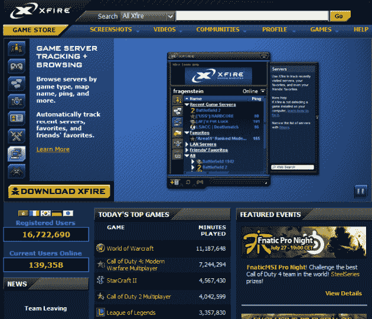

# 独家报道:泰坦游戏将 Xfire 从 Viacom 手中夺走

> 原文：<https://web.archive.org/web/https://techcrunch.com/2010/08/02/exclusive-titan-gaming-takes-xfire-off-viacoms-hands/>

# 独家:泰坦游戏从维亚康姆手中接过 Xfire

在 2006 年被维亚康姆以[1 . 02 亿美元](https://web.archive.org/web/20230306115429/http://www.xfire.com/cms/xf_acquisition/)收购的游戏玩家社交网络 Xfire 有了新主人。买家是 [Titan Gaming](https://web.archive.org/web/20230306115429/http://www.crunchbase.com/company/titan-gaming) ，一家小公司，到目前为止只筹集了[100 万美元的天使投资](https://web.archive.org/web/20230306115429/https://techcrunch.com/2010/05/18/titan-gaming-platform/)，所以我们在这里做一个有根据的猜测，并假设与几年前维亚康姆支付的价格相比，它是以一首歌的价格出售的。

在 Xfire 网站最近发布的一条消息中(通过 [Kotaku](https://web.archive.org/web/20230306115429/http://kotaku.com/5602816/xfire-sold-off-development-team-leaving?skyline=true&s=i) )，看起来大多数开发团队都没有留下来:

> 2010 年 8 月 2 日——Xfire 被另一家公司收购。过去 6 年里给你带来 Xfire 的大部分团队成员都离开了，包括我。我们已经享受了我们的时间，我个人很难过，我只能做 127 释放。再见，游戏开始！

这条消息来自一个名叫“克里斯”的人——很可能是[克里斯·科尔姆塞](https://web.archive.org/web/20230306115429/http://www.crunchbase.com/person/chris-kirmse)，Xfire 创始人兼工程副总裁。在 2003 年创建 Xfire 之前，Krimse 曾经是 Yahoo Games 的高级工程师。

Xfire 是一项免费的服务，它让玩家能够与其他玩家互动，同时还提供了一个工具，可以自动跟踪玩家在何时何地在线玩电脑游戏。无论游戏类型、服务器浏览器或游戏服务如何，它都能正常工作。

因此，这项服务不再需要运行多个程序，如 IRC、即时信使或游戏中的好友列表，来跟踪玩家的朋友在何时何地玩游戏。它结合了即时消息、服务器浏览器、点对点文件下载、游戏内消息、屏幕截图和视频捕捉以及活跃的游戏社区。

这项服务迄今已吸引了约 1600 万用户。

我们刚刚与 Titan Gaming 首席执行官 John Maffei 确认他们已经收购了 Xfire——交易是在几个小时前签署的——但是还不能确定确切的收购价格。以下是泰坦的一份简短声明:

> 泰坦游戏已经购买了 Xfire。购买条款没有披露。泰坦将会使用 Xfire 的名字。Xfire 服务将继续不间断地为用户服务。Xfire 重新定义了游戏玩家的交流方式，Titan 打算在这一传统的基础上，利用 Xfire 平台帮助游戏公司更好地参与游戏并从中获利。

Maffei 补充说，Titan Gaming 保留了几名开发人员的关键成员，这听起来比 Xfire 网站上的声明(该声明称大部分团队成员正在离开公司)要积极得多。

去年五月，泰坦游戏公司宣布，它已经从一系列著名的天使投资者那里筹集了[100 万美元的资金](https://web.archive.org/web/20230306115429/http://www.crunchbase.com/company/titan-gaming)。

你可以在这家初创公司的 CrunchBase 档案中找到投资者的完整名单，但其中包括像[clear stone Venture Partners](https://web.archive.org/web/20230306115429/http://www.crunchbase.com/financial-organization/clearstone-venture-partners)负责人[威廉·奎格利](https://web.archive.org/web/20230306115429/http://www.crunchbase.com/person/william-quigley)和[吉姆·阿姆斯特朗](https://web.archive.org/web/20230306115429/http://www.crunchbase.com/person/jim-armstrong)，PriceGrabber 联合创始人[卡姆兰·普尔赞贾尼](https://web.archive.org/web/20230306115429/http://www.crunchbase.com/person/kamran-pourzanjani)和 MP3.com 创始人[迈克尔·罗伯森](https://web.archive.org/web/20230306115429/http://www.crunchbase.com/person/michael-robertson)这样的人。

