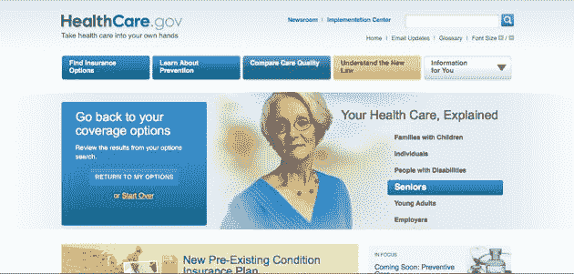
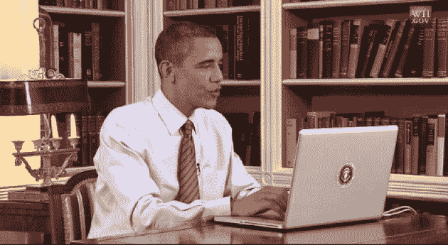

# Healthcare.gov 背后:华盛顿如何从硅谷汲取灵感

> 原文：<https://web.archive.org/web/https://techcrunch.com/2010/08/06/healthcare-obama-entrepreneurs-twitter/>

“我们每周 7 天、每天 24 小时都在工作，工作周期非常快，最后期限和里程碑非常短。我们以一种非常、非常灵活的超级消费者为中心的方式工作……所有这些都融合在披萨、激浪和通宵达旦的漩涡中，你知道理想主义。”

这听起来可能像典型的硅谷企业家因咖啡因刺激而失眠的咆哮。但事实并非如此——试试托德·帕克吧，他是美国卫生与公众服务部(HHS)的首席技术官。

他正在谈论他的最新项目，[Healthcare.gov](https://web.archive.org/web/20221006021232/http://www.healthcare.gov/)，这是一个消费者友好的网站，帮助用户查找和比较私人和公共保险选项，并了解新的医疗改革法。根据 Park 的说法，它是公共和私人保险信息的最大在线存储库。(见上面视频。)

正如奥巴马总统在[视频](https://web.archive.org/web/20221006021232/http://www.whitehouse.gov/blog/2010/07/28/not-your-ordinary-website-demo)中演示的那样(见下面的视频)，消费者可以使用网站的搜索器，通过回答一些关于他们的位置和身份的基本问题(如年龄范围、需求等)来获得定制的保险选项。).今年秋天晚些时候，该网站还将包括定价信息，以帮助用户比较计划的成本。

虽然 Healthcare.gov 肯定不是第一个由政府牵头的全面在线倡议，但它确实反映了本届政府对在线参与的认真承诺，以及他们对硅谷的关注。

白宫新媒体主管 Macon Phillips 称这个网站为医疗保险的 Expedia，他说他们借鉴了其他网络公司的想法来开发这个网站:

“它看起来不像普通的(政府)网站，因为我认为那些特别是在奥巴马政府时期出现的网站，但甚至在最近，都在关注私营部门——关注互联网上其他任何地方发生的事情。”

除了那个大胖子”。Gov”域名，Healthcare.gov 的美学看起来更像一个年轻的初创公司，而不是患者保护与平价医疗法案的某个条款。它干净、简单的用户界面在顶部有一排大按钮，指引用户“寻找保险选项”或“了解新法律”考虑到我们的医疗保健系统是多么错综复杂，Healthcare.gov 设法将信息组织在逻辑桶中，并将关键概念推到前台。这里看一下 Healthcare.gov 的主页，作为比较，HHS 的网站(它有更多的标准。gov 网站手感)。

如果 Healthcare.gov 看起来是一个受欢迎的、新鲜的视角，政府应该感谢 Twitter。白宫和 HHS 不仅从硅谷汲取灵感，他们也在寻找人才。

今年早些时候，在法案通过之前，Macon Phillips 在 Twitter 上偶然发现了 Edward Mullen(T4)，他发布了一个关于备受争议的保险交易市场的模拟网页设计。这里的教训是:下一次你在 Twitter 上随便发些东西，政府可能会看到你手里拿着一份工作邀请。

> “新泽西州泽西城有一位设计师，我联系了他，因为他在推特上发布了他认为交易所会是什么样子的设计……因为他认为向公众展示这是一个视觉化的东西真的很有帮助，”菲利普斯说。“这是我们收到的许多建议之一，但我把它打印出来，给人们看，我会说，看，这就是那种创造力……一件事让给了另一件事，他离开了泽西城去了 DC..帮助我们完成了信息架构过程，像政府人员一样问问题，他们不理解首字母缩写，不理解字母汤，[但]完全了解经营小企业是什么样子，寻找自己的医疗保险是什么样子，问了一些非常好的问题，我认为产生了非常积极的影响。”

一旦团队就位，就到了关键时刻，Park 说。根据该法案，HHS 有 90 天的时间让网站上线，因此出现了“披萨、激浪和通宵达旦的漩涡”——这是几乎所有科技企业家都熟悉的成人礼。该网站于 7 月 1 日正式上线，几周后，奥巴马总统发布了他的视频演示。虽然许多博客指出奥巴马的苹果[代言](https://web.archive.org/web/20221006021232/http://tech.fortune.cnn.com/2010/07/29/barack-obamas-macbook-pro/)——隐藏得很差的 MacBook Pro——但它也是第一个在任总统为网站做的演示。

那么网站做的怎么样？还不错。截至今天早上，Healthcare.gov 已经获得了 1，015，148 次访问，每周都有数千条评论(网站上有几个黄色按钮，用户可以在那里提供反馈)。Phillips 说他们确实在倾听:每个星期，团队都会召开一次会议，专门讨论本周的评论。当然，100 万还远远达不到 4500 万左右没有保险的人，但我相信菲利普斯、帕克和他的团队知道还有很多东西要向美国的科技企业家学习。

我们有机会通过 Skype 与 Phillips，Park 谈论网站的制作和奥巴马总统的反应，见上面的视频。