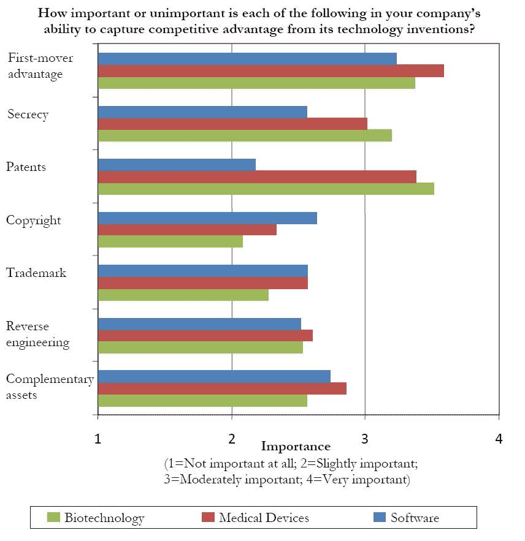
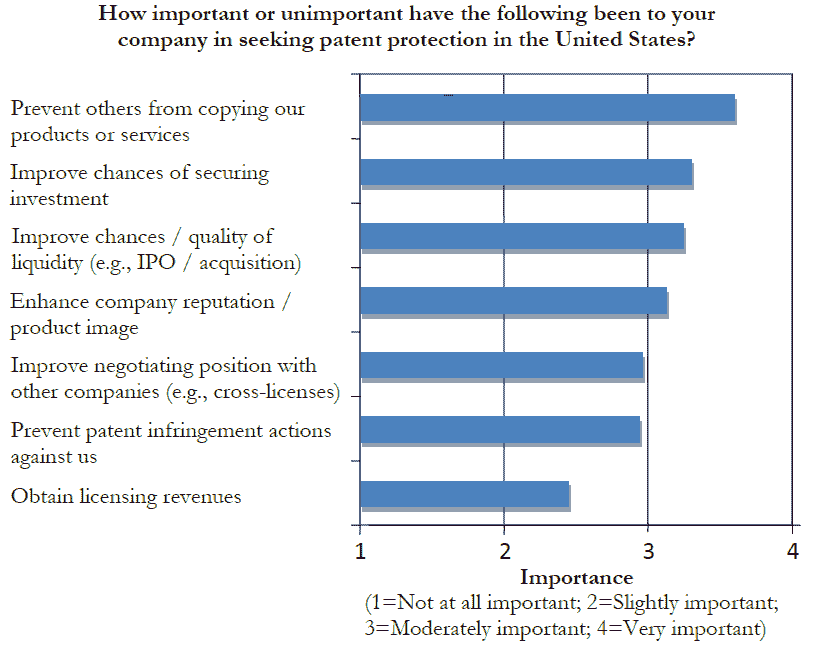

# 为什么我们需要废除软件专利 TechCrunch

> 原文：<https://web.archive.org/web/http://techcrunch.com/2010/08/07/why-we-need-to-abolish-software-patents/>

在我从事技术工作的日子里，我与人合著了[四项软件专利](https://web.archive.org/web/20221206072457/http://patft.uspto.gov/netacgi/nph-Parser?Sect1=PTO2&Sect2=HITOFF&u=/netahtml/PTO/search-adv.htm&r=0&p=1&f=S&l=50&Query=in/vivek+and+wadhwa&d=PTXT)。每台电脑花费了我的创业公司大约 15000 美元——这在当时看来是一大笔钱。我真的没指望这些能给我带来什么好处；毕竟，如果我的竞争对手有半个大脑，他们会简单地从我的专利申请中学习一切，并把事情做得更好。但我需要筹集资金，除非我能讲出一个令人信服的故事，说明我们是如何独自拥有我们秘方的知识产权，否则风投不会给我时间。我们得到了融资，专利的牌匾在我们的接待区看起来很棒，所以花费是值得的。但是绝对没有竞争优势。

专利在许多行业都很有意义；需要它们来保护工业设备、药物配方、生物技术产品和方法、生物医学设备、消费品(牙膏、洗发水、隐形眼镜等)的设计。)、高级材料和复合材料，当然还有小配件(照明设备和元件、电池、玩具、工具等。).但是在软件中，这些只是军备竞赛中的核武器。他们不鼓励创新，而是抑制创新。那是因为这个行业变化很快。速度和技术过时是唯一重要的保护措施。比起担心有人窃取他们的创意，羽翼未丰的初创公司更担心一些大玩家或专利流氓拿出一把大枪，用一场无聊的诉讼让他们破产。

伯克利教授斯图尔特 J.H 格雷厄姆、罗伯特·p·梅格斯、帕姆·萨缪尔森和特德·西切尔曼的新研究强调了这个问题的严重程度。他们调查了 1332 家自 1998 年成立的早期技术公司，其中 700 家在软件/互联网领域。以下是他们的发现:

*   在软件领域，只有 24%的初创公司甚至懒得申请专利。在医疗器械中，这一比例为 76%；在生物技术领域，这一比例为 75%。更多风险投资支持的公司申请专利:在软件领域，67%；在医疗器械方面，94%；在生物技术领域，97%。
*   风险投资支持的公司也比其他申请专利的公司申请更多的专利。他们平均申请 5.9 项专利，而全公司平均为 1.7 项。在医疗器械和生物技术领域，这一比例分别为 25.2 比 15.0 和 34.6 比 9.7。
*   软件高管认为专利是竞争力中最不重要的因素。他们认为获得先发优势是最重要的因素，其次是收购补充资产；版权；商标；保密；并使软件难以逆向工程。
*   公司申请专利是为了防止竞争对手抄袭他们的产品，提高他们获得投资或流动性事件(首次公开募股、收购等)的机会。)，提高公司的声誉，并获得与他人讨价还价的权力。令人惊讶的是，拥有专利的公司——甚至是风险投资支持的公司——并不认为专利让他们更有可能创新。更令人惊讶的是，四分之一从其他公司获得技术许可的公司表示，他们这样做是为了避免诉讼，而不是为了获得技术或知识。换句话说，专利是一种武器或战利品，而不是从他人对其技术的商业应用中获取收入的一种方式。

该报告的合著者之一 Pam Samuelson 说，她的研究结论是，如果没有软件专利，世界可能会更好；软件专利的最大受益者是专利律师和专利流氓，而不是企业家。

与此同时，美国的专利系统正被堵塞和失灵。《密尔沃基哨兵报》的约翰·施密德分析了美国专利商标局[的数据，发现截至 2009 年，有超过 120 万项专利等待批准——几乎是十年前的三倍。2009 年，专利代理机构处理一项专利申请平均需要 3.5 年，是 18 个月目标的两倍多。最令人担忧的是，专利局在 18 个月后自动在网上公布申请——详细列出每一项创新，不管审查员是否已经开始考虑该申请。世界上任何地方的竞争者都可以窃取创意。这实际上破坏了专利制度的整个目的:专利局向申请人收取高额费用，因为他们给了它泄露商业秘密的特权。](https://web.archive.org/web/20221206072457/http://www.inventionstatistics.com/Patent_Backlog_Patent_Office_Backlog.html)

更糟糕的是，专利局正以前所未有的速度拒绝申请——批准的不到 50%,而十年前是 70%。一项估计是，企业家每年在“放弃的创新”上至少要花费 64 亿美元:合法技术无法获得许可，初创企业无法获得资金。因此，负责保护美国知识产权和帮助创新的机构往往做的恰恰相反。

[铸造集团](https://web.archive.org/web/20221206072457/http://www.foundrygroup.com/)的总经理布拉德·菲尔德说，我们应该干脆[废除软件专利](https://web.archive.org/web/20221206072457/http://www.feld.com/wp/archives/2006/04/abolish-software-patents.html)。他认为系统已经完全失控，绝大多数申请都没有通过专利的基本测试(即非显而易见、新颖和独特的创新)。从历史上看，版权和商业秘密一直是软件知识产权的主要保护机制，现在仍然是最好的解决方案。费尔德指出，科技公司现在被迫转移大量资源来保护自己免受专利流氓的攻击，而不是推进他们的创新。

美国的创始人认为知识产权值得在宪法中占有特殊的位置——“通过在有限的时间内保护作者和发明家对他们各自的作品和发现的专有权，来促进科学和有用艺术的进步。”他们的概念是正确的，但他们肯定没有想到 Amazon.com 会对网上购物车中的点击[和网上讨论的](https://web.archive.org/web/20221206072457/http://www.google.com/patents?vid=USPAT5960411)和[方法](https://web.archive.org/web/20221206072457/http://patft.uspto.gov/netacgi/nph-Parser?Sect1=PTO2&Sect2=HITOFF&p=1&u=/netahtml/PTO/search-bool.html&r=30&f=G&l=50&co1=AND&d=PTXT&s1=6525747&OS=6525747&RS=6525747)申请专利，或者微软会对用一次点击激活双击应用程序的[申请专利。是时候按照布拉德·菲尔德的建议去做了:简单地废除这些令人厌恶的东西。](https://web.archive.org/web/20221206072457/http://patft.uspto.gov/netacgi/nph-Parser?Sect2=PTO1&Sect2=HITOFF&p=1&u=/netahtml/PTO/search-bool.html&r=1&f=G&l=50&d=PALL&RefSrch=yes&Query=PN/5611040)

***编者按:**客座作家[维韦克·瓦德瓦](https://web.archive.org/web/20221206072457/http://www.crunchbase.com/person/vivek-wadhwa) 是一位企业家转学者。他是加州大学伯克利分校信息学院的访问学者，哈佛大学法学院的高级研究员，杜克大学创业和研究商业化中心的研究主任。你可以在推特 [@vwadhwa ](https://web.archive.org/web/20221206072457/http://twitter.com/vwadhwa) 关注他，在[www.wadhwa.com](https://web.archive.org/web/20221206072457/http://www.wadhwa.com/)找到他的研究。*