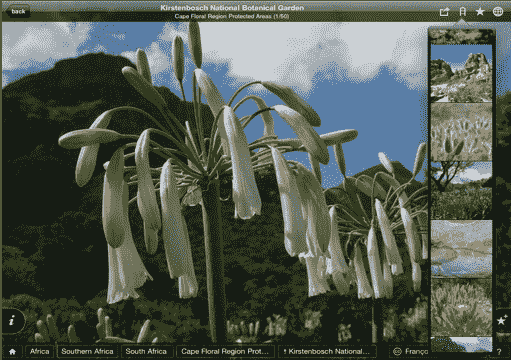

# Fotopedia 推出 iPad 上的无尽相册(视频演示)

> 原文：<https://web.archive.org/web/https://techcrunch.com/2010/08/09/fotopedia-ipad-photo-book-video/>

iPad 正在催生各种各样的关于如何创作[电子书的](https://web.archive.org/web/20221207012934/https://beta.techcrunch.com/2010/08/04/vook-ipad/)新想法，而最有趣的想法并不是以 iBook 的形式出现的。相反，它们是作为应用程序交付的。这方面的一个很好的例子是[的 Fotopedia Heritage](https://web.archive.org/web/20221207012934/http://www.fotopedia.com/products/heritage-info) ，这是 iPad 和 iPhone 系列相册的第一本( [iTunes 链接](https://web.archive.org/web/20221207012934/http://itunes.apple.com/us/app/fotonauts/id383327395?mt=8))。

它不仅仅是一本放入 iPad 的相册。Fotopedia photo book 应用程序远远超出了任何传统咖啡桌相册所能提供的范围，让超过 20，000 张高质量的世界遗产图片触手可及。 [Fotopedia](https://web.archive.org/web/20221207012934/http://www.fotopedia.com/) 的创造者，前苹果技术专家， [Jean-Marie Hullot](https://web.archive.org/web/20221207012934/http://www.crunchbase.com/person/jean-marie-hullot) ，给了我一个上面视频中的应用程序的排练(提前为光线不好道歉，我用我的 iPhone 拍的)。

该应用程序也可以在 iPhone 上使用，但它实际上是为 iPad 设计的。只需轻轻一扫，你就可以浏览世界遗产地的精彩照片。每张照片都有许多与它们所描绘的地点和物体相关的标签。用手指按下一个标签，就可以从法国的照片切换到巴黎的照片、埃菲尔铁塔的照片，或者从泰国的照片切换到寺庙的照片。这样，您可以从一组相关的照片跳到下一组。如果你想走得更快，你可以拉起一个幻灯片，它出现在右手边，可以单独滑动。

所有的照片都来自 Fotopedia，这是一个社交照片网站，两年前在 TechCrunch50 上推出。Fotopedia 上的摄影师社区非常有才华，大多数照片都是在知识共享许可下拍摄的，每张照片都链接到谷歌地图和维基百科的一篇文章。它旨在通过照片记录世界。iPad book 是整理特定照片集的一种方式。Fotopedia 大约每个月都会发布一本新书。下一个是关于国家公园的。

因为 Fotopedia 是一个结构化的照片数据库。大多数照片都链接到维基百科的文章上，这些文章是这本书的基础文本。你还可以在地图上看到任何照片的拍摄地点，以及猫途鹰的链接。任何照片都可以通过电子邮件、脸书或推特分享。

Fotopedia 的书籍将是免费的，当它们由社区照片组合而成，并获得知识共享许可时，它也将成为 Fotopedia 上的摄影师的一个模板，他们可以利用其他图像一起创建付费下载的照片应用程序。在这种情况下，Fotopedia 将从下载销售额中提成。

这个应用程序本质上是 Fotopedia 网站的一部分，包装得很好。我问 Hullot 为什么他不在浏览器里做同样的事情。他的回答是会的，但是不会像 app 那么无缝。尽管如此，这种数字图书的方法显示了当数字图书连接到网络时可以实现什么——你可以获得无尽的选择，以及可搜索和共享的结构化数据。最终，书籍和网络之间不应该有任何区别。

