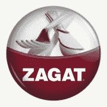

# Zagat 第一个整合美食照片和指南的合作伙伴 TechCrunch

> 原文：<https://web.archive.org/web/https://techcrunch.com/2010/08/13/zagat-and-foodspotting-get-cozy-take-fine-dining-to-the-next-level/>

# Zagat 第一个整合美食照片和指南的合作伙伴

 [Foodspotting](https://web.archive.org/web/20221007001343/http://foodspotting.com/) 和 [Zagat Survey](https://web.archive.org/web/20221007001343/http://zagat.com/) ，这两个我们之前[在这里](https://web.archive.org/web/20221007001343/https://beta.techcrunch.com/2010/08/05/steve_jobs_eats/)介绍过的主要食品品牌[，](https://web.archive.org/web/20221007001343/https://beta.techcrunch.com/2010/08/04/zagat-wins-foursquares-battle-of-the-brands/)今天[宣布了](https://web.archive.org/web/20221007001343/http://www.prnewswire.com/news-releases/zagat-and-foodspotting-announce-partnership-allowing-diners-to-see-their-bites-with-bytes-100632424.html)一项 iPhone 应用程序集成举措，这在很大程度上设定了未来移动社交餐饮的步伐(你在听[米其林吗？](https://web.archive.org/web/20221007001343/http://justanotheriphoneblog.com/wordpress/iphone-software/michelin-guides-apps-for-iphone-launched-priced-so-youll-never-eat-out-again))。

Zagat 之前[曾与 Foursquare](https://web.archive.org/web/20221007001343/https://beta.techcrunch.com/2010/02/08/foursquare-mainstream-deals/) 合作过，他是第一个使用 Foodspotting API 在其应用中使用 Foodspotting 数据的合作伙伴。由于这一举措，Zagat 用户现在可以访问数以千计的美食照片和指南。Foodspotting 首席执行官 Alexa Andrzejewski 表示，这种合作将是许多合作的第一步，暗示 Foodspotting API 将很快向公众开放。

为了庆祝这一合作伙伴关系，Foodspotting 用户现在可以从旧金山、波士顿、芝加哥、洛杉矶和纽约的任何 Zagat 评级餐厅向 [Foodspotting 应用](https://web.archive.org/web/20221007001343/http://www.foodspotting.com/iphone)添加食物照片，从而获得“Zagat 徽章”(见左上)。

来自 [Andrzejewski](https://web.archive.org/web/20221007001343/http://twitter.com/alexia) :

> "*我们很高兴 Zagat 成为第一个利用美食定位数据来增强其餐厅列表的合作伙伴。通过整合美食照片，Zagat 应用程序不仅将成为帮助人们决定去哪里吃饭的重要资源，还将帮助你决定去哪里吃什么。”*

Zagat 移动负责人 Ryan Charles 告诉 TechCrunch，整合为许多联合品牌的机会留下了空间，*“展望未来，我们计划为完成徽章相关任务的美食搜索用户添加特别优惠，包括我们网站的推广访问。”*

这两个移动应用程序的未来版本都将提供完整的 Zagat/Foodspotting 集成。

双方没有透露交易的条款。