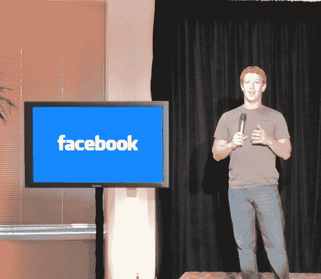

# 来自脸书现场活动(视频流)的现场直播

> 原文：<https://web.archive.org/web/https://techcrunch.com/2010/08/18/facebook-location-video/>

我们在位于帕洛阿尔托的脸书总部，这家社交网络终于推出了备受期待的定位功能，该功能将被称为 [Places](https://web.archive.org/web/20221006084944/https://beta.techcrunch.com/2010/08/18/facebook-places/) 。我们已经发布了新功能的[第一张截图](https://web.archive.org/web/20221006084944/https://beta.techcrunch.com/2010/08/18/facebook-location/)，但我们即将获得关于它如何工作以及脸书与谁合作的完整概要。该公司已经邀请了数十家媒体参加这次活动(它甚至把其中一些媒体从旧金山接了过来)，很明显它把这次活动当成了一件大事。

我在博客上直播我对下面事件的记录。

扎克的照片

首席执行官马克·扎克伯格已经登台。每当我们做一些新的东西想展示给一群人看时，我们都有发布夜的传统。我们的想法是让社区里的每个人都聚在一起，包括那些想要写文章、分析、谈论我们正在做的新事情的人。

“这将是一个有趣的夏天，我们将推出许多新产品。”今天我们谈论的是一个新的“位置”产品，我们已经工作了几个月…一段时间。(人们咯咯地笑—“我猜已经有点多了”。

我们知道它已经准备好了。我和我的女朋友在门洛帕克吃饭，我从来没去过那里。我在给她看产品。她说，嘿，克里斯·考克斯和他的未婚夫就在我们隔壁的餐厅。是不是很牛逼？“就在那一刻，这个偶然的时刻，我们知道产品已经准备好了。

这样做的三个目的:帮助你分享你在哪里。帮你看清身边的人。看看附近发生了什么。

显示该功能的视频。在 iPhone 应用程序上展示它。该视频感觉很像苹果公司生产的东西，显示了朋友们在一起聊天，以及工程师们谈论产品的剪辑。

迈克尔·沙龙，Places 的产品经理，走上了舞台。

开始:在 touch.facebook.com 和今晚晚些时候发布的一个全新的 iPhone 应用程序中发布。主屏幕上将出现一个新图标。打开它，它会显示一个朋友列表，包括那些在附近的朋友。看起来很像 Foursquare。一旦你登记入住，你会看到你周围的地方列表。您可以搜索附近的位置。如果他们不在那里，你可以点击“+”号来添加一个位置。
添加一个你键入名称和描述的地方。

在一个地点页面上，你有一个最近的活动部分(该地点的新闻提要)。在网络上，有许多不同的部分。最右边有一组个人资料图片，所以你可以看到访问过的朋友。“地点”不是向全世界广播您的位置，而是与朋友分享您的位置。

点击签入按钮。你会在顶部看到一个故事的预览，还有一个将要发生的事情的通知(以及一个了解发生了什么的链接)。一旦您同意，会在“地点”页面上创建一个新故事。

现在，您可以在这里看到可能在同一地点登记的朋友和其他人。

照片是 FB 上最受欢迎的产品之一。

可以在照片和状态更新中标记人物(使用@符号)。在他们和我的墙上创造了一个故事。FB 上的每个人都熟悉在照片和状态更新中添加标签。

在您登记时将您标记为好友，您将看到一个列表。它创造了一个故事。

为什么要标记。不是每个人都有先进的手机，但人们希望成为其中的一部分。标记是我们与每个脸书人联系的一种方式(所以你只需要与拥有先进手机的人成为朋友，这是他们想要的)。

当你点击“允许”时。就好像是你自己登记入住的一样。将显示在墙上，最近的活动在位置页面上，以及(还有一个)。

如果你点击“现在不行”，它就会出现在 firend 的墙上，显示你最近的活动。但你的资料上没有。你现在不要出现在这里。

**隐私
默认只对朋友可见。:可以缩小范围，仅限于几个特定的人。可以从您的手机或网络上删除任何签入。
在“现在就在这里”部分，只有在你同意加入之后。**

**标记:你只能标记你的朋友。你只能在登记入住时标记你的朋友(如果你想在一个低级酒吧登记你的朋友，你必须在那里登记你自己)。只要你被标记，就会收到通知。您可以随时移除任何标签。**

你可以选择不让朋友给你加标签。可以直接点击‘禁用’

API
读取明天可用的 API。在封闭测试版中编写和搜索 API。http://developers.facebook.com/docs/api/#places

合作伙伴登场。

Scott Raymond——Gowalla 的首席技术官和联合创始人。
Gowalla 有一个“对脸书的持续承诺”。用户界面/UX 保持不变，邮票和照片内嵌。当你发布一些东西时，你可以选择是否要发布到 FB。

Holger lue dorf——four square 移动和合作伙伴副总裁。
“我认为这对行业来说是一件大好事。这证明我们正在做一些事情。这将是一件更大的事情。”“我认为人们使用 foursquare 有不同的原因。游戏元素就是其中之一。积分/徽章推动了许多早期参与。让人们熟悉签入。必须记住签入是这个的核心。在 foursquare，我们将继续创新，让它成为更好的用户体验。”将有添加到 foursquare，让您从网站添加信息到 foursquare 系统，当您在附近时，您会得到提醒。关于脸书 API，期待看到我们将如何利用它。“这有点奇怪——它是 Foursquare 的一个大宣传片，有 20-30 秒是关于脸书的。

Yelp 登台了。兴奋地使用脸书 API。我们的集成很简单，可以只与 yelp 共享，当然也可以与脸书共享。我们会出版，展示商业照片。很快，我们将推出一些东西，你可以在我们的 Yelp 移动应用程序中阅读 FB checkin。

Booyah CEO 上台。新产品叫做 InCrowd。在三周内，我们在 iPhone 上推出了客户端应用程序，全面整合了脸书广场。可以从 FB 读取附近的列表。可以编写订阅源的签入。可以搜索。还集成了图形 API。

脸书产品副总裁 Chris Cox 在台上。社会学家雷·奥尔登堡谈到了这一点。他的观点是:有三个地方很重要。家、工作场所和“第三个地方”，如酒吧、图书馆等。在那里会发生随机的冲突。我观察到技术有摧毁第三个地方的危险，因为人们坐在家里…这将走向何方？也许有一天你去酒吧。

把你神奇的未来十年电话放下。突然，它开始发光，说嘿，这是你可以在这里点的，这是你朋友喝的。显示你的朋友在这里做了什么的照片。我们所处的物理现实随着我们在那里讲述的故事而变得鲜活起来。

问:如果有人在我家创建了一个地方，我对此有什么控制权？
答:我们有可见性规则，所以如果你创建了一个地方，它只会对你和你的朋友可见，但如果有足够多的人登录，我们就会说这是很多人感兴趣的东西，并将其公开。

你可以想象可以建造的东西的世界。带有位置等的照片标签。(回避关于货币化的问题)

首先在美国推出。不会马上覆盖所有使用 FB 的 5 亿人。如果你不在美国，你仍然可以看到在美国使用它的朋友的帖子。

黑莓/安卓。现在，我们确实有计划添加到所有能够支持它的应用程序中(没有时间表)。在发布会上，我展示了一个网页版的 Place page 的例子。如果是你的生意，你可以点击页面底部的链接，申请属于你自己的页面。它变成了一个商业页面。

这在国内是一件卑鄙的事情。大约在去年 12 月，团队围绕这个特定的愿景走到了一起。团队必须弄清楚的一件主要事情是——什么是不同于其他人构建的一套好的功能/产品？