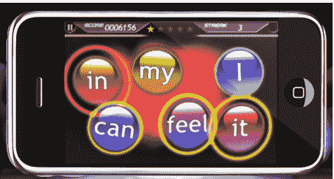

# 更好地了解歌词:TuneWiki 游戏将歌词与 Tap Tap 复仇 TechCrunch 相结合

> 原文：<https://web.archive.org/web/https://techcrunch.com/2010/08/31/tunewiki-lyric-legend/>

# 更好地了解歌词:TuneWiki 游戏将歌词与 Tap Tap 复仇结合在一起

今年早些时候，移动开发商 [TuneWiki](https://web.archive.org/web/20230214074550/http://www.tunewiki.com/) 筹集了超过[700 万美元](https://web.archive.org/web/20230214074550/https://techcrunch.com/2010/02/08/tunewiki-funding-motorola-ventures/)用于扩展以歌词为中心的[音乐播放器](https://web.archive.org/web/20230214074550/http://itunes.apple.com/us/app/tunewiki-lyrics-radio/id320088832?mt=8)之外的领域，使其声名大噪。今天见证了该公司的第一次重大扩张，推出了一款名为 [Lyric Legend](https://web.archive.org/web/20230214074550/http://itunes.apple.com/us/app/lyric-legend/id381473803?mt=8) 的新 iPhone 游戏，该游戏将歌词与节奏游戏相结合，使 Tapulous 的 Tap Tap Revenge 获得了巨大成功。

玩歌词传奇非常简单:点燃一首歌，你会看到一系列的泡泡出现在屏幕上，每个泡泡上有一个不同的单词。您选择的歌曲将开始在背景中播放，您的工作是在演唱时轻敲每个单词。这里有一些额外的技巧(当一个词被唱了很长时间时，你用手指按住它)，但即使是这些技巧也很容易掌握。

当然，如果你想玩好这个游戏，你必须真正地学习每首歌的歌词，尽管你可以在不知道所有歌词的情况下通过最简单的方式。

我在它的测试版期间玩过这个游戏，发现它很有趣，很容易上手，而且它足够不同，感觉不像一个完整的 Tap Tap 复仇克隆。也就是说，这个游戏仍然需要一些润色——图形有点平淡无奇，它们不会改变来反映你正在唱的歌。只有时间才能证明这是否能够吸引大量的追随者，这使得 TTR 成为 iPhone 有史以来最受欢迎的应用程序之一(这很难)。

这款免费游戏只附带三首歌曲(包括《全美拒绝》、《Metric》和《吸血鬼周末》中的歌曲)。你可以使用一个集成的音乐商店来完善你的图书馆，这个商店以 99 美分的价格出售两包的歌曲，并提供像 Kanye West 和 Coldplay 这样的乐队。

歌词是 TuneWiki 的舒适领域。该公司的原创应用程序可用于 iPhone 和 Android，允许用户在播放歌曲时观看歌词滚动到屏幕上，就像卡拉 ok 一样。这款应用还包括一些社交功能，比如可以看到不同地理区域最流行的歌曲。