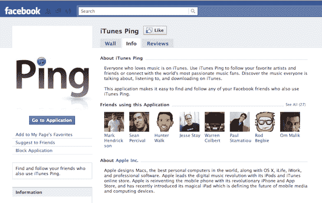

# 平和脸书昨天成了朋友。我仍然保持联系。TechCrunch

> 原文：<https://web.archive.org/web/https://techcrunch.com/2010/09/02/itunes-ping-facebook/>

# 平和脸书昨天成了朋友。我仍然保持联系。

关于苹果新的音乐社交网络 iTunes Ping 和脸书，现在似乎有些混乱。有些人似乎认为它从来就不是 iTunes 的一部分，苹果决定不连接；而其他报道称他们*认为*在某一点上是集成的，但它没有工作，并且已经被移除。我可以肯定地告诉你，昨天脸书连接是 Ping 的一部分——因为我用了它。

当我昨天第一次加载 iTunes 10 并启动 Ping 时，我做的第一件事就是联系脸书来寻找朋友。一开始，我会说没用。我点击了连接按钮，输入了我的凭证，但什么也没发生。但是我又试了一次，效果很好。我找到了一些刚刚开始使用 Ping 的脸书朋友，并与他们建立了联系。

此外，查看我的脸书账户，我仍然连接着苹果的 Ping 应用。目前我的 27 个脸书朋友也是如此。苹果现在已经从 iTunes 上移除了这个实现，但是这个应用程序仍然在脸书上运行。

我也在昨天的活动中与一些苹果代表交谈过，他们证实脸书连接的实现只是为了让你的朋友们加入 Ping。我被告知，没有其他数据被转移。

脸书的应用页面似乎证实了这一点:

> 这个应用程序可以让你很容易地找到并跟踪你在脸书的朋友，他们也使用 iTunes Ping。

那么苹果为什么要把它去掉呢？谁知道呢。这可能是错误的(正如我所说，这是昨天)，或者可能是脸书不喜欢实现的某些方面，并要求 iTunes 重新工作。到目前为止，双方都没有说话。

我确实认为 Ping 有一个很好的简单的社交模型，让用户可以追随、交友或潜伏。相比之下，脸书是一个烂摊子或隐私设置。

但同样，这两者之间的联系昨天肯定是有效的。但这只是关于寻找朋友，没有其他数据被转移。

**更新**——以下是脸书对此事的声明:

> 脸书相信将人们与他们的兴趣联系起来，我们已经与世界各地分享这一愿景的创新开发者合作。脸书和苹果在过去成功合作，为人们提供了很好的社交体验，并期待在未来这样做。

