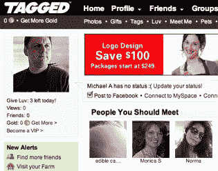

# 如何标记发现 1 亿用户路径张贴 Facebookocalypse(视频)

> 原文：<https://web.archive.org/web/https://techcrunch.com/2010/09/02/tagged-100-million-users-facebookocalypse/>

听说过[标记的](https://web.archive.org/web/20230123161013/http://www.tagged.com/)吗？早在 2005 年，它还是一个青少年专用的社交网络，主要迎合美国高中生，因为脸书在大学人群中冲锋陷阵。到 2007 年，他们在 T2 开始盈利，价值超过 1 亿美元。

只有一个问题。脸书最终开始允许高中学生进入，然后其他所有人都进入。Tagged 的回应也是向所有人开放。但是到了 2007 年中期，首席执行官 Greg Tseng 告诉我，Tagged 知道它遇到了麻烦。

“脸书打败了我们，”他说。“我们只是另一个社交网络……但不是前五名。”

因此，曾和他的团队决定接触用户，询问他们想要什么。“我们了解到的最重要的事情是，人们使用我们的网站来结识新朋友。”

宾果！脸书不擅长帮你认识新朋友。你可以按姓名搜索，也可以点击朋友的朋友，但你不能只是通过别人找到你还没有联系上的新朋友。在 Tagged，人们使用过滤搜索来结识朋友。分享活动，约会，或者其他。

“我们致力于成为出于任何社会原因结识新朋友的最佳场所，”曾告诉我。

约会显然是很重要的一部分。脸书没有约会档案。至少对一些人来说，Match.com 和其他交友网站是一种耻辱。但是被标记的人可以见面、约会或从事其他活动。“去 Tagged 就像和朋友去酒吧，你很可能会遇到新的人。去 Match.com 就像去参加单身活动，这是一种耻辱。”

用户肯定同意。2007 年，Tagged 拥有 2000 万活跃用户。今天他们已经达到了 1 亿。每月有 1/3 到 1/4 的人访问该网站，该网站每月有 50 亿次页面浏览量。

他们在花钱。虚拟礼物。VIP 帐户可以让您以每月 20 美元的价格查看谁在查看您的个人资料。收入增长到 3000 多万美元，两周前，Inc .将其列为 500 家增长最快的公司之一。Tseng 说，2011 年的收入应该是 5000 多万美元。