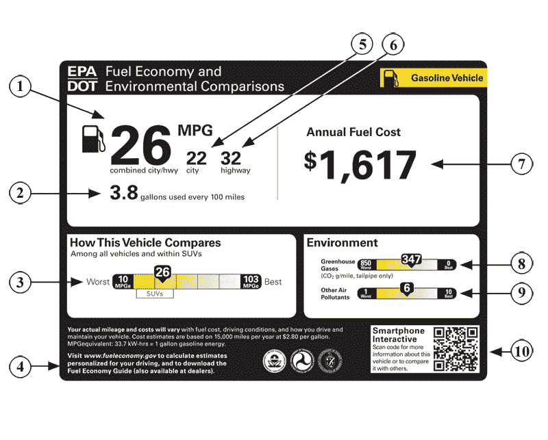

# 苹果重视保密胜过环境吗？TechCrunch

> 原文：<https://web.archive.org/web/https://techcrunch.com/2010/09/04/apple-secrecy-environment/>

根据皮尤互联网公司的最新研究表明，82%的美国成年人拥有手机、黑莓、苹果手机或其他类似设备。65%拥有手机的成年人表示，他们睡觉时手机放在床边或旁边。

然而，消费者不知道这些设备到底是由什么制成的，以及它们可能对环境和健康产生的影响。手机制造商不需要分享所有细节。有些人还是会。

但不是苹果。该公司一如既往地为 T4 保守秘密，这次是从总部位于英国的旨在对最环保和最不环保的手机进行排名的倡议“T5”O2 eco ratings“T6”开始的。

诺基亚、宏达电、三星、LG、Palm 和索尼爱立信参加了 O2 EcoRatings。RIM 承诺参与下一年的研究。上周发布的评级结果显示，索尼爱立信 Elm 公司的 T7 手机是最环保的手机。

苹果有理由对苹果手机进行外部环境调查吗？毕竟，新的环境报告、标签和认证每隔几周就会发布。

最近，[环保局提出了一个新的车辆效率等级，](https://web.archive.org/web/20221006224425/https://beta.techcrunch.com/2010/08/30/the-epas-proposed-vehicle-window-stickers-give-cars-a-letter-grade/)和一个名为 [ULE-880](https://web.archive.org/web/20221006224425/http://www.greenbiz.com/blog/2010/08/02/introducing-ule-880-sustainability-manufacturing-organizations) 的新伙伴关系启动了对制造商的评级。

庞大的数据量让公司和消费者很难知道哪些报告是可信的、科学的，或者只是公关宣传。

然而，华盛顿附近的战略可持续发展咨询公司的创始人兼总裁詹妮弗·伍福特认为 O2 的生态评级是可信的。伍夫特的公司帮助制造商使他们的产品、运营和环境报告符合零售商的规格，如沃尔玛。

通过拒绝参与值得信赖的外部机构的环境评级，Woofter 说“[苹果]在可持续发展方面没有处于领先地位。这有可能让人觉得它是一家不善于接受反馈的公司。”她认为，苹果自己的环境审计还没有以一致的方式进行，或者有足够明确的标准来平息合理的担忧。

环境研究人员仍然希望苹果公开回答一些问题，如:其设备中的材料是从无冲突的矿山中获得的吗？那些 iPhones 和充电器里还有哪些毒素，如果有的话？苹果用什么标准和规律来审查其原始设备制造合作伙伴，以确保他们以对环境和社会负责的方式运营？该公司将如何遏制电子垃圾？

继续保密不应该让那些熟悉苹果公司运作方式的人感到惊讶。今年早些时候，公司[否决了两份要求其进行更严格报告的股东提案](https://web.archive.org/web/20221006224425/http://www.environmentalleader.com/2010/02/26/apple-shoots-down-two-shareholder-sustainability-proposals/)。

苹果[很少收购其他公司，](https://web.archive.org/web/20221006224425/http://stevecheney.posterous.com/apple-and-efficiently-growing-its-future)更喜欢从内部创新，这也恰好使其在目标公司的律师、会计师或顾问等外部人士面前的曝光率最小化。

开发 O2 EcoRatings 的公司之一 Telefónica O2 UK 对苹果来说并不陌生，但它是在欧洲销售苹果 iPhone 的主要移动运营商和零售商。另一个，[未来论坛，](https://web.archive.org/web/20221006224425/http://www.forumforthefuture.org/)是一个独立的非营利组织，致力于促进“可持续发展”，研究各种行业对人类和地球的影响。

Woofter(他与这两者都没有关系)称赞他们:使他们的评级标准清晰和非专有；检查手机的能源使用和材料等指标；看看这些材料的来源，以及供应链上工人的工作条件。“可持续性不仅仅是关于碳，”她说。

过去，苹果允许其许多个人电脑和笔记本电脑接受美国非营利环境报告机构绿色电子委员会的评级，该机构创建了极具影响力的电子产品环境评估工具，即 EPEAT 标准。其产品获得了恒星 EPEAT 评级、[、【金】级全面](https://web.archive.org/web/20221006224425/http://www.epeat.net/CompanyDetail.aspx?CompanyID=32)。

公开其电脑帮助苹果赢得了绿色和平组织的尊重(并平息了它的声音);2007 年，环保主义者发起了一场批评苹果的大规模运动。允许对 iPhone 进行独立评级，并与同行的设备进行比较，可能会让该公司看起来又好又环保。那么，苹果为什么还会衰落呢？

波士顿学院企业公民中心的研究和政策主任克里斯·平尼认为这是因为他们不需要说话。“苹果有一个全面的供应商代码和审计程序。他们可能觉得自己的报告足以应对“绿色”问题。他说:“他们可能还会觉得，在一个他们占主导地位的市场，加入一个新的‘生态评级’项目不会有什么好处。

Pinney 认为，真正的变化和更少的保密将由政府标准和大型运营商和零售商如沃尔玛推动，因为他们由于消费者的压力要求在他们处理的产品上贴更多的标签。

目前，苹果发言人拒绝对 O2 生态评级发表评论。她指着苹果网站上的“环境”页面，强调该公司限制的毒素比欧洲 RoHS 指令还多，该指令限制在电子产品中使用有害物质，在今天被认为是进步的。

她说，顾客可以将大多数 iPhones 和 iPods(不包括 shuffle)带到苹果零售店进行回收。对于退回的 iPod，他们可以获得新 iPod 的 10%折扣。不过，该公司还没有为其 iPads、iPhones、电池、充电器或笔记本电脑创建类似的激励计划。

【T2

苹果的零售员工没有被要求告知消费者负责任的电子垃圾处理，或者可用的回收和再循环计划。

环境责任也是苹果宣传活动中基本没有的主题。上周，苹果公司推出了一系列新的媒体设备[时，没有人谈论绿色功能或电子垃圾回收。](https://web.archive.org/web/20221006224425/http://www.crunchgear.com/2010/09/01/round-up-our-take-on-apples-new-media-devices/)

相反，苹果公司因其意外且公开的绿色环保而受到称赞:他们的 iPods 和 iTunes 商店已经取代了成吨的光盘垃圾。他们也一直在设计更节能的产品，使用毒性更低的材料，并随着时间的推移尽量减少包装。他们已经申请了专利，将太阳能电池纳入他们的便携式设备中。T2 的一系列 iPhone 应用程序旨在帮助消费者过上“更绿色”的生活。

然而，如果你发现你的新 iPhone 充满了冲突矿物，你会留着它吗？或者如果它含有致癌毒素，你还会带着它睡觉吗？

*绝密照片 via:* [马拉克·凯莱夫拉](https://web.archive.org/web/20221006224425/http://www.flickr.com/people/malakhkelevra/)
*电子垃圾回收照片 via:* [美国陆军环境司令部](https://web.archive.org/web/20221006224425/http://www.flickr.com/people/armyenvironmental/)