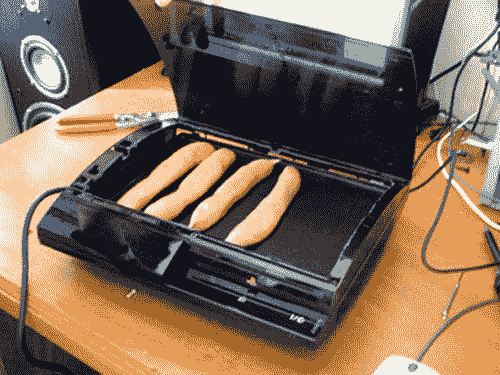

# 用 Nexus One、Palm Pre 或诺基亚 N900 | TechCrunch 越狱 PS3

> 原文：<https://web.archive.org/web/https://techcrunch.com/2010/09/06/jailbreak-a-ps3-with-just-a-nexus-one-palm-pre-or-nokia-n900/>

# 用 Nexus One、Palm Pre 或诺基亚 N900 破解 PS3

 
[PS3](https://web.archive.org/web/20230322162648/http://www.crunchgear.com/tag/ps3/) 现在到处都是 mod。最新的方法是[类似于早期的 USB 漏洞利用](https://web.archive.org/web/20230322162648/http://www.crunchgear.com/2010/08/19/ps-jailbreak-does-what-it-promises-jailbreaks-your-ps3/)。相反，它使用某些手机来做肮脏的勾当。支持的设备列表很短，但是如果你有合适的手机，这就再简单不过了。

【YouTube http://www.youtube.com/watch?v=piqhQR7G-q4&fs=1&hl=en_US]

PS3Hax.net 链接到[兼容性列表](https://web.archive.org/web/20230322162648/http://psfreedom.com/wiki/index.php?title=Device_compatibility_list)和[布局指令](https://web.archive.org/web/20230322162648/http://www.ps3hax.net/showthread.php?p=109538)。

> 1.  **[下载](https://web.archive.org/web/20230322162648/http://www.ps3hax.net/downloads.php?do=file&id=401)** 包，解压。
> 2.  提取 N1-CM6-PSFreedom.tar.gz 并将内容复制到你的 [SD 卡](https://web.archive.org/web/20230322162648/http://www.ps3hax.net/showthread.php?p=109538) 。
> 3.  将 PS3-signed.zip 和 PS3-No-More-signed.zip 复制到您的 SD 卡。
> 4.  重启[进入恢复控制台](https://web.archive.org/web/20230322162648/http://www.ps3hax.net/showthread.php?p=109538)。
> 5.  安装/刷新 PS3-signed.zip。
> 6.  重启 [你的手机](https://web.archive.org/web/20230322162648/http://www.ps3hax.net/showthread.php?p=109538) 。
> 7.  使用 ConnectBot 或任何终端应用程序并键入:
>     *   CD/mnt/SD 卡
>     *   苏联（USSR 的缩写）
>     *   insmod psfreedom.ko
> 8.  切断 PS3 的电源，打开背面的开关(PS3 Fat)或从墙上拔下插头(PS3 Slim)，通过 USB 连接手机。
> 9.  重新启用电源，然后快速连续按 PS3 电源按钮和弹出按钮。
> 10.  你的 PS3 现在被黑了！你会在 XMB 的游戏下看到“安装包文件”。

> 要让你的手机恢复正常，只需启动恢复并刷新 PS3-No-More-signed.zip。就这么简单。视频即将推出。

易如反掌，但是记住，这个[可能会导致警察出现](https://web.archive.org/web/20230322162648/http://www.crunchgear.com/2010/08/23/dont-use-that-jailbroken-ps3-online/)。你的电话。[via[phandroid](https://web.archive.org/web/20230322162648/http://phandroid.com/2010/09/06/use-your-android-phone-to-jailbreak-your-playstation-3/)&<a href = "[PS3](https://web.archive.org/web/20230322162648/http://www.crunchgear.com/tag/ps3/)mod 现在到处都是。最新的方法是[类似于早期的 USB 漏洞利用](https://web.archive.org/web/20230322162648/http://www.crunchgear.com/2010/08/19/ps-jailbreak-does-what-it-promises-jailbreaks-your-ps3/)。相反，它使用某些手机来做肮脏的勾当。支持的设备列表很短，但如果你有合适的手机，就再简单不过了。”>制造]