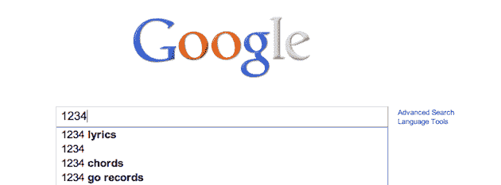
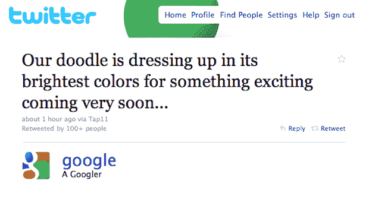

# 谷歌又更新了涂鸦；指向实时更新结果 TechCrunch

> 原文：<https://web.archive.org/web/https://techcrunch.com/2010/09/07/google-logo-update/>

# 谷歌又更新了涂鸦；指向实时更新结果

谷歌标志的传奇仍在继续。搜索巨头刚刚在今天晚上再次修改了 google.com T2 的涂鸦，T3 为他们明天的搜索活动 T4 做准备。再一次，看起来这个标志指向了他们明天将要宣布的东西。

然而，昨天的涂鸦更加动感，谷歌称之为“*快速、有趣和互动”，*今天的标志会随着你在搜索框中的输入而更新。这意味着谷歌将推出他们一直在测试的实时更新输入结果的功能。

当你现在加载 Google.com，你会看到图标变灰。当你开始打字时，这些颜色一次一个字符地呈现出来。如果您退格，徽标也会退回。

明天太平洋时间上午 9:30，请准时参加我们的活动报道。以防你还看不到新的标志(昨晚它似乎推出得很慢)，我将在下面包括一个视频。

与此同时，如果你想看看昨天的涂鸦是如何工作的，[看看](https://web.archive.org/web/20221006115820/http://rawkes.com/experiments/google-bouncing-balls-canvas/)罗布·霍克斯[只用 HTML5 制作的娱乐作品](https://web.archive.org/web/20221006115820/http://twitter.com/robhawkes)。

【YouTube = http://www . YouTube . com/watch？v=OJLGXY0TZIE&w=630]

**更新**:这是谷歌[关于此事的推文](https://web.archive.org/web/20221006115820/http://twitter.com/google/statuses/23883179800):

