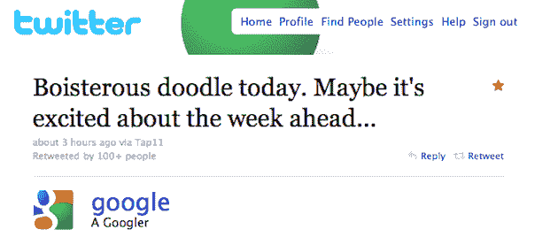

# 谷歌的 Kinetic 标志显然与他们明天的大型搜索活动 TechCrunch 有关

> 原文：<https://web.archive.org/web/https://techcrunch.com/2010/09/07/googles-kinetic-logo-apparently-has-to-do-with-their-big-search-event-tomorrow/>

# 谷歌的动态标识显然与他们明天的大型搜索活动有关

到现在为止，你可能已经注意到了有趣的，[谷歌今天已经有了运动标识](https://web.archive.org/web/20221209130058/https://beta.techcrunch.com/2010/09/07/google-logo/)。尽管这个搜索引擎巨头还没有给出确切的官方说法，但他们已经给出了一些暗示。根据这些暗示，一个很好的猜测似乎是，这个标志与他们将于明天早上在旧金山 MOMA 举行的大型搜索活动中宣布的内容有关。

今天早些时候，谷歌[发推文给](https://web.archive.org/web/20221209130058/https://twitter.com/google/status/23258891556)说:“B *今天很酷的涂鸦。也许它对即将到来的一周感到兴奋…* ”与此同时，谷歌代表[告诉](https://web.archive.org/web/20221209130058/http://www.seroundtable.com/archives/022861.html)搜索引擎圆桌会议“*今天的涂鸦与生日无关，而是快速、有趣和互动的，正是我们认为搜索应该有的方式。*“这导致博客推测明天可能会宣布三件事:AJAX 驱动的搜索结果，每页 30 个结果，以及你输入时的流结果。就 AJAX 和流媒体而言，Google [一直在测试这两者](https://web.archive.org/web/20221209130058/https://beta.techcrunch.com/2010/08/21/live-update-search/)(就 AJAX 而言，[自 2009 年初](https://web.archive.org/web/20221209130058/https://beta.techcrunch.com/2009/08/29/ajax-search-is-google-sweating-bing-or-just-feeling-the-need-for-speed/))。

就搜索事件本身而言，谷歌上周向媒体成员发出了题为“继续搜索”的邀请。事实上，它是在一个艺术博物馆是有趣的，虽然也许不完全相关。但是演讲者阵容绝对是:

*   搜索产品和用户体验副总裁 Marissa Mayer
*   产品管理总监 Johanna Wright
*   本·戈麦斯，杰出的工程师
*   高级软件工程师 Othar Hansson

正如搜索引擎公司 Land 的丹尼·沙利文[上周指出的](https://web.archive.org/web/20221209130058/http://searchengineland.com/google-announces-cant-be-missed-press-event-on-search-49899)，前三者都与谷歌的搜索用户界面紧密相关——所以，再次期待一次修补。“快速、有趣、互动”的改造

另一个附带说明是，谷歌已经在实验室悄悄推出了一个新工具，名为[谷歌脚本](https://web.archive.org/web/20221209130058/http://scribe.googlelabs.com/)。正如谷歌操作系统[指出的](https://web.archive.org/web/20221209130058/http://googlesystem.blogspot.com/2010/09/google-scribe.html)，这是一个在你输入时自动提示文档中短语的工具。是的，这类似于谷歌目前提供的搜索框。是的，它也很快，有趣，互动，就像谷歌奇怪的标志。

我们明天会去现场直播。

**还有更多** : [Google 又更新了嘟嘟；指向实时更新结果](https://web.archive.org/web/20221209130058/https://beta.techcrunch.com/2010/09/07/google-logo-update/ "Google Updates The Doodle Again; Points To Live-Updating Results")

