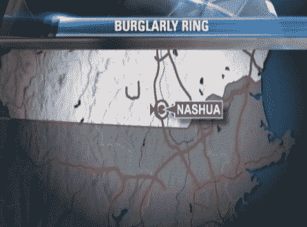

# 新罕布什尔州的脸书变成了现实生活中的 PleaseRobMe.com

> 原文：<https://web.archive.org/web/https://techcrunch.com/2010/09/10/facebook-places-please-rob-me/>

# 新罕布什尔州的脸书变成了现实生活中的 PleaseRobMe.com

还记得[请抢我，](https://web.archive.org/web/20230219191716/http://pleaserobme.com/)那个试图提高人们对当你不在家时在 Foursquare 和其他地理服务上公开广播的[危险](https://web.archive.org/web/20230219191716/https://techcrunch.com/2010/02/17/please-rob-me-makes-foursquare-super-useful-for-burglars/)的认识的网站吗？我不知道由于网站上的信息，是否真的发生过任何盗窃，无论如何，网站已经不再运行了(它表明了它的观点)。

但是，当你把同样的定位广播的想法放到一个拥有超过 5 亿用户的服务上时，它就不再只是学术了。人们的房子会被抢劫，至少在新罕布什尔州是这样。新罕布什尔州纳舒厄的一个盗窃团伙瞄准了在脸书登记入住的人，当他们不在家时会发出警报。警察在他们闯入 50 户人家偷了价值 10 万美元的货物后抓住了他们。更新:目前还不清楚受害者是在使用脸书地点功能，还是仅仅更新了他们正在度假的状态，但这相当于同一件事:他们在广播他们不在家。更新 2 :脸书表示，他们已经和纳舒厄警方确认，到目前为止，脸书·普莱斯似乎没有参与任何犯罪活动。

这似乎是一个重温请抢我的[使命宣言](https://web.archive.org/web/20230219191716/http://pleaserobme.com/why)的好时机:

> 危险在于公开告诉人们你在哪里。这是因为它离开了一个地方，你肯定不是…家。所以我们在这里；一方面，我们去度假时会开着灯，另一方面，我们会告诉网上的每个人我们不在家。如果你有“朋友”想要殖民你的房子，情况会变得更糟。这意味着他们必须输入你的地址，告诉每个人他们在哪里。你的地址..在网上..现在你知道当人们一进入你家就伸手拿手机时该怎么做了。没错，扇他们耳光。

请抢劫我，真的。

http://www . necn . com/09/10/10/Burglary-ring-targets-脸书-users-in-/landing.html？block id = 307943 & feed id = 4206 & UTM _ source = Twitter feed & UTM _ medium = Twitter