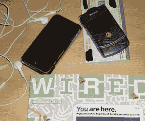

# “威瑞森 iPhone”对“威瑞森网络上的 iPhone”

> 原文：<https://web.archive.org/web/https://techcrunch.com/2010/09/11/the-verizon-iphone/?utm_source=feedburner&utm_medium=feed&utm_campaign=Feed%3A+Techcrunch+%28TechCrunch%29>

如果你回想 2005 年，你会记得摩托罗拉 RAZR 手机风靡一时。与今天的 iPhone 并不完全不同，它是每个人都想要的时尚手机。但是如果你碰巧在美国最大的航空公司威瑞森号上，你就找不到了。又来了，听起来熟悉吗？

直到大约一年后，一个版本(V3c)终于来到了威瑞森。这是一个漫长的等待，但我很高兴终于可以使用这款设备，我在第一天就预订了一台。当我最终得到它时，有一些惊喜在等待着我。它没有我朋友的 RAZRs(在其他网络上)一样丰富多彩的用户界面，而是有一些威瑞森自己制作的可怕的红色专有用户界面。此外，威瑞森还禁用了蓝牙文件传输功能。它装满了威瑞森的 V 星垃圾。

因此，虽然等待的一部分无疑是因为摩托罗拉准备出售 CDMA 版本的设备，但更大的一部分可能是威瑞森谈判并努力将他们的垃圾软件加载到设备上。这对所谓的威瑞森 iPhone 来说并不好。

iPhone 将登陆威瑞森的传言现在比以往任何时候都更加响亮。毫无疑问，苹果公司已经开发 CDMA 版本的设备([代号:N92](https://web.archive.org/web/20221007022736/http://daringfireball.net/2010/08/n92) )有一段时间了，也许就在我们说话的时候，它已经进入了生产的[过程。但这款设备的目的地是威瑞森还是 Sprint(另一家美国 CDMA 提供商)仍有待观察。毫无疑问，苹果希望他们的设备在这个国家(威瑞森)最大的运营商，但他们也无疑将不得不做出牺牲来实现这一点。而苹果不喜欢做出牺牲。](https://web.archive.org/web/20221007022736/https://beta.techcrunch.com/2010/08/08/verizon-iphone-january/)

关于苹果可能不得不从其他美国运营商那里接受更低的补贴，如果他们超越了与美国电话电报公司的独家协议(这给了他们一个惊人的补贴，使他们的底线增加了数十亿美元)，已经有很多报道了。但没有多少人谈论苹果将设备放在威瑞森上可能不得不放弃的更基本的东西:控制权。

记住，当苹果在 2007 年首次推出 iPhone 时，他们去[和](https://web.archive.org/web/20221007022736/http://www.wired.com/gadgetlab/2007/01/verizon_turned_/)谈交易的第一家运营商是威瑞森。双方当时无法达成一致，主要问题无疑是控制权。苹果当时基本上没有优势，因为他们是这个领域的新玩家，市场份额为零。威瑞森知道这一点，可能对苹果的一些要求一笑置之。所以苹果去了 AT & T，剩下的就是历史了。

自从 iPhone 大获成功(以及随后的更新版本发布)以来，苹果和威瑞森之间的讨论无疑已经进行了很多次。双方都知道，最受欢迎的智能手机出现在最受欢迎的网络上是有道理的。但问题依然存在:谁愿意放弃某些东西来实现这一点？

在过去的一周里，我写了一堆[的](https://web.archive.org/web/20221007022736/https://beta.techcrunch.com/2010/09/05/apple-android/)[的](https://web.archive.org/web/20221007022736/https://beta.techcrunch.com/2010/09/09/android-open/)帖子，都是相同的基本重复:运营商[烂](https://web.archive.org/web/20221007022736/https://beta.techcrunch.com/2010/09/10/google-nexus-one/)。这些帖子都是在 Android 的背景下，特别是运营商如何利用移动操作系统的开放性，让我们回到 5 年前他们完全控制美国市场的时代 iPhone 出现之前的时代。威瑞森是迄今为止最糟糕的罪犯。毫无疑问，他们想对 iPhone 做同样的事情吗？

早在 2007 年，威瑞森可能认为苹果的应用商店和用户体验完全由他们控制，但在威瑞森的网络上运行的想法是一种侮辱。如果有一个应用程序商店，它将是一个威瑞森的应用程序商店。如果要有一种新的用户体验，那将是一种*威瑞森*的新用户体验。T 公司可能也想要这些东西，但他们看到了苹果公司对 iPod 所做的一切，很可能愿意冒这个险——只要他们能独家报道。不亚于苹果公司首席执行官史蒂夫·乔布斯[在& T](https://web.archive.org/web/20221007022736/https://beta.techcrunch.com/2010/06/01/steve-jobs-att/) 时对这种远见卓识的赞誉。

威瑞森再也不能嘲笑苹果的想法了，但是 iPhone 目前在他们网络上的前景可能会吓到他们。当然，他们会从新合同中增加数十亿的收入，但他们本质上是这个设备的哑管道。正如他们用所有其他设备证明的那样——包括 RAZR 和现在的 Android 手机——他们不想成为那样。他们不仅想控制网络，还想至少控制网络上的一些内容。

所以现在我心中的问题是苹果是否愿意向威瑞森做出任何让步？例如，苹果会允许他们在每一部 iPhone 上都包含 V CAST 应用标准吗？一个不能删除的？App Store 中的应用程序只能在威瑞森的 iphone 上使用，而不能在美国电话电报公司的 iphone 上使用(就像 Skype 在 Android 上的应用一样)，该怎么办？界面变化(无论是软件还是硬件)如何更突出地表明这是一部*威瑞森*手机？或者从所有售出的应用程序和下载的音乐/电影/电视节目中提成怎么样？

很难想象苹果会允许威瑞森这么做。但如果他们想交易的话，他们可能不得不这么做。

我要说的是，我仍然不相信威瑞森网络上的 iPhone 是一个大灌篮的谣言。它肯定会到来，但我怀疑苹果将不得不做出一些他们在正常情况下永远不会做出的让步来实现它。

如果他们还不准备这么做，我们能不能先看看 T-Mobile 和 Sprint 版的 iPhone？这肯定会给苹果更多的筹码，使威瑞森成为美国唯一没有 iPhone 的运营商。威瑞森现在可能已经接受了这一点，因为他们看到了 Android 销量的爆炸式增长，看到了他们对这一操作系统的影响力——这是他们可以控制的— [扩大。](https://web.archive.org/web/20221007022736/https://beta.techcrunch.com/2010/09/09/android-open/)

苹果因为不像安卓那样“开放”而受到很多指责。但一如既往，事情并不像看起来那样非黑即白。威瑞森对 Android 的重新定位开始非常清楚地表明了这一点。在“开放”的伪装下，这种程度的外部操纵是苹果永远不会允许出现在他们制造的设备上的。

不管我们多么想要威瑞森的 iPhone，我们都不想要。

*【影像通*[*TiPb*](https://web.archive.org/web/20221007022736/http://www.tipb.com/2008/09/30/want-an-iphone-on-verizon/)*】*