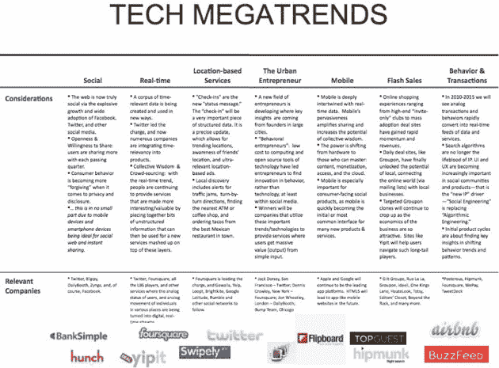

# 罗恩·康韦的机密投资指南:科技大趋势

> 原文：<https://web.archive.org/web/https://techcrunch.com/2010/09/13/ron-conways-confidential-investment-guide-the-tech-megatrends/>

# 罗恩·康韦的机密投资指南:科技大趋势

天使投资人 [SV 天使](https://web.archive.org/web/20230324043930/http://www.crunchbase.com/financial-organization/sv-angel)，在[罗恩·康韦](https://web.archive.org/web/20230324043930/http://www.crunchbase.com/person/ron-conway)的带领下，很早就开始投资初创公司，以至于他在做投资决定时主要看团队和当前的技术趋势。

去年，他专注于实时定位初创公司。今年，根据一份发给 SV 天使投资者的机密报告，他正在关注一系列趋势。

当 SV Angel 考虑投资时，会考虑一家初创公司如何适应这些趋势。这些趋势包括:

*   社会的
*   实时
*   基于位置的服务
*   城市企业家
*   移动的
*   快闪销售
*   行为和交易

我们已经包括了相关幻灯片的截图，点击它查看大图(或点击[此处](https://web.archive.org/web/20230324043930/https://techcrunch.com/wp-content/uploads/2010/09/megatrendss.jpg))。这张幻灯片还包含了每个类别中的创业案例。

最令人着迷的趋势是“城市企业家”——SV Angel 表示，Twitter 和 Foursquare 等初创公司就是这种趋势的代表。报告称:“一个新的企业家领域正在发展，关键的洞察力来自大城市的创始人。”。它补充道，“[技术工具]…已经让企业家找到了行为创新，而不是技术创新，至少在社交媒体中是这样。”