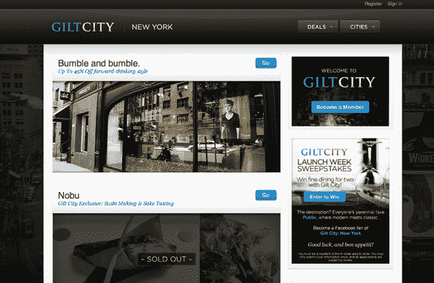

# Gilt City 正式成立，扩展到美国六个城市 TechCrunch

> 原文：<https://web.archive.org/web/https://techcrunch.com/2010/09/14/gilt-city-official-launch/>

# 吉尔特城正式成立，扩展到六个美国城市

Gilt City，奢侈品电子零售商 Gilt Groupe 进军当地交易，在过去一个月左右的时间里，已经悄悄地在全国范围内进行测试版扩张，正如我们在这里写的和[一样。](https://web.archive.org/web/20230213151559/https://techcrunch.com/2010/08/17/gilt-city-sf-la/)今天，flash local deals 网站在波士顿、芝加哥和迈阿密(除了已经上线的纽约、旧金山和洛杉矶之外)正式启动计划。

虽然与 Groupon 处于同一个社交购物空间，但无论有多少人选择加入，Gilt City 的交易都会持续进行。虽然吉尔特本身营造了一种排外的氛围，而且只接受半邀请，但吉尔特城向所有人开放。Gilt City 和 Groupon 的另一个区别？Gilt City 在每个城市开展三次或三次以上的促销活动，活动持续一周左右，或者一直持续到商品售罄。

但和 Groupon 一样，Gilt Groupe 似乎也把目光放在了通过 Gilt City 统治世界上。*“我们从 Gilt 品牌已经建立的本地市场开始，在近期内，我们预计将扩展到与 Gilt 体验式模式相匹配的市场，”*总裁 Nate Richardson 说。

Gilt City 将正式推出旧金山 VIP 梦幻女郎剧院门票、芝加哥公牛队观看门票、纽约 Bumble 和 Bumble 沙龙折扣等优惠(桨板之旅！在迈阿密)。吉尔特城还在每个首发城市举办了一场[脸书竞赛](https://web.archive.org/web/20230213151559/http://apps.facebook.com/giltcity/contests/59362)，粉丝们可以赢得在不同餐馆的双人晚餐，包括旧金山的[云杉](https://web.archive.org/web/20230213151559/http://www.sprucesf.com/)

Gilt 有增长的空间，最近筹集了 8300 万美元的资金，最近一次是去年 5 月的 3500 万美元。未来计划包括 Gilt City iPhone 应用程序和针对 Gilt City 供应商的更多销售分析跟踪。

