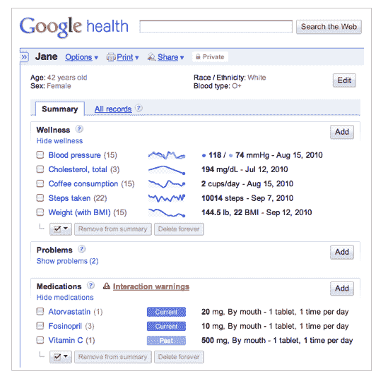

# 谷歌健康进行了健康改造，现已与 Fitbit 和心脏训练器 TechCrunch 整合

> 原文：<https://web.archive.org/web/https://techcrunch.com/2010/09/15/google-health-gets-a-wellness-makeover-now-integrated-with-fitbit-and-cardiotrainer/>

# 谷歌健康得到了健康改造，现在与 Fitbit 和 CardioTrainer 集成

[谷歌健康](https://web.archive.org/web/20221127163908/http://www.google.com/intl/en-US/health/about/)，可以让你在网上的一个地方存储和管理你所有的健康信息，今天得到了[急需的重新设计](https://web.archive.org/web/20221127163908/http://googleblog.blogspot.com/2010/09/google-health-update.html)和功能升级。2008 年[推出](https://web.archive.org/web/20221127163908/https://beta.techcrunch.com/2008/05/19/google-health-a-quick-peek/) Google Health 的谷歌已经与流行的移动健康应用 [CardioTrainer](https://web.archive.org/web/20221127163908/http://www.worksmartlabs.com/cardiotrainer/about.php) 和个人健康监测设备 [Fitbit](https://web.archive.org/web/20221127163908/http://www.crunchbase.com/company/fitbit) 合作，将这些应用程序的数据整合到你的健康档案中。

通过一个新的仪表板，Google Health 现在将在一个地方组织您所有的健康和健康(即健身)信息。新平台将提供你减肥目标进展的图表，你可以为健康问题创建定制的跟踪器，如饮食习惯，日常睡眠，运动频率，怀孕甚至每天喝多少杯咖啡。

此外，您现在可以记录健康状况的健康目标进展。谷歌正在升级谷歌健康的内容整合，允许用户访问用户在其谷歌健康档案中输入的每种医疗状况、药物或实验室结果的内容链接。过去的医疗历史或条件也可以很容易地删除。

谷歌正在与 TechCrunch50 初创公司 Fitbit 合作，该公司开发了一种可穿戴设备，可以捕捉健康和健康数据，如采取的步骤、消耗的卡路里和睡眠质量；和 CardioTrainer，一个跟踪健身活动和减肥的移动应用程序，将这些数据整合到你的谷歌健康档案中。

谷歌表示，在 CardioTrainer 整合上线后的两周内，该应用的开发商 WorkSmart Labs 表示，用户向谷歌健康上传了超过 15 万次锻炼。然后，这些数据可以与用户输入到 Google Health 的医疗数据融合在一起。

当然，Google Health 取得全面成功的关键之一是与保险公司和医院合作，让消费者更容易获得数据。截至去年秋天，谷歌健康仍然需要在美国注册数百家保险公司。今天，谷歌宣布与斯坦福大学 Lucile Packard 儿童医院、匹兹堡大学医疗中心(UPMC)和夏普医疗保健公司建立合作关系。去年，谷歌宣布[与 CVS](https://web.archive.org/web/20221127163908/https://beta.techcrunch.com/2009/04/06/cvs-signs-on-with-google-health-to-offer-comprehensive-pharmacy-history/) 合作，将处方数据导入平台。