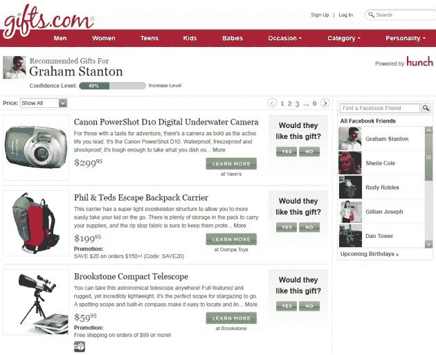

# Hunch 通过 API 导出味道图，商业模式浮出水面 TechCrunch

> 原文：<https://web.archive.org/web/https://techcrunch.com/2010/09/15/hunch-taste-graph-business-model-api/>

# Hunch 通过 API 输出味道图，商业模式出现

推荐引擎 [Hunch](https://web.archive.org/web/20221006181354/http://www.hunch.com/) 正在与七家大型网站展开合作，为他们的产品、服务或内容提供个性化推荐。互动公司的 Gifts.com、Bluefly、Buzzfeed、Heyzap、ShopStyle、Milo 和 FanBridge 是最初的合作伙伴，Hunch 表示不久将宣布更多合作伙伴。

“这些公司要么在 Hunch.com 上开发应用程序，要么在自己的网站上嵌入 Hunch 功能，或者两者兼而有之，”Hunch 说。

Hunch 首席执行官克里斯·迪克森(T4)说，合作伙伴将为我们提供一个全新的 API，向用户展示个性化的推荐。Hunch 网站本身是使用为合作伙伴开发的相同 API 构建的。

这也给了 Hunch 一个潜在的有利可图的收入模式。大多数合作伙伴将使用免费版的推荐引擎，但电子商务网站将分享 Hunch 推荐的购买所产生的收入。

“我们的整个业务都围绕着 API，”Dixon 说。

迪克森说，公司在推出学习模式后的第一年左右，建立数据并寻找联系。现在，他们有足够的数据和 200 亿个“连接”，可以自信地向人们推荐任何东西。今年早些时候，当我采访她的时候，联合创始人 [Caterina Fake](https://web.archive.org/web/20221006181354/http://www.crunchbase.com/person/caterina-fake) 发表了[类似的声明](https://web.archive.org/web/20221006181354/https://beta.techcrunch.com/2010/03/23/a-conversation-with-hunch-cofounder-caterina-fake/)。