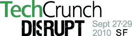

# TechCrunch 扰乱下周:这是 Awesome TechCrunch 的议程

> 原文：<https://web.archive.org/web/https://techcrunch.com/2010/09/20/techcrunch-disrupt-next-week-heres-the-agenda-of-awesome/>

 TechCrunch Disrupt 从今天开始一周。五月，近 2000 人[涌向](https://web.archive.org/web/20221206154046/http://disrupt.beta.techcrunch.com/2010-nyc/)来观看 25 家公司的发布会和令人惊叹的演讲者阵容。下周，该展览将在旧金山举行，为期三天的颠覆性技术盛会门票几乎销售一空。我们刚刚在这里(及以下)发布了活动的议程

25 家新创公司将争夺 5 万美元的现金奖励和([最近被玷污的](https://web.archive.org/web/20221206154046/https://beta.techcrunch.com/2010/09/14/soluto-defiles-the-techcrunch-disrupt-cup/) ) Disrupt 杯。当这些公司没有在几轮演示中争得你死我活时，我们会让世界级的演讲者上台谈论技术的下一步。红杉的迈克尔·莫里茨。凯鹏华盈的约翰·杜尔登。IAC 的巴里·迪勒。惠普的托德·布拉德利。迪格的凯文·罗斯。谷歌的玛丽莎·梅耶尔和布拉德利·霍洛维茨。大卫·司达雷德·霍夫曼。罗恩·康韦。彼得·泰尔。丹·罗森斯维。还有更多。这个清单还在继续。[议程在这里](https://web.archive.org/web/20221206154046/http://disrupt.beta.techcrunch.com/2010-sf/agenda/)。完整的演讲者阵容[在这里](https://web.archive.org/web/20221206154046/http://disrupt.beta.techcrunch.com/2010-sf/speakers/)。

你还会看到谷歌、微软和其他公司发布的一些特别的新产品。

哦，伙计，我们今晚有一些很棒的派对。特别是谷歌风投和 SV Angel 周二晚上将举办一场大型派对，其中包括 MC Hammer 和他的舞者们的表演。媒体圣殿将在周一晚上举办一场派对，邮件黑猩猩在周三也有自己的派对。

TechCrunch Disrupt 将会有重大新闻和重大社交机会。[现在就买票](https://web.archive.org/web/20221206154046/http://disrupt.beta.techcrunch.com/2010-sf/tickets/)。早鸟票价格多一天有效。

**TechCrunch 扰乱议程**

9 月 27 日星期一

9:00-9:10
TechCrunch 的开场白

9:10-9:40
打造互联网宝藏:[约翰·杜尔登](https://web.archive.org/web/20221206154046/http://disrupt.beta.techcrunch.com/2010-sf/speakers/#johndoerr)，[马克平卡斯](https://web.archive.org/web/20221206154046/http://disrupt.beta.techcrunch.com/2010-sf/speakers/#markpincus)，[宾戈登](https://web.archive.org/web/20221206154046/http://disrupt.beta.techcrunch.com/2010-sf/speakers/#binggordan)

9:40-10:10
超级天使 vs 风投:[罗恩·康韦](https://web.archive.org/web/20221206154046/http://disrupt.beta.techcrunch.com/2010-sf/speakers/#ronconway)，[克里斯·萨卡](https://web.archive.org/web/20221206154046/http://disrupt.beta.techcrunch.com/2010-sf/speakers/#chrissacca)，[戴夫·麦克卢尔](https://web.archive.org/web/20221206154046/http://disrupt.beta.techcrunch.com/2010-sf/speakers/#davemcclure)，+无畏风投待定

10:10-10:30
炉边聊天:[雷德·霍夫曼](https://web.archive.org/web/20221206154046/http://disrupt.beta.techcrunch.com/2010-sf/speakers/#reidhoffman) & [大卫·司达](https://web.archive.org/web/20221206154046/http://disrupt.beta.techcrunch.com/2010-sf/speakers/#davidsze)、格雷洛克

10:30-10:40
特殊产品公告

10:40-11:00 休息

11:00-11:10
特殊产品发布

11:10-11:40
炉边谈话:[托德·布拉德利](https://web.archive.org/web/20221206154046/http://disrupt.beta.techcrunch.com/2010-sf/speakers/#toddbradley)，惠普

11:40-12:00
创新文化:[贝丝·康斯托克](https://web.archive.org/web/20221206154046/http://disrupt.beta.techcrunch.com/2010-sf/speakers/#bethcomstock)(通用电气)[斯考特·库克](https://web.archive.org/web/20221206154046/http://disrupt.beta.techcrunch.com/2010-sf/speakers/#scottcook) (Intuit)

12:00-12:30
炉边谈话:[彼得·泰尔](https://web.archive.org/web/20221206154046/http://disrupt.beta.techcrunch.com/2010-sf/speakers/#peterthiel)，创始人基金

中午 12:30-2:00 午餐

2:00-2:15
炉边聊天:[丹·罗森斯维](https://web.archive.org/web/20221206154046/http://www.crunchbase.com/person/dan-rosensweig)，齐格

2:15–3:15
扰乱战场会话 1

3:15–3:30 休息

3:30–4:30
扰乱战场会话 2

4:30–4:45 休息

4:45–5:45
扰乱战场会话 3

9:00–午夜
在媒体圣殿
**庄园西**举办的派对后:加州三藩市哈里森街 750 号，邮编 94107 ( [谷歌地图上的方向](https://web.archive.org/web/20221206154046/http://maps.google.com/maps?hl=en&tab=wl) ) —入场需要会议徽章

9 月 28 日星期二

9:00-9:10
TechCrunch 的开场白

9:10-9:50
上市还是不上市

9:50-10:30
炉边聊天:[迈克尔·莫里茨](https://web.archive.org/web/20221206154046/http://disrupt.beta.techcrunch.com/2010-sf/speakers/#michaelmoritz)(红杉)& [史蒂夫·斯特雷特](https://web.archive.org/web/20221206154046/http://disrupt.beta.techcrunch.com/2010-sf/speakers/#stevestreit)(绿点)

10:30-10:40
特别产品发布

10:40-11:00 休息

11:00-11:30
设计与工程:[查理·契弗](https://web.archive.org/web/20221206154046/http://www.crunchbase.com/person/charlie-cheever) (Quora)、[迈克·斯科洛普夫](https://web.archive.org/web/20221206154046/http://www.crunchbase.com/person/mike-shroepfer)(脸书)、[布拉德利·霍洛维茨](https://web.archive.org/web/20221206154046/http://www.crunchbase.com/person/bradley-horowitz)(谷歌)、[詹森·高德曼](https://web.archive.org/web/20221206154046/http://www.crunchbase.com/person/jason-goldman)(推特)

11:30-12:00
科技界的女性:[劳伦·勒托](https://web.archive.org/web/20221206154046/http://disrupt.beta.techcrunch.com/2010-sf/speakers/#laurenleto)(Bnter)[莱拉·奇拉亚思·贾纳](https://web.archive.org/web/20221206154046/http://disrupt.beta.techcrunch.com/2010-sf/speakers/#leilajanah)(Samasource)[萨拉·奇普斯](https://web.archive.org/web/20221206154046/http://disrupt.beta.techcrunch.com/2010-sf/speakers/#sarachipps)(女孩开发者)[青·巴尼斯特](https://web.archive.org/web/20221206154046/http://www.crunchbase.com/person/cyan-banister)(兹维特)

12:00-12:10

Yammer 新产品发布

12:10-12:30

企业消费化:[乔治·扎卡里](https://web.archive.org/web/20221206154046/http://disrupt.beta.techcrunch.com/2010-sf/speakers/#georgezachary)(查尔斯河风险投资公司)[大卫·萨克斯](https://web.archive.org/web/20221206154046/http://disrupt.beta.techcrunch.com/2010-sf/speakers/#davidsacks)(Yammer)[戴夫·吉鲁阿德](https://web.archive.org/web/20221206154046/http://www.crunchbase.com/person/dave-girouard)(谷歌)[克里斯·迪克森](https://web.archive.org/web/20221206154046/http://www.crunchbase.com/person/chris-dixon)(创始人集体)

中午 12:30-2:00 午餐

2:00–2:15
炉边谈话:[马特·科勒](https://web.archive.org/web/20221206154046/http://disrupt.beta.techcrunch.com/2010-sf/speakers/#mattcohler)，基准资本

2:15–3:15
启动战场会话 4

3:15–3:30 休息

3:30–4:30
启动战场会话 5

4:30–4:45 休息

4:45–5:45
启动战场会话 6

5:45–7:30
Yammer 主办的鸡尾酒会

上午 9:00–12:30
在谷歌风投&天使投资人举办的派对之后

MC 锤子提供的特别娱乐

地点:加利福尼亚州旧金山福尔松街 1015 号，邮编:94103 ( [谷歌地图上的方向](https://web.archive.org/web/20221206154046/http://maps.google.com/maps?hl=en&q=jason+goldberg+twitter&um=1&ie=UTF-8&sa=N&tab=wl) ) —入场需要会议徽章

**9 月 29 日星期三**

9:00-9:05
TechCrunch 的开场白

9:05-9:15
产品发布

9:15-9:35
炉边聊天:[杰夫·韦纳](https://web.archive.org/web/20221206154046/http://disrupt.beta.techcrunch.com/2010-sf/speakers/#jeffweiner)，LinkedIn

9:35-9:45 特殊产品发布

9:45-9:55 特殊产品发布

9:55-10:10 [优素福·迈赫迪](https://web.archive.org/web/20221206154046/http://disrupt.beta.techcrunch.com/2010-sf/speakers/#yusufmehdi)，微软

10:10-10:30 休息

10:30-11:00
炉边谈话:[IAC 的巴里·迪勒](https://web.archive.org/web/20221206154046/http://disrupt.beta.techcrunch.com/2010-sf/speakers/#barrydiller)

11:00-11:30 移动广告:[Zaw Thet](https://web.archive.org/web/20221206154046/http://disrupt.beta.techcrunch.com/2010-sf/speakers/#zawthet)(4INFO)[Mihir Shah](https://web.archive.org/web/20221206154046/http://www.crunchbase.com/person/mihir-shah-2)(Groupon)[John Hadl](https://web.archive.org/web/20221206154046/http://www.crunchbase.com/person/john-hadl)(品牌在手)、

11:30-12:00 新的移动前沿:[克里斯蒂·怀亚特](https://web.archive.org/web/20221206154046/http://disrupt.beta.techcrunch.com/2010-sf/speakers/#christywyatt)(摩托罗拉)[斯科特·汤普森](https://web.archive.org/web/20221206154046/http://disrupt.beta.techcrunch.com/2010-sf/speakers/#scottthompson)(PayPal)[霍尔格·卢多夫](https://web.archive.org/web/20221206154046/http://www.crunchbase.com/person/holger-luedorf) (Foursquare)

12:00-12:30 绿色科技:[凯文·斯基伦](https://web.archive.org/web/20221206154046/http://disrupt.beta.techcrunch.com/2010-sf/speakers/#kevinskillern)，通用电气

中午 12:30-2:00 午餐

2:00–2:15 red beacon 演示

2:15-2:30 炉边聊天:[凯文·罗斯](https://web.archive.org/web/20221206154046/http://www.crunchbase.com/person/kevin-rose)

2:30-3:00 GroupMe 和黑客马拉松黑客

3:00-3:15 特殊产品发布，[玛丽莎·梅耶尔](https://web.archive.org/web/20221206154046/http://disrupt.beta.techcrunch.com/2010-sf/speakers/#marissamayer)，谷歌

3:15–3:30 休息

3:30–5:30
初创战场决赛选手，(评委:[玛丽莎·梅耶尔](https://web.archive.org/web/20221206154046/http://disrupt.beta.techcrunch.com/2010-sf/speakers/#marissamayer)、[罗恩·康韦](https://web.archive.org/web/20221206154046/http://disrupt.beta.techcrunch.com/2010-sf/speakers/#ronconway)、[鲁洛夫·博塔](https://web.archive.org/web/20221206154046/http://disrupt.beta.techcrunch.com/2010-sf/speakers/#roelofbotha)、[詹森·高德曼](https://web.archive.org/web/20221206154046/http://www.crunchbase.com/person/jason-goldman))

5:30–7:00
闭幕鸡尾酒会，由第二市场主办

7:00–7:30
闭幕式
多个奖项，包括 Soluto 颁发的奖杯，以及 TechCrunch 颁发的 5 万美元大奖

9:00–午夜
由 MailChimp
**Mighty** 举办的派对之后:加利福尼亚州旧金山市犹他街 119 号，邮编 94103 ( [方向](https://web.archive.org/web/20221206154046/http://maps.google.com/maps?hl=en&q=jason+goldberg+twitter&um=1&ie=UTF-8&sa=N&tab=wl) ) —入场需要会议徽章