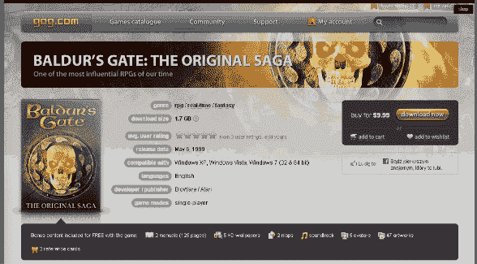

# 优秀的老游戏没有关闭，明天重新推出新游戏中的博德之门| TechCrunch

> 原文：<https://web.archive.org/web/https://techcrunch.com/2010/09/22/good-old-games-not-shutting-down-re-launches-tomorrow-with-baldurs-gate-among-new-games/>

# 不错的老游戏没有关闭，明天重新推出新游戏中的博德之门

好消息和坏消息，伙计们。好消息是:老游戏并没有关闭 T2。坏消息是:显然[文斯·鲁索](https://web.archive.org/web/20230304190134/http://en.wikipedia.org/wiki/Vince_Russo)正在运营网站的公关部门，因为这种“[突然转向](https://web.archive.org/web/20230304190134/http://en.wikipedia.org/wiki/Swerve_(professional_wrestling)#Swerve)”很少被人欣赏。

所以让我们把注意力集中在好消息上，同时承认整个“我们不能再以现在的方式运行了”也许是愚蠢的。

网站[将于明天](https://web.archive.org/web/20230304190134/http://gog.com/)重新上线，它将不再处于测试阶段。耶！它还将重新推出几款新游戏，其中最主要的是《博德之门》。所有那些认为*龙腾世纪:起源*很有趣，但想要“更多”的人，现在你的机会来了。

(考虑到让游戏在现代电脑上以现代分辨率运行是一件多么痛苦的事情，鲍德之门的发布实际上是相当巨大的。我知道:我在夏天从亚马逊购买了 DVD 版本。)

据说该网站的速度快了“十倍”。很好，我想，但是我从来没有发现这个网站很慢。

但是，越快越好。

至于整个“我们正在关闭”的噱头，这里是该网站如何解释自己:

> 首先，我们要向所有因为 GOG.com 的关闭而感到被欺骗或受到伤害的人道歉。作为一家小公司，我们没有庞大的营销预算，这就是为什么我们不能错过一个机会，围绕一个像推出我们网站的全新版本这样大的事件产生一些轰动

你猜怎么着一切都被原谅了。我真诚地怀疑，下周的这个时候(如果不是明天，当它重新启动的时候)，会不会有人在乎这个宣传噱头。

总之:呜呜~！