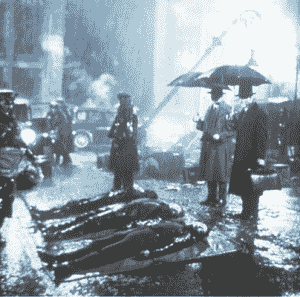

# 从前在美国...一鸣惊人的破产文件| TechCrunch

> 原文：<https://web.archive.org/web/https://techcrunch.com/2010/09/23/blockbuster-goes-bust/>

# 从前在美国…百视达申请破产

这个已经到了[的时候:在美国](https://web.archive.org/web/20230306013417/http://www.prnewswire.com/news-releases/blockbuster-reaches-agreement-on-plan-to-recapitalize-balance-sheet-and-substantially-reduce-its-indebtedness-103606759.html)[网飞](https://web.archive.org/web/20230306013417/http://www.crunchbase.com/company/netflix)和[红盒子](https://web.archive.org/web/20230306013417/http://www.crunchbase.com/company/redbox)的成功已经驱使[大片](https://web.archive.org/web/20230306013417/http://www.blockbuster.com/)如[所料](https://web.archive.org/web/20230306013417/http://online.wsj.com/article/SB10001424052748704129204575506443334512852.html?KEYWORDS=bankruptcy#ixzz10GLB0nbQ)在未能充分和迅速地将其电影租赁模式从实体店面调整到邮购和由上述竞争对手开创的在线技术之后申请破产保护。

该公司今天在纽约的美国破产法院提交了自愿的第 11 章申请，列出了 10.2 亿美元的资产和 14.6 亿美元的债务。根据今天的文件，该公司最大的贸易债权人是二十世纪福克斯家庭娱乐公司，索赔 2160 万美元。

这条新闻最早由彭博报道，距离百视达开设第一家店(1985 年 10 月 26 日，得克萨斯州达拉斯)已经过去了将近 25 年。

百视达的非美国业务及其国内和国际特许经营商，都是法律上独立的实体，不包括在文件中，也不是第 11 章程序的当事方。

百视达在一份声明中表示，它已经与亿万富翁卡尔·伊坎领导的一群债券持有人达成协议，根据一项计划的条款，他们持有其 11 . 75%的优先担保票据的大约 80.1%的本金，以调整其资产负债表的资本结构，并使其财务状况更加强劲。

Blockbuster claims 表示，该计划将大幅降低其债务，从目前的近 10 亿美元降至实施后的约 1 亿美元或更少。

该公司已从高级票据持有人处获得了 1.25 亿美元的新“债务人持有”融资承诺，以帮助其在资本重组过程中的正常过程中履行对客户、供应商和员工的义务。

Blockbuster 表示，其在美国的所有业务，包括商店、DVD 售货亭、电子邮件和数字业务，都是正常开放的，并为客户提供服务，公司照常履行所有订单，包括继续在新品上市的第一天提供服务。

目前，该公司在美国的所有 3000 家商店都将继续营业。然而，如果我是你，我就不太确定你家附近的音像店还能坚持多久。

该公司在加拿大、丹麦、意大利、墨西哥和英国的国际业务也在照常进行——唯一一个被砍掉的国家是阿根廷，百视达称该国的运营现金流持续短缺。