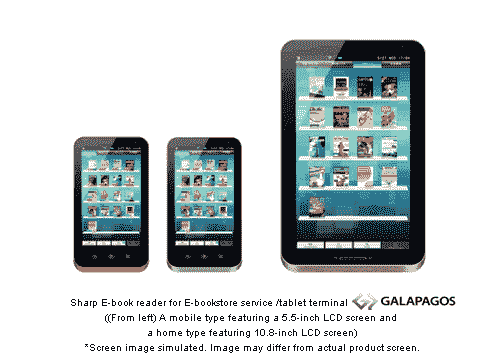
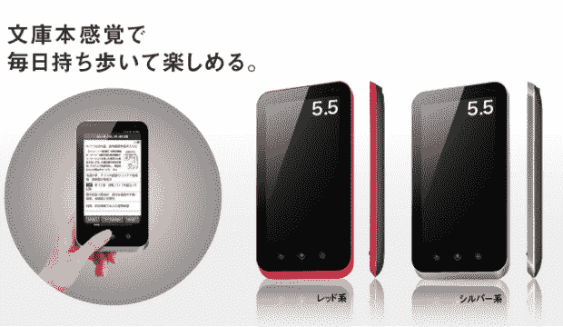
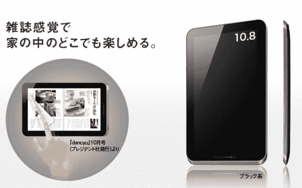

# 加拉帕戈斯:夏普发布 5.5 英寸和 10.8 英寸安卓平板电脑(视频)

> 原文：<https://web.archive.org/web/https://techcrunch.com/2010/09/27/galapagos-sharp-announces-5-5-inch-and-10-8-inch-android-tablets-video/>

# 加拉帕戈斯:夏普宣布 5.5 英寸和 10.8 英寸安卓平板电脑(视频)

他们花了一段时间，但现在看来，夏普对进入电子书和平板电脑业务是认真的。该公司今天在东京【英文新闻稿】宣布了“加拉帕戈斯”，加拉帕戈斯是夏普基于云的电子书服务和两款支持该服务的新 Android 设备的([可怕的](https://web.archive.org/web/20221209141952/http://en.wikipedia.org/wiki/Gal%C3%A1pagos_syndrome))名称。

较小的“移动型”有一个 5.5 英寸的液晶屏幕(1024×600 分辨率)，专门用于显示平装书(它将有红色和黑色两种版本)。它还配有一个轨迹球，可以滚动页面。

另一种型号，加拉帕戈斯“家庭型”，错过了所说的轨迹球(你会像在 iPad 上一样翻页)。它有一个 10.8 英寸的液晶显示屏(1，366 × 800)，用于两页的杂志内容。相比之下，iPad 拥有 9.7 英寸的液晶显示屏，分辨率为 1024×768。

这两款加拉帕戈斯设备都将搭载 Wi-Fi (IEEE 802.11b/g)。买家将可以上网冲浪，查看“PC 文档”，玩游戏(通过应用程序)，并通过预装的“社交应用程序”与其他所有者分享评论和建议。这就是为什么夏普在其日本网站上将这些设备宣传为“媒体平板电脑”——而不仅仅是电子书阅读器。

加拉帕戈斯电子书店服务计划于 12 月在日本启动。夏普说，reader 的购买者在推出时可以期待总共 30，000 份报纸、杂志和书籍。

该公司尚未公布进一步的细节(更多规格(哪个安卓版本？)、价格、确切发布日期、国际可用性)。该公司预计明年将售出约 100 万台。我们会随时通知你。

下面是夏普官方的宣传片视频(是日文的，不过这种情况下没那么重要):
【YouTube = http://www . YouTube . com/watch？v = O0KMJgKETnQ&w = 480&h = 385】