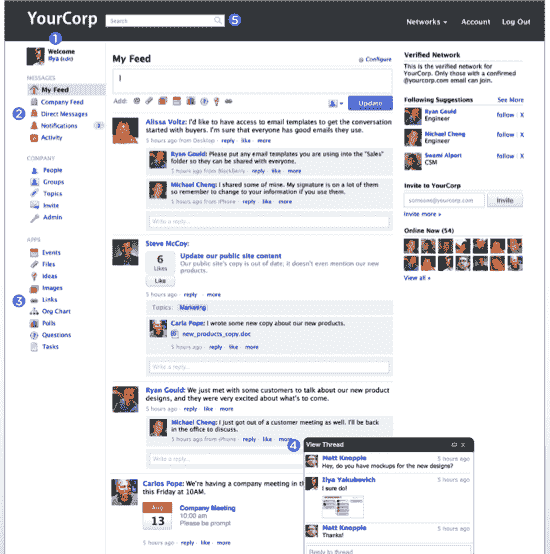

# Yammer 首次推出企业版脸书 TechCrunch

> 原文：<https://web.archive.org/web/https://techcrunch.com/2010/09/28/yammer-debuts-a-facebook-for-the-enterprise/?utm_source=feedburner&utm_medium=feed&utm_campaign=Feed%3A+Techcrunch+%28TechCrunch%29&utm_content=Google+Reader>

# Yammer 为企业首次推出脸书

Yammer，[在 2008 年 TechCrunch 50](https://web.archive.org/web/20221206100040/https://beta.techcrunch.com/2008/09/08/yammer-launches-at-tc50-twitter-for-companies/) 上推出了的“企业 Twitter”[，今天发布了其平台的下一代版本。Yammer 2.0 旨在成为一个成熟的企业社交网络，今天在 TechCrunch Disrupt 上发布。正如我们在新平台的](https://web.archive.org/web/20221206100040/https://beta.techcrunch.com/2008/09/10/yammer-takes-techcrunch50s-top-prize/)[初始评论](https://web.archive.org/web/20221206100040/https://beta.techcrunch.com/2010/09/02/yammer-2-0-to-launch-as-a-powerful-full-fledged-social-network-for-the-enterprise/)中所写的，Yammer 正在向其平台添加许多应用程序，以增加其功能，而不仅仅是一个通信平台。

这些新应用包括投票、聊天、事件、链接、主题、问答、想法等等。一个新的活动源将在他们所有的企业应用程序(包括 Yammer 内外)中聚合关于员工行动的故事，并允许用户关注内容。

理论上类似于 [Google Apps marketplace，](https://web.archive.org/web/20221206100040/https://beta.techcrunch.com/2010/03/09/google-apps-marketplace/) Yammer 让第三方开发者能够销售和创建类似 Yammer 现在将提供的应用程序。例如，一个 Crocodoc 应用程序将允许你突出显示和评论 pdf、Word 文档、图像和其他附加到 Yammer 消息的文件。新的 Zendesk 应用程序将允许用户在 Yammer 信息中附加一张 Zendesk 客户服务票。该公司表示，Box、Expensify 和 Lithium Yammer 应用程序目前正在开发中。

我们在 TechCrunch 内部使用的 Yammer 正在一个充满 Jive、Salesforce 的 Chatter、CubeTree 等竞争对手的领域获得稳定的牵引力。全球有超过 100 万用户和 80，000 家公司在使用 Yammer(其中包括 80%的财富 500 强)。这家初创公司每个季度的收入都翻了一番。

萨克斯认为，这一产品将使通信平台突飞猛进。虽然有些人回避将他们的合作平台作为实际的社交网络，但萨克斯说，创建一个直接面向企业的社交网络的能力是一个脸书大小的机会。有趣的是，Yammer 2.0 看起来和感觉上更像是企业的脸书。这并不是一件坏事——新平台非常容易使用。

