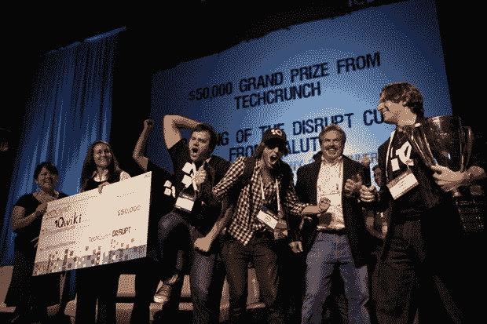
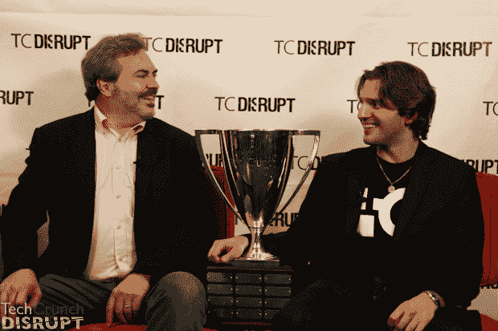
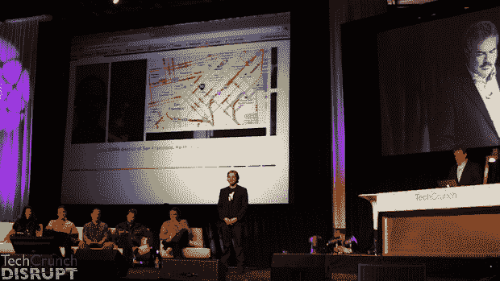

# Qwiki 赢得 TechCrunch Disrupt:信息消费将被打破

> 原文：<https://web.archive.org/web/https://techcrunch.com/2010/09/29/qwiki-techcrunch-disrupt-winner/>

# Qwiki 赢得 TechCrunch Disrupt:信息消费将被颠覆

选票已经统计出来了。评委们也参与进来了。27 家初创公司的战场被削减至最后的精英

[group of seven](https://web.archive.org/web/20230105075931/https://techcrunch.com/2010/09/29/startup-battlefield-the-final-7-make-their-last-stand/)

。现在获胜者已经选出来了:

[**Qwiki**](https://web.archive.org/web/20230105075931/http://www.qwiki.com/) **has taken the top prize at TechCrunch Disrupt San Francisco.**

除了 50，000 美元的大奖之外，该公司刚刚获得了 Disrupt Cup，从 Disrupt NYC 冠军 [Soluto](https://web.archive.org/web/20230105075931/http://www.soluto.com/) 手中接过奖杯。在接过奖杯时，首席执行官道格·因布鲁斯大声说道:“让我们改变世界！”

获得亚军的是 [CloudFlare](https://web.archive.org/web/20230105075931/http://www.cloudflare.com/) 和 [Pinger](https://web.archive.org/web/20230105075931/http://www.pinger.com/) ，两者都令人印象深刻。

Qwiki 通过提供一种新的消费信息的方式超越了其他方式:文本、音频、视频和图像在一个无缝的界面中融合在一起，生成一部你搜索的任何内容的动态电影。这真的像是来自未来的东西，而且只会越来越好。

我们对 Qwiki 的后台采访:

请务必查看我们对这些明星公司的全面报道:

虽然一次只有一家初创公司可以声称拥有 Disrupt Cup 的权利，但这是一个公司非常稳定的领域，我们想重申，这是一场非常激烈的比赛。许多参与创业战场的公司将会做出伟大的事情。

除了 Disrupt Cup，还颁发了一些特殊奖项:

yume for Best Marketing Strategy–check points
Perkins Coie–cloud flare
Greylock Partners 颠覆性产品——q wiki
Greylock Partners 商业模式——Pinger
omid yar Network——Sumazi
Microsoft BizSpark——Badgeville