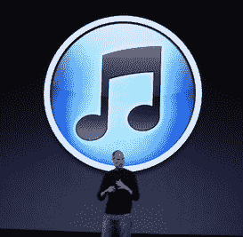

# 告诉你一个秘密——即使整合了脸书，Ping 仍然会是一场灾难

> 原文：<https://web.archive.org/web/https://techcrunch.com/2010/09/30/itunes-ping-is-a-disaster/>

# 告诉你一个秘密——即使与脸书合并，Ping 仍然会是一场灾难

随着苹果公司 [iTunes](https://web.archive.org/web/20221006083522/http://www.crunchbase.com/product/itunes) 软件[Ping](https://web.archive.org/web/20221006083522/http://www.crunchbase.com/product/ping)[部分](https://web.archive.org/web/20221006083522/https://beta.techcrunch.com/2010/09/01/itunes-10-download/)的[推出，](https://web.archive.org/web/20221006083522/http://www.crunchgear.com/2010/09/01/itunes-10-features-new-logo-features/)[说了很多](https://web.archive.org/web/20221006083522/https://beta.techcrunch.com/2010/09/03/ping-ping-ping-ping-ping-ping-ping/)关于苹果进军“社交网络”的事情(至少是他们认为这个术语必然会涉及的事情)。

有些人对它的机会持乐观态度，说它仅仅是即将到来的令人惊奇的事情的种子，其他人则认为它不太可能。

我同意后一种观点，认为这个产品是马粪，[1.6 亿潜在用户见鬼去吧。](https://web.archive.org/web/20221006083522/https://beta.techcrunch.com/2010/09/01/itunes-ping/)

是的，他们最近增加了喜欢/分享你过去已经购买的歌曲的功能，确实使它变得更好。

但这只是告诉我在那之前它有多糟糕(我实际上非常肯定，苹果公司的一些人因为没有从一开始就在用户现有的 iTunes 库中添加对 Ping 的支持而被踩了一脚——至少我应该希望如此)。

在我看来，这仍然是一个没有人期待的功能。

是的，你会说，但是如果脸书和苹果没有联合[在](https://web.archive.org/web/20221006083522/https://beta.techcrunch.com/2010/09/02/itunes-ping-facebook/)[最后一分钟](https://web.archive.org/web/20221006083522/https://beta.techcrunch.com/2010/09/02/its-complicated/)拔掉脸书整合的插头，我会看得更清楚。多亏了脸书，一旦你可以和你真正的朋友联系，在 Ping 内外传递音乐推荐和分享购买信息，我就会意识到这有多棒。

好吧，我说它不会让产品变得不那么糟糕，而且一旦它最终以某种方式实现，它也不会(脸书的 CTO 是[【非常有信心】](https://web.archive.org/web/20221006083522/http://www.businessinsider.com/facebook-cto-very-confident-facebook-and-apple-work-together-on-ping-2010-9)显然它会)。

如果事实证明，平安需要在与脸书的整合中大放异彩，我会很高兴地坚持自己的观点，但我对这种情况很快发生的可能性坚决持悲观态度。

不要误解我的意思:Ping *需要*脸书集成来使它更有用，或者更有趣。但一点点有用或有趣并不是人们想要的——有太多更好的音乐发现和相关的社交网络服务，由于 iTunes 的成功，Ping 唯一的目标是其潜在的观众。但是纯粹作为一个产品，它现在很糟糕(特别是在桌面上)，人们也意识到了这一点。

Ping 首次亮相已经一个月了。毫无疑问，你已经一起检查了。你已经开始关注你的一些朋友，甚至一些艺术家，甚至有人开始关注你。但是从那以后你真的经常使用这个产品吗？有没有因为它发现了很多音乐？你和你追随的人有过有效的联系吗，更不用说和在网站上推销商品的艺术家了？

我根本看不到当脸书一体化有朝一日开花结果时，这种情况会发生任何根本性的变化。

在其首次亮相时，乔布斯谈到了 Ping，大意是“脸书和 Twitter 遇到了 iTunes”。但这不是脸书，也不是推特。”他对第二部分的看法完全正确。完全没有脸书或推特元素；只有 iTunes 出现在他提到的那个派对上。

因此，它不是一个非常活泼的。