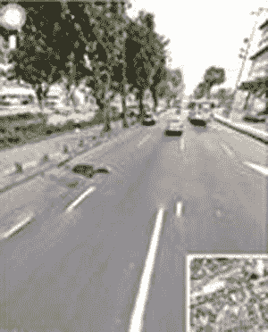

# 巴西谷歌街景首次亮相拍摄的尸体 TechCrunch

> 原文：<https://web.archive.org/web/https://techcrunch.com/2010/10/01/google-street-view-brazil/?utm_source=feedburner&utm_medium=feed&utm_campaign=Feed:+Techcrunch+(TechCrunch>)

# 巴西谷歌街景首次亮相捕捉到的尸体

巴西已经有相对高比例的谷歌数据删除请求，正在经历[一些与昨天推出的谷歌街景相关的挫折](https://web.archive.org/web/20221208025648/https://beta.techcrunch.com/2010/09/30/landfail/)，包括发现不是一张而是两张尸体的图像，特别是左边的照片在里约热内卢的 Avenida Presidente Vargas 拍摄，另一张[据报道](https://web.archive.org/web/20221208025648/http://www.gizmodo.com.br/conteudo/google-street-view-captura-o-que-nao-gostariamos-de-ver)在米纳斯吉拉斯的 Belo Horizonte 拍摄。

据 [G1 报道，](https://web.archive.org/web/20221208025648/http://g1.globo.com/tecnologia/noticia/2010/09/google-diz-que-vai-retirar-imagem-de-corpo-flagrada-por-street-view-no-rj.html)谷歌已经删除了巴西图片，并指示其他人在街景上发现不适当的内容，通过页面底部的“报告问题”链接向谷歌报告。

也许这个令人不安的问题的一个解释是巴西的高谋杀率，每年每 10 万公民中有 25.2 起故意杀人案。

在此之前，最著名的[“街景尸体”](https://web.archive.org/web/20221208025648/http://news.cnet.com/8301-17852_3-20013500-71.html)故事发生在英国，有一个美好的结局，有问题的尸体属于一个恶作剧的小女孩。

你可以在这里查看[图像的特写](https://web.archive.org/web/20221208025648/http://g1.globo.com/tecnologia/noticia/2010/09/google-diz-que-vai-retirar-imagem-de-corpo-flagrada-por-street-view-no-rj.html)。[警告，不适用于心脏衰弱者]

照片:[科雷罗巴西](https://web.archive.org/web/20221208025648/http://www.correiobraziliense.com.br/app/noticia182/2010/10/01/brasil,i=215838/NO+BRASIL+STREET+VIEW+ESTREIA+COM+CADAVERES.shtml)