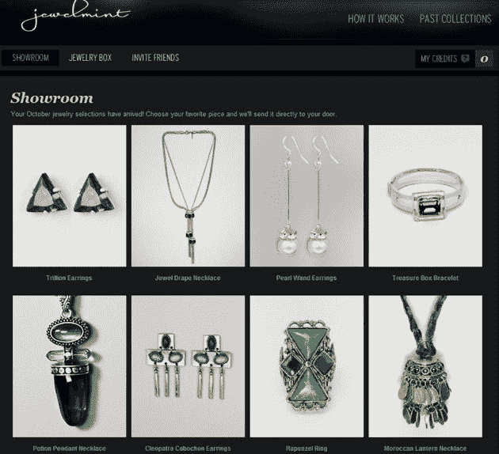

# BeachMint 与凯特·波茨沃斯合作推出首个垂直产品:JewelMint TechCrunch

> 原文：<https://web.archive.org/web/http://techcrunch.com/2010/10/04/beachmint-teams-with-kate-bosworth-to-launch-first-vertical-jewelmint/>

# BeachMint 与凯特·波茨沃斯合作推出第一款垂直产品:JewelMint

 在过去的六个月里，我们一直在跟踪 BeachMint 的进展，这是一家由[迭戈·伯达金](https://web.archive.org/web/20230208090022/http://www.crunchbase.com/person/diego-berdakin)和 MySpace 联合创始人[约什·伯曼](https://web.archive.org/web/20230208090022/http://www.crunchbase.com/person/josh-berman)创办的公司，他们曾一起领导新闻集团孵化器 Slingshot Labs。6 月，两人完成了 BeachMint 的一轮 500 万美元的融资，但拒绝透露更多细节，只说他们的目标是在社交商务领域掀起波澜。今天，我们对他们的所作所为有了更好的了解:BeachMint 刚刚推出了它的第一个购物网站，一家名为 [JewelMint](https://web.archive.org/web/20230208090022/http://www.jewelmint.com/) 的珠宝店，它还会有更多的网站。

该网站最大的吸引力在于明星效应:JewelMint 上的每件珠宝都是由女演员凯特·波茨沃斯和她的造型师切尔·库尔特设计的。注册该网站，每月一次，你将能够从该网站独家提供的少量 Bosworth/Coulter 设计的适合你口味的作品中进行选择，每件售价 29.99 美元。如果你曾经用过[shoedazze](https://web.archive.org/web/20230208090022/http://www.shoedazzle.com/)，那么 JewelMint 的模式听起来会很耳熟(shoedazze 的名人靠山是金·卡戴珊)。对于那些还没有这样做的人，下面是它的工作方式:

首次浏览 JewelMint 后，您将被要求完成一个测验，以建立您的“风格档案”。然后你会被要求输入你的信用卡信息(实际上直到你第一次购买时才收费)，并看到一些珠宝。购买一个，你就会注册该计划——每月一次，你将被收取 29.99 美元，你将收到一个“信用”，可用于在网站上购买一件珠宝。问题是，你只能看到根据你的喜好推荐的一小部分商品——你不能像在亚马逊上那样浏览整个目录。如果你一个月没有看到任何你喜欢的东西，你可以跳过它，等到下个月(如果你决定跳过一个月，你不会被收取 29.99 美元的费用)。

这种“推送购物”对 ShoeDazzle 来说非常成功，BeachMint 希望在未来几个月内将这种模式扩展到更多的垂直行业。但在这方面，它并不孤单:ShoeDazzle 本身刚刚筹集了 1300 万美元的资金，已经在销售鞋子、手袋和珠宝，几乎可以肯定的是，它还将扩展到更多的垂直领域。

