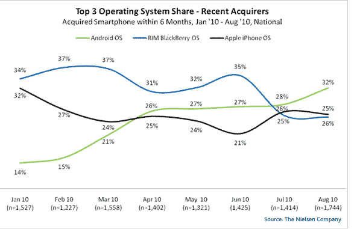
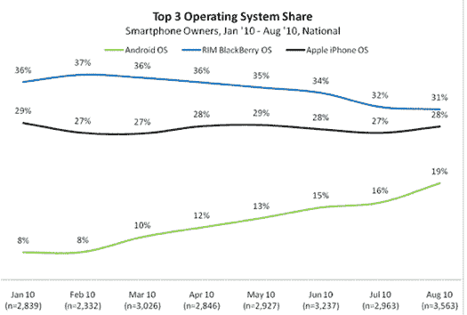

# 尼尔森:32%的新智能手机用户选择安卓手机 TechCrunch

> 原文：<https://web.archive.org/web/https://techcrunch.com/2010/10/05/nielsen-32-percent-of-new-smartphone-owners-choose-android-phones/>

# 尼尔森:32%的新智能手机用户选择安卓手机

根据尼尔森公司[八月数据](https://web.archive.org/web/20221207105758/http://blog.nielsen.com/nielsenwire/online_mobile/android-most-popular-operating-system-in-u-s-among-recent-smartphone-buyers/)显示，Android 已经超过 iPhone 和黑莓，成为过去六个月购买智能手机的人最受欢迎的操作系统。在过去的六个月里，32%的新智能手机用户选择了安卓操作系统的手机，25%选择了 iPhone OS，26%选择了 RIM 的黑莓智能手机。

该数据涵盖了 iPhone 4 上市一整月的时间，还显示黑莓仍然占据智能手机市场的最大份额，占 31%。28%的智能手机用户拥有苹果 iPhones，相比之下，19%的用户拥有安卓设备。

虽然消费者对 Android 手机的兴趣可能达到了顶峰，但根据[尼尔森 6 月份的调查结果，苹果 iPhone 的市场份额保持稳定。](https://web.archive.org/web/20221207105758/http://www.eweek.com/c/a/Mobile-and-Wireless/Android-Phone-Users-More-Willing-to-Switch-to-IPhone-Finds-Nielsen158224/)虽然苹果的市场份额仍然比安卓手机高出很多(10 个百分点)，但令人印象深刻的是，在新的兴趣和最近的采用率方面，安卓正在超过 iPhone。

