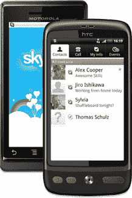

# Skype For Android 已经推出，可以通过 WiFi 和 3G 使用(美国、中国和日本除外)

> 原文：<https://web.archive.org/web/https://techcrunch.com/2010/10/05/skype-for-android-is-here-its-free-and-works-over-wifi-and-3g/>

# Skype For Android 已经推出，可以通过 WiFi 和 3G 使用(美国、中国和日本除外)

虽然花了一段时间，但是 [Skype](https://web.archive.org/web/20221208235959/http://www.crunchbase.com/company/skype) 现在[发布了](https://web.archive.org/web/20221208235959/http://blogs.skype.com/en/2010/10/android.html)一款用于 [Android](https://web.archive.org/web/20221208235959/http://www.crunchbase.com/company/android) 智能手机的应用程序，使用户能够与其他 Skype 用户免费通话，发送和接收即时消息，一对一或与一群人通话。这款安卓应用可以在 WiFi、3G、EDGE 和 GPRS 上运行，而且价格无可匹敌——免费。

大警告:在美国，你只能通过 WiFi 打电话，这款应用在中国和日本的安卓市场上不可用。去年二月，Skype [与威瑞森](https://web.archive.org/web/20221208235959/https://beta.techcrunch.com/2010/02/16/verizon-skype/)[联手推出 Skype Mobile，包括安卓手机，](https://web.archive.org/web/20221208235959/http://www.crunchbase.com/company/verizon)[专门面向美国运营商的客户。](https://web.archive.org/web/20221208235959/http://www.mobilecrunch.com/2010/03/24/skype-on-verizon-launching-on-thursday/)

还值得注意的是，三星 Galaxy S 的 Skype Mobile 存在已知问题，该公司表示正在调查。

除了你需要一部安装了 Android 2.1 或更高版本的手机才能下载这个应用程序，你可以从 Android Market 或从你的手机访问[Skype.com/m](https://web.archive.org/web/20221208235959/http://skype.com/m?cm_mmc=m181)之外，没有什么要补充的了。

Skype 现在可以在三个最受欢迎的移动平台上使用:Android、 [iOS](https://web.archive.org/web/20221208235959/https://beta.techcrunch.com/2010/07/21/skype-with-multitasking-support-now-available-for-iphone-4-and-3gs-3g-calls-to-stay-free/) 和 [Symbian](https://web.archive.org/web/20221208235959/https://beta.techcrunch.com/2010/03/03/skype-app-hits-ovi-store-and-potentially-200-million-nokia-handsets-next/) 。

值得注意的是: [Fring](https://web.archive.org/web/20221208235959/http://www.crunchbase.com/company/fring) 昨天宣布了其 [FringOut](https://web.archive.org/web/20221208235959/http://www.fring.com/fringout/) 程序的 [Android 版本](https://web.archive.org/web/20221208235959/http://thenextweb.com/apps/2010/10/05/fring-is-now-on-android-fringout-takes-on-skype-at-01-per-minute/)，用户可以通过任何数据连接(WiFi、3G 和 4G)以每分钟 0.01 美元的价格打电话。

不管你更喜欢哪种服务，到目前为止，对 Android 用户来说，这是很好的一周。

顺便说一下:Skype 昨天宣布任命新的首席执行官，[托尼·贝茨](https://web.archive.org/web/20221208235959/http://www.crunchbase.com/person/tony-bates)，思科高级副总裁——该公司[已于去年 8 月申请上市](https://web.archive.org/web/20221208235959/https://beta.techcrunch.com/2010/08/09/skype-ipo/)。

【YouTube = http://www . YouTube . com/watch？v = nyvyjjes 1 _ w & w = 640 & h = 400 & fs = 1 & HL = en _ US]