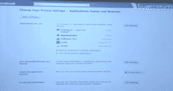

# 脸书为您的互联应用推出仪表盘 TechCrunch

> 原文：<https://web.archive.org/web/https://techcrunch.com/2010/10/06/facebook-launches-a-dashboard-for-your-connected-apps/?utm_source=feedburner&utm_medium=feed&utm_campaign=Feed%3A+Techcrunch+%28TechCrunch%29&utm_content=Netvibes>

# 脸书为你的联网应用推出了一个仪表盘

今天，在脸书的[产品发布会上，](https://web.archive.org/web/20221005151331/https://beta.techcrunch.com/2010/10/06/live-from-todays-special-facebook-event/)创始人兼首席执行官马克·扎克伯格宣布了一个新的用户仪表盘，让脸书会员可以看到他们允许多少网站和应用程序通过网络和脸书连接访问他们的个人数据。

这其实是个绝妙的主意。有超过 100 万个网站使用脸书连接和数十万个脸书应用程序，很容易忘记应用程序可以访问哪些个人信息。

仪表板将在您的隐私设置中提供，它显示三条主要信息。首先，dashbaord 显示了应用程序在您的社交图中可以访问的权限。其次，仪表板将允许您管理应用程序在一段时间内拥有的权限，因此您可以限制应用程序访问您的某些信息或限制操作(例如，在您的墙上张贴)。最后，仪表板将向您显示每个应用程序正在使用的 API 调用的详细访问日志。

例如，您可以限制应用程序在您的墙上发布信息。或者您可以从仪表板中完全删除某个应用程序。随着社交网络上对隐私的高度关注，让用户能够控制脸书应用程序访问的个人信息的仪表板无疑将成为一个受欢迎的功能。