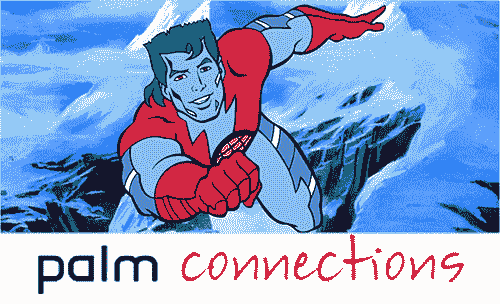

# Palm 向“公益事业”| TechCrunch 赠送了 500 部 Pre Plus 手机和 15 万美元的服务

> 原文：<https://web.archive.org/web/https://techcrunch.com/2010/10/06/palm-gives-away-500-pre-plus-phones-and-150000-of-service-to-good-causes/>

# Palm 向“公益事业”赠送了 500 部 Pre Plus 手机和 15 万美元的服务

我不经常写明显的公关举措，但当它们主要是为了让世界变得更美好时，我会忍气吞声，提一提。至少，它可能会激励另一家公司去做好事。就像我蹩脚的向前播放的小版本。

手掌。也许你知道他们是昔日的 PDA 建筑巨人；也许你知道他们是一家不被看好的硬件公司，他们不能制造出完美的设备。不管你叫他们什么，他们有了一个新的徽章:慈善者。

在过去的几周里，Palm 一直在悄悄地启动他们所谓的“ [Palm Connections](https://web.archive.org/web/20230223191745/http://www.palmconnections.com/) ”计划，其中他们将分发大约 500 部 Pre Plus 手机(以及每部手机 300 美元的威瑞森服务),给那些努力支持慈善机构、生态企业家、可持续发展倡导者和其他“公益事业”的人们。他们说，他们的目标是帮助这些行善者相互联系，并“与网络世界同步，讲述他们的故事。”

换句话说，Palm 正在努力成为行星队长，他们正在发放 Pre Pluses，而不是令人敬畏的小戒指。