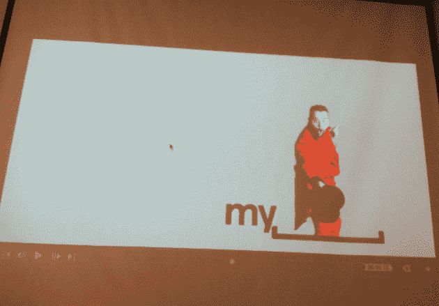
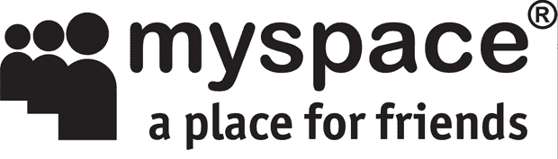
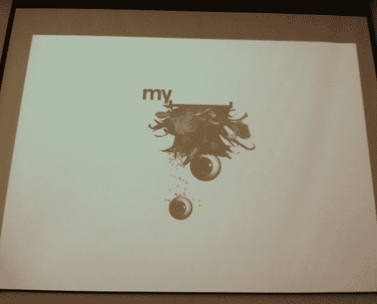

# MySpace 推出新的艺术标志

> 原文：<https://web.archive.org/web/https://techcrunch.com/2010/10/08/new-myspace-logo/>

# MySpace 推出新的艺术标志

如果你最近一直在关注新闻，你可能已经意识到标志重新设计是一件大事。今天在三藩市的[暖枪设计](https://web.archive.org/web/20230326195014/http://www.warmgun.com/)会议上，太多设计/用户体验笑话的屁股提到了社交网站 [MySpace](https://web.archive.org/web/20230326195014/http://myspace.com/) 发布了他们的新标志，听着，Helvetica 的单词“我的”,然后是一个描绘空间的符号。

MySpace 用户体验副总裁 [Mike Macadaan](https://web.archive.org/web/20230326195014/http://www.crunchbase.com/person/mike-macadaan) 解释了其背后的理念*“MySpace 是一个平台，人们可以随心所欲，所以我们决定给他们空间去做。”*显然，当用户将鼠标悬停在重新设计的网站上时，左侧的空白区域将被用户生成的作品填充，如下所示:

如果说 [iTunes 10](https://web.archive.org/web/20230326195014/https://techcrunch.com/2010/09/03/haters-gonna-hate/) logo 和 [Gap logo](https://web.archive.org/web/20230326195014/https://techcrunch.com/2010/10/08/generation-gap/) 惨败教会了我们什么，那就是人们讨厌 logo 的变化，所以人们不可避免地会讨厌这个(我已经等不及这篇帖子的评论部分了)。

但是，平心而论，新标志的艺术学院抽象性和 UGC 元素比旧标志的[人体蜈蚣](https://web.archive.org/web/20230326195014/http://www.imdb.com/title/tt1467304/)+Arial“myspace”的平淡无奇要好(见上文)，而且从 Macadaan 的演示来看，一旦 MySpace 的重新设计在今年年底推出，它将具有一些类似谷歌涂鸦的交互功能。

【YouTube = http://www . YouTube . com/watch？v=2Jp4Nz5iN0Y&w=630]

无论如何，请把你不可避免的重新设计建议写在评论里，或者如果你愿意的话，写在 [Dribbble](https://web.archive.org/web/20230326195014/http://dribbble.com/) 上。

