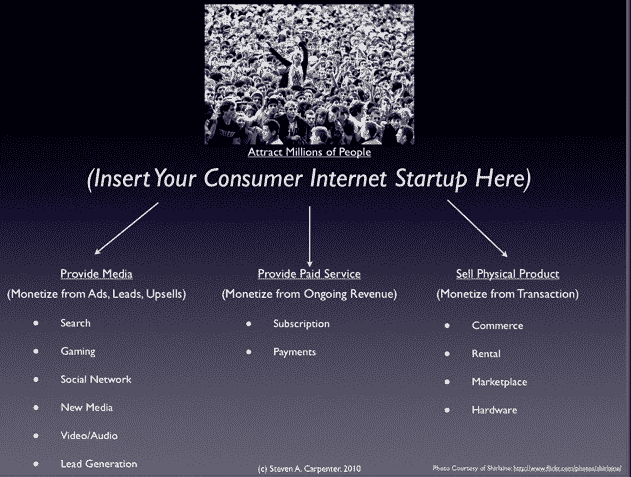
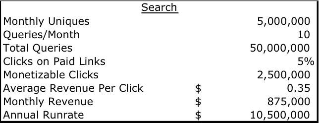
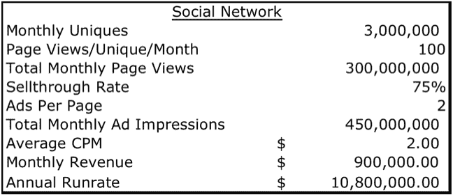

# TC 拆卸:获得 1000 万美元收入的 13 种方法(第一部分)

> 原文：<https://web.archive.org/web/https://techcrunch.com/2010/10/10/teardown-13-ways-10-million-revenues/>

在上个月的 [TechCrunch 扰乱](https://web.archive.org/web/20221231063659/https://techcrunch.com/2010/10/03/from-aol-to-qwiki-the-definitive-guide-to-techcrunch-disrupt-in-100-videos-tctv/)之后，为了给流行的“精益创业”客户开发方法提供一个商业伙伴，这个 TC 拆解的重点不是一个特定的公司如何赚钱，而是试图提供一个消费互联网创业公司试图赚钱的主要一般方式的细分。把它看作是互联网商业模式的指南。如果你目前正在考虑或正在发展自己的消费者创业想法，这些关键的商业模式将有助于你了解如何实现 1000 万美元的收入(假设你有一个市场想要的好产品)。

(在你评论你的初创公司有多独特之前，这个列表并不意味着囊括了所有消费者业务的排列。总会有例外。此外，像 [Zynga](https://web.archive.org/web/20221231063659/https://techcrunch.com/2010/05/13/zynga-teardown/) 、 [Groupon](https://web.archive.org/web/20221231063659/https://techcrunch.com/2010/05/02/teardown-groupon/) 、脸书、Twitter 和 Foursquare 等脱离出来的公司不可避免地会给现有模式带来细微差别。)

你可以从三大类来思考消费互联网公司。以下三类消费互联网初创公司和 13 种典型的商业模式应该让你对你在 TechCrunch 上听到和读到的 95%的消费互联网初创公司的主要驱动力有一个基本的了解。最好的消费者投资者对这些指标非常熟悉，所以在与他们见面之前，确保你知道你在做什么生意，以及你如何达到 1000 万美元。

我想传达的两个要点是:1)每种消费者互联网创业公司赚钱所需的活动是不同的，2)这些活动不难理解。

目前还没有一个好的资源来揭开各种消费者互联网商业模式的神秘面纱。在我努力将这些简化为基本要素的过程中，我知道我可能忽略了一些显而易见的东西。请随时评论或发邮件给我，让我知道我可能忽略了什么，或者介绍你对其中一个模型的真正独特的看法，以便我可以更新这篇文章，并对其他人有用。您还可以在此查看、下载和使用以下每个财务模型[。](https://web.archive.org/web/20221231063659/https://spreadsheets0.google.com/ccc?key=t0ilOUOas7dP6ytvxneKzLA&hl=en#gid=1)

**消费者互联网公司赚钱的三种主要方式**

作为一家消费互联网公司，你试图通过提供以下三种产品中的一种(或多种)来吸引足够多的潜在客户:1)媒体，2)优质服务，或 3)获得实物商品。这些并不相互排斥——一个创业公司可以从不止一个来源获得收入。例如，许多媒体公司从广告和付费服务中赚钱，比如 LinkedIn。

**1。媒体:**

如果你是一家媒体公司，你提供免费内容并收集购买意向，这样你就可以销售广告，向你的受众发送可能感兴趣的产品或服务，和/或追加销售订阅或数字产品。这一类别包括很大比例的消费者互联网创业公司，因为创业成本通常是最低的。正如之前多次说过的那样，这类公司起步成本低廉，但要形成规模，成本高昂。代表性的媒体初创公司是那些在搜索、游戏、社交网络、新媒体、视频和音频领域创建应用程序的公司，以及领先一代公司。

**2。付费服务:**

如果你提供付费服务，你就要尽可能地吸引更多的潜在消费者，让他们为你的服务付费，然后尽可能长时间地让他们成为付费用户。这个领域的大多数初创公司都遵循“免费增值”策略，免费提供一些内容或基本服务，希望将一小部分免费用户转化为付费用户。“免费增值”绝不是获得客户的唯一方式，但它通常是最具成本效益的方式，尤其是如果服务是建立在廉价制作的媒体或第三方基础设施提供商(如亚马逊的 S3)之上，并且服务一个新客户的可变成本是最小的。

支付和金融服务公司包括在内，因为它们免费或收费提供一些服务，并从每笔交易中收取一小部分费用。代表性的初创公司是创建高级订阅服务的公司、新银行或投资公司以及支付公司。这些类型的公司通常比媒体创业公司需要更多的资金来启动，但可能不需要那么多来扩大规模，因为他们可以利用消费者支付的现金。

**3。实体商业:**

如果你销售的产品是通过仓库完成的，可以通过 UPS 发送，或者是可以用来在现实世界中购买商品和服务的优惠券，那么你就是在经营一家商业公司。这些初创公司为每笔交易创造收入，需要围绕仓储业务、退货和客户服务的效率，以及销售和营销支出的金额进行规范。

**13 种消费互联网商业模式**

下面你可以看到一个图表，描述了 13 种消费者互联网业务模式(带示例)，每种模式的 3 或 4 个关键盈利驱动因素，以及公司要达到 1000 万美元的年收入运营率需要达到的规模。当然，这些类别的公司需要做好许多活动，但这些是建立可持续业务的最重要的驱动力。

这 13 种消费者创业公司是(排名不分先后):

1.  搜索
2.  赌博
3.  社交网络
4.  新媒体
5.  市场
6.  录像
7.  贸易
8.  零售
9.  签署
10.  音乐
11.  线索挖掘
12.  五金器具
13.  支付

下面是前四种公司类型的简要概述，以及相应的小型商业模式，这样你就可以看到关键驱动因素是如何工作的。其余的商业模型将在第二部分中出现。

**类型 1:搜索**

作为一家搜索公司，你试图尽可能广泛地接触寻找产品和服务的消费者。你生成的查询越多，用户就越有可能点击你的付费链接。这类公司的关键指标是:

*   每月唯一
*   每月查询次数
*   点击付费链接的用户百分比
*   每次点击收入

这些指标是相互依赖的，因此，举例来说，你每个月需要的唯一性数量将在很大程度上取决于你能获得的平均每次点击收入。对于一家 5%的搜索者点击付费链接，平均每次点击收费 0.35 美元的公司来说，该公司需要每月有 250 万次可变现的点击，才能获得 1000 万美元的收入。Hunch 是一个很好的例子，它将传统搜索的元素与一种新型服务相结合，在这种情况下是一种个性化引擎，以提供更准确的产品推荐，因此，有望实现更高的转化率和更好的每次点击收入。

**类型 2:游戏**

正如我在休闲社交游戏初创公司 Zynga 的[分拆中详细写的那样，在线游戏公司通过休闲游戏、幻想角色扮演游戏、虚拟世界和手机游戏创造娱乐。这个想法是围绕一个概念创造核心知识产权，免费提供游戏组合，然后追加销售一定比例的用户来购买虚拟商品。该业务的主要驱动因素是:](https://web.archive.org/web/20221231063659/https://techcrunch.com/2010/05/13/zynga-teardown/)

*   月/日平均用户数
*   付费用户的转换率(通常为 1%-2%)
*   平均每月花费

由于这是一个批量业务，游戏公司需要达到至少 500 万月平均用户才有机会达到 1000 万美元的收入。通过最后一种方式，社交游戏公司，如 [Zynga](https://web.archive.org/web/20221231063659/http://www.zynga.com/) 和 [Nexon](https://web.archive.org/web/20221231063659/http://www.nexon.net/) ，将传统媒体的元素与商业结合起来，用数字产品取代实物产品。

**类型 3:社交网络**

围绕共同经历或共同兴趣创建媒体的初创公司通常通过广告和赞助赚钱，偶尔也通过优质服务赚钱。作为一家新媒体公司，像 [MyYearbook](https://web.archive.org/web/20221231063659/http://www.myyearbook.com/) (初中生)或 [Dogster](https://web.archive.org/web/20221231063659/http://www.dogster.com/) (宠物爱好者)这样的社交网络关心他们一个月吸引了多少独立访客，他们能够展示多少广告印象，他们能够出售多少库存，以及广告客户将支付的平均费率。一般来说，社交网络越专注于特定的垂直领域，CPM 率就越高。一家初创公司需要几百万用户和高重复使用率来抵消通常较低的 CPM 媒体购买量。

*   独特的访问者
*   广告印象
*   销售率(即，你的存货售出的百分比)
*   每千成本（cost per mille）

**类型四:“新媒体”平台**

在所有创业类型中，最难定义，也最难预测其最终成功的是新媒体平台公司，它们围绕新技术实现的体验创造内容。许多这样的公司通常被认为是社交网络。但脸书、Twitter 和 Foursquare 都是要求消费者改变当前行为、以新方式消费媒体的创业公司的例子。对脸书来说，它提供了一种与我们的社交网络保持同步的新方式；对 Twitter 来说，它提供了一种与新闻人物和时事直接互动的方式；对 Foursquare 来说，它提供了一种及时了解朋友和家人行踪的方式。

*   唯一用户
*   行动(例如，推文、签到)
*   百分比货币化
*   每千成本（cost per mille）
*   官方认可的专业会计师组织的成员

这里的关键指标是你的服务可以吸引多少人(包括创建内容和消费内容)，你可以说服多少人改变他们的行为来创建新内容(状态更新、推文、签到)，以及你可以在这种新形式中赚钱的百分比。这些公司的伟大之处在于，如果你能说服人们使用这些新工具并消费这些内容，你很可能会拥有一个快速增长的业务，用很少的资本轻松超过 1000 万美元。面临的挑战是，这些公司通常是受打击驱动、赢家通吃的企业，需要大量资本来扩大规模。你可能需要说服媒体策划人和广告商，让他们相信创造一种新的广告形式是值得的。

***编者按**:撰稿人[史蒂文·卡彭特](https://web.archive.org/web/20221231063659/http://www.crunchbase.com/person/steven-carpenter)定期撰写 TC 拆机专栏。他是 [Cake Financial](https://web.archive.org/web/20221231063659/http://www.crunchbase.com/company/cakefinancial) 的创始人兼首席执行官，该公司今年早些时候被[出售给 E*Trade](https://web.archive.org/web/20221231063659/https://techcrunch.com/2010/01/14/cake-financial-acquired-etrade/) 。他的最后一篇客座博文是关于团购网站 Groupon 的解散。*