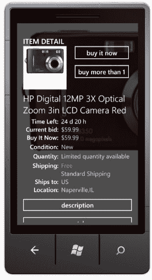
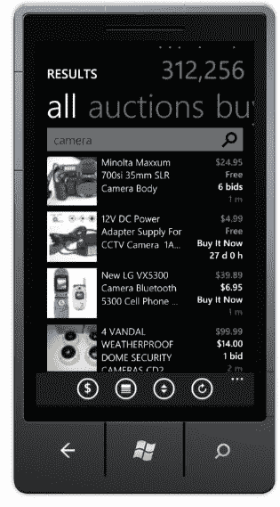

# 易贝应用在 Windows Phone 7 上大受欢迎，现在有了待办事项列表和保存的搜索 TechCrunch

> 原文：<https://web.archive.org/web/https://techcrunch.com/2010/10/11/ebay-app-goes-metro-on-windows-phone-7-now-with-to-do-lists-and-saved-searches/>

# 易贝应用程序在 Windows Phone 7 上运行，现在有了待办事项列表和保存的搜索

随着本周发布的[微软的](https://web.archive.org/web/20221208141834/http://www.crunchbase.com/company/microsoft) [Windows Phone 7](https://web.archive.org/web/20221208141834/http://www.crunchbase.com/product/windows-phone-7) ，[易贝](https://web.archive.org/web/20221208141834/http://www.ebay.com/)借此机会推出其平台旗舰应用。[易贝的](https://web.archive.org/web/20221208141834/http://www.crunchbase.com/company/ebay)微软友好版本加载了许多 iPhone 和 Android 应用程序的基本功能，但你会注意到一些新的选项和显著不同的审美(反映了新的 Windows Phone 7 环境)。

毫不奇怪，你将能够在拍卖市场搜索、出价和“立即购买”商品，并选择推送通知来帮助你跟踪你的出价。新应用有什么不同？易贝将首次允许用户保存搜索并创建待办事项列表，以帮助管理交易和支付。该应用程序还会为你区分列表的优先级，将最具时效性的操作放在最前面。

虽然这些功能对铁杆易贝迷来说是加分项，但对普通用户来说，真正的区别在于设计。据易贝移动和平台业务解决方案副总裁 Steve Yankovich 称，该公司渴望探索 Windows Phone 7 的设计框架，并从 Metro(该平台设计系统的名称)中汲取灵感。

这里的影响是显而易见的，相对干净的用户界面，彩色块，默认的黑色或深色背景，辅以白色或亮色的文本。如果你看过一些 Windows Phone 7 的早期照片，就会发现这个应用程序和它的操作系统环境之间有着明显的、有意的连续性。

此外，与 iPhone 或 Android 版本不同，你还可以选择设置独特的背景主题和颜色。我不知道这如何增强了投标体验，但 Yankovich 说，这是许多移动用户要求的功能。

不可否认，我不是一个重度易贝手机应用用户。我从来没有觉得必须在旅途中竞标一件商品，也没有渴望定制我的易贝应用壁纸——但移动业务对易贝来说是一个蓬勃发展的业务，所以我不怪他们密切关注消费者并在新平台上试驾功能(Yankovich 说，根据反馈，一些微软独有的功能，如保存的搜索可能很快就会找到其他平台)。

根据易贝的说法，移动交易每秒钟至少发生一次，移动部门的商品总值(交易的总价值，而不是易贝的利润)今年有望达到 15 亿美元。

这与易贝的主要门户网站仍有很大差距，后者每年在 GMV 的收入约为 600 亿美元，但鉴于智能手机和平板电脑采用量的爆炸性增长，易贝没有打这个电话的奢侈(即使是在 Windows Phone 7 上……)。

