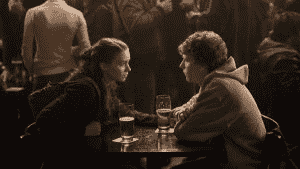

# 给阿伦·索尔金的备忘录:你也发明了这个愤怒的讨厌女人的呆子 TechCrunch

> 原文：<https://web.archive.org/web/http://techcrunch.com/2010/10/11/memo-to-aaron-sorkin-you-invented-this-angry-nerd-misogeny-too/>

 好吧，阿伦·索尔金，你来挑。要么你以[对互联网、脸书、马克·扎克伯格和你写了一部电影的世界一无所知而自豪](https://web.archive.org/web/20230203071601/http://bigthink.com/ideas/24213)，要么你只是一个空容器，告诉世界关于硅谷的更大真相。因为到目前为止，你似乎在指控的基础上摇摆不定。

当被指责没有准确再现事实时，人们都在说“哦，这是好莱坞！你期望什么？”但是当人们对影片中女性的刻画提出异议时？突然间，[你只是一个信使](https://web.archive.org/web/20230203071601/http://kenlevine.blogspot.com/2010/10/aaron-sorkin-responds-to-commenter-in.html)，忠实地记录着一个世界，在这个世界里，女人们通常会为男人脱下上衣，当男人们想谈生意时离开房间，而一个新的现代超级书呆子讨厌那些拒绝他的女人，用他的力量来摧毁她们。

让我来破坏你的结局，索金:你对创建科技公司的男人和女人一无所知。电影中固有的夸张和被误导的描述已经被[写成了死亡](https://web.archive.org/web/20230203071601/http://www.tnr.com/article/books-and-arts/78081/sorkin-zuckerberg-the-social-network?page=0,1)，所以让我们假设我们都同意这一点。见过马克·扎克伯格的人都不会认出你在电影中对他的快速说话、脸皮薄的描述——即使是用人字拖。然而，在回应对电影中女性形象的指责时，索金突然成了 Web 2.0 世界的专家。

在对[的评论的回复中，这篇文章](https://web.archive.org/web/20230203071601/http://kenlevine.blogspot.com/2010/10/aaron-sorkin-responds-to-commenter-in.html) Sorkin 写道:

> “我写的是一群非常愤怒、极度厌恶女性的人。他们不是我们在 80 年代拍电影时描述的那种可爱的书呆子。他们非常愤怒，因为啦啦队长仍然想和四分卫约会，而不是现在主宰宇宙的男人(男孩)。她们身边的女人不是挑战她们的女人(坦白地说，没有一个挑战她们的女人会有兴趣接近她们。)"

我很好奇，索金先生。一个承认自己并不了解他所写的大多数人的人，怎么会对他们如何对待女性了解这么多呢？我特别好奇，因为我碰巧是一个在 1999 年 23 岁时搬到硅谷的女人，在我“可利用”的几年里，我花了很多时间去参加聚会，和你坚持认为是厌恶女人的那类人混在一起。我也是一个在早年认识马克·扎克伯格的女人，在办公室度过时光，参加过几次脸书高级职员的生日聚会。我没有被剥削。我确实和扎克伯格的聪明、不轻浮的长期女友进行了几次长谈，她是从电影中剪下来的。我想，因为它不方便你的故事线的愤怒书呆子谁不能得到奠定。

但是让我们把脸书放在一边。在硅谷的 10 年里，我一只手就能数清自己在科技派对或活动中被搭讪的次数——即使是在那几次，人们一意识到我结婚了就道歉了。我从未有过不正当的提议，我从未见过女孩在派对上脱光衣服，我从未见过穿着内裤咯咯笑的未成年女孩在男性程序员编写代码时打大麻。我在这种场景中看到的厌女症远比我在纽约或我报道过的世界上近 12 个国家期间看到的要少。任何去过山谷聚会的人都可能会说一件关于女孩的事情:在那里几乎没有任何东西可以被物化。但是，这真的会让你震惊:*我甚至没有一条红色的斯坦福内裤，可以用来到处勾引年轻的百万富翁！*

不要因为你写的东西而责怪别人:**这是你编造的。你描绘的硅谷只存在于你的想象中。**

公平地说，我知道你从哪里得到这个。总的来说，网络上肯定有很多厌女症——看看任何允许匿名评论的大众网站就知道了。但这并不意味着这些公司背后的人会有那样的行为，这并不意味着 YouTube 总部到处都是玩键盘的猫和西瓜里的婴儿。可悲的是，你没有足够尊重在这些公司工作的女性，没有花时间去了解她们的真实生活。

事实是，我在硅谷认识的大多数企业家根本不把我当女孩看待。我很少在活动中被请去喝酒，也几乎没有人给我开门。事实上，几年前我和几名硅谷技术人员去以色列旅行，团队中的女性开玩笑说，被我们遇到的轻浮的以色列程序员“像女人一样对待”是多么独特。你的描述不仅侮辱了这里的男人，也侮辱了这里的女人，认为我们会忍受这样的行为。你说你所依据的“事实”——最后的俱乐部聚会和扎克伯格醉酒博客的一个晚上——都发生在哈佛。这似乎与常春藤联盟的大学生活有关，而不是一些愤怒的书呆子创业文化。

索金，你拍了一部人们喜欢的电影。但你是从一些证词、博客帖子和你受洛杉矶影响的想象力中创造出来的，你想象一家与你不了解的行业毫无关系的公司会是什么样子。我意识到，并不是每个人都有我在一部关于一个活生生的人的电影中遇到的同样的道德问题，这部电影根本不是以这个人为原型的。这很好。但当人们对此感到不安时，不要开始假装这不是你创造的世界——因为它肯定不存在于我所见过的任何版本的硅谷中。

索金先生，你不能两者兼得:要么写无聊的真相，要么承认卖座的色情版本是虚构的。