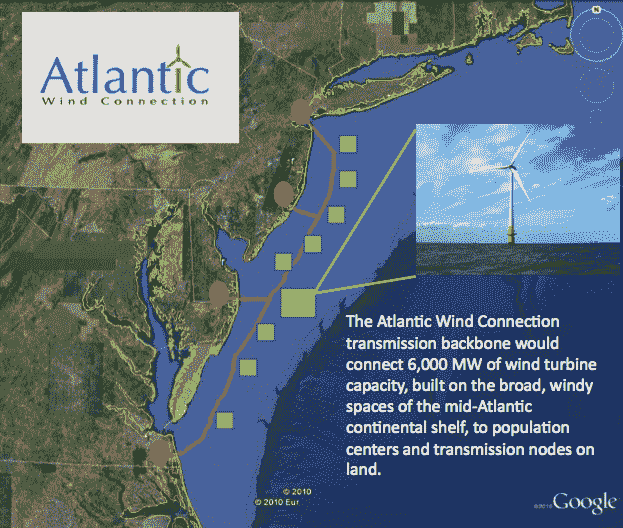

# 谷歌支持美国最大的海上风力发电项目 TechCrunch

> 原文：<https://web.archive.org/web/https://techcrunch.com/2010/10/12/google-wind-project/>

# 谷歌支持美国最大的海上风力发电项目

继续使用现金启动可再生能源业务的战略，[谷歌现在支持](https://web.archive.org/web/20221206154543/http://googleblog.blogspot.com/2010/10/wind-cries-transmission.html)迄今为止美国最大的海上风力发电场项目。大西洋风力连接是一个提议的海上风力涡轮机串，将从弗吉尼亚到新泽西延伸 350 英里离开大西洋海岸。一旦完工，该项目将产生 6000 兆瓦的电力，相当于美国去年风力发电总量的 60%。风能项目将为近 200 万个家庭提供服务。

整个项目预计将耗资约 50 亿美元，但谷歌只是投资于第一阶段，以帮助它启动(或者说，出海)。第一阶段包括在风力发电线实际开始建设之前获得必要的政府批准和融资。虽然这是这个过程中最便宜的部分，但实际上是最棘手的部分，因为人们普遍反对离岸风力发电场。其他投资者包括[好能源](https://web.archive.org/web/20221206154543/http://www.goodenergies.com/)和[丸红株式会社。](https://web.archive.org/web/20221206154543/http://www.marubeni.com/)

谷歌之前已经投资了风力项目，并签订了购买风力发电的长期合同。它最近一次风能投资是 3880 万美元，这一次可能会以同样的幅度结束。这类项目的开发阶段成本通常高达数千万美元。谷歌发言人表示，这项投资没有相关的退税或其他好处，谷歌希望获得直接的财务回报。

大西洋风连接(AWC)