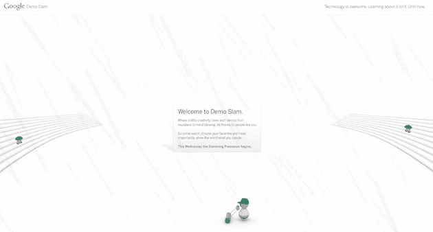

# Google Demo Slam:周三开始有些奇怪的事情 TechCrunch

> 原文：<https://web.archive.org/web/http://techcrunch.com/2010/10/18/google-demo-slam/>

# 谷歌演示 Slam:奇怪的事情从周三开始

今天早上，我们接到警报，发现一个网址为[demoslam.com](https://web.archive.org/web/20230203151025/http://demoslam.com/)的网站。想象一下，当它被证明是某种谷歌项目时，我们有多惊讶。或者至少，看起来是这样。

目前，该网站只是一个不断播放的巨型 Flash 文件。它展示了一些怪异的像瓦力一样的人物坐在雨中，而一个戴着绿色帽子的人在修剪一些不存在的草坪。非常奇怪。页面上写着:“ *Google Demo Slam:技术牛逼。了解它并不容易。直到现在*

下面写着“*欢迎来到 Demo Slam。一点点创意让技术演示从平凡变得令人兴奋。多亏了像你这样的人。所以来观看，选择你最喜欢的，最重要的是，向世界展示你能做什么。本周三，砰的季前赛开始了。*

悬停在看台上的人会让他们举着标语，上面写着“假发男摇滚！”以及“支持超重的兔子！”还是很奇怪。

基于所有这些，听起来像是谷歌在举办某种竞赛，看看互联网上的人们使用他们的各种产品和技术能想出什么。我的猜测是，这将是一个 HTML5 项目，类似于[他们的 HTML5Rocks 网站](https://web.archive.org/web/20230203151025/https://techcrunch.com/2010/06/22/html5rocks-google/)或最近的[他们的 Arcade Fire 体验](https://web.archive.org/web/20230203151025/https://techcrunch.com/2010/08/30/google-chrome-html5-arcade-fire/)，但事实上，整个预告是在 Flash 中，似乎违背了这一想法。我们应该很快会知道更多。

**更新**:这是一个突出谷歌产品的演示比赛。这是谷歌的博客文章。

