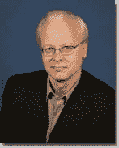

# 微软首席软件架构师雷·奥茨将卸任

> 原文：<https://web.archive.org/web/https://techcrunch.com/2010/10/18/microsofts-ray-ozzie-to-step-down-as-chief-software-architect/>

# 微软首席软件架构师雷·奥茨卸任

微软刚刚[在](https://web.archive.org/web/20221207082134/http://www.microsoft.com/presspass/press/2010/oct10/10-18steveb-mail.mspx)宣布[公司的首席软件架构师雷·奥茨](https://web.archive.org/web/20221207082134/http://www.crunchbase.com/person/ray-ozzie)即将卸任。CEO 史蒂夫·鲍尔默发给员工的信全文如下。

Ozzie 在 2006 年 6 月担任了首席软件架构师的角色。Ozzie 负责监督公司的技术战略和产品架构。在此之前，Ozzie 于 2005 年 4 月至 2006 年 6 月担任首席技术官。2005 年 4 月，在微软收购了他于 1997 年成立的下一代协作软件公司 Groove Networks 后，他担任了这一职务。

在这封信中，鲍尔默写道，奥齐将一直留在微软，直到退休(目前还不清楚具体时间)。鲍尔默指出，Ozzie 作为 CSA 的角色是独特的，他不会在这个时候填补这个职位。

在过去的几年里，Ozzie 一直是微软的云布道者。

> 发件人:Steveb
> 发件人:2010 年 10 月 18 日星期四
> 发件人:微软全体员工
> 主题:雷·奥茨过渡
> 
> 今年 3 月，我在华盛顿大学的一次演讲中向全世界传达了一个信息，那就是当谈到云时，我们“都在”。在那次演讲中，我提到了雷近五年前的互联网服务中断备忘录，以及他此后的工作，激发了整个公司的思考，并帮助催化了我们向云的进军。
> 
> 作为一家公司，在过去的五年里，我们在云计算和服务方面取得了很大成就。Windows Live 现在是 Windows 和 Office 基于网络的服务的天然补充。SharePoint 和 Exchange 现在已经明确地拥抱了云。通过构思、孵化和指导 Windows Azure，Ray 帮助确保我们拥有一个极其丰富的平台基础，这将在未来几年内实现整个公司和客户的应用程序级创新。
> 
> 随着我们在服务和云方面的进步，现在我们业务的各个方面都在全速前进，Ray 和我今天宣布 Ray 打算辞去首席软件架构师的职务。他将继续留在公司，在他的组织内转移团队和正在进行的战略项目-将他所聚集的伟大创新和伟大创新者带入推动我们业务的团队。在他的团队自然过渡时间之后，但在他从微软退休之前，Ray 将专注于更广泛的娱乐领域，微软在该领域有许多正在进行的投资。总的来说，我们在娱乐领域有巨大的机会，我对我们能取得的成就感到兴奋。除此之外，雷目前没有任何计划。虽然在交接期间他将继续向我汇报，但 CSA 的角色是独一无二的，我不会在 Ray 离开后填补这个职位。我们有强大的规划流程，每个业务部门都有强大的技术领导者，并有强大的创新能力走向市场。
> 
> 虽然 Ray 还会在微软工作一段时间，但今天我要感谢他作为一名领导者和长期的微软独立软件开发商为微软做出的贡献。作为早期的 ISV，Ray 为 Windows 的早期成功做出了重大贡献。自从在微软工作以来，通过启发和影响，他在我们向现在以服务为中心的软件世界的转变中发挥了重要作用。他一直是一个“创造者”和合作伙伴，我们期待着在他的未来继续合作。Ray 在帮助我们占据云领域的领导地位方面发挥了关键作用，并为我们未来的成功做好了准备。
> 
> 请和我一起感谢雷，并祝愿他一切顺利。
> 
> 史蒂夫(男子名)