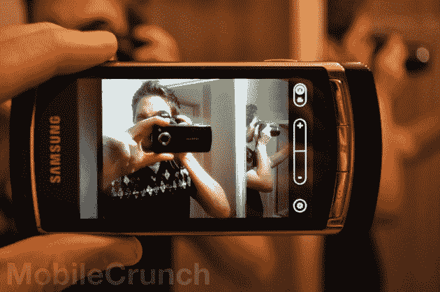

# 点评:Windows Phone 7 TechCrunch

> 原文：<https://web.archive.org/web/https://techcrunch.com/2010/10/20/review-windows-phone-7/>

多年来，微软的移动操作系统一直背负着“乏味”的恶名。随着竞争对手的智能手机平台在受欢迎程度和功能上都超过了它，Windows Mobile 6 越来越陷入了一个默默无闻的领域，受到劣质界面、糟糕透顶的触摸屏键盘和彻头彻尾的*糟糕透顶的*应用商店的谴责。

微软的下一步实际上是他们唯一的选择:放弃一切，重新开始。结果呢？Windows Phone 7。从头开始建造，它和它的前身的相似程度就像我和一棵莴苣的相似程度一样。当然，与众不同并不一定意味着*更好*——那么这款新产品怎么样呢？跳跃后加入我们的全面审查。

如果你已经在这些地方呆了一段时间，你可能还记得我们在 7 月份对 Windows Phone 7 早期版本的[“预审查】。我有太多的意见要做，这不是一个简单的“预览”，但它的早期状态会使它不公平做“审查”；因此，进行了预先审查。不管怎样，我们向我们的读者承诺，到时候我们会对最终的发布版本做一个适当的回顾——所以我们来了。](https://web.archive.org/web/20221005193215/http://www.mobilecrunch.com/2010/07/19/pre-review-preview-windows-phone-7-2/)

## 简而言之:

当人们点击这些评论时，很大一部分人只是向下滚动到底部寻找结论。对于那些寻找一段总结的人，我将省去你的鼠标滚轮的麻烦:

Windows Phone 7 运行优雅，非常直观，有时甚至非常漂亮。不是的，相对于竞争对手来说，是*完整*。它做的事情，它做得很好——但是它(还)没有做的事情，往往会突出。这些东西——第三方应用程序多任务处理、复制粘贴或共享——是一年半前人们抱怨其他移动操作系统缺乏的东西。

## 界面——博主测试，女友认可:

在脑海中描绘 Windows Mobile 6.5 的界面。明白了吗？好吧，现在，继续在精神上把这些都撕碎，忘记它曾经存在过。

Windows Phone 7 的用户界面尽可能快地脱离了它的前辈。见鬼，与之前的任何手机操作系统相比，这是一个巨大的飞跃。基于他们在 Zune 上建立的一些设计理论，微软真的在这个设计上冒了一些险……嗯，他们*真的*取得了对他们有利的结果。

为什么我会这样想？因为我女朋友。断章取义，这有点奇怪，所以让我解释一下:由于我的工作是互联网手机博客类型的人，我的房子基本上是一个古老的手机博物馆。说出一部过去几年生产的手机，它可能就在这附近的某个地方。在审查这些手机时，我倾向于把它们交给朋友和亲戚，以获得他们的见解和意见，希望通过那些不为这种东西而困扰的人的眼睛来看待事情*。一个能看到他们每一个人的人？前面提到的女朋友。那个似乎会说“嗯，令人困惑”的人。对他们中的每一个人？还是那句话，前面提到的女朋友。*

她对 Windows Phone 7 的反应是:“哇！这很漂亮。”然后她花了 45 分钟，直到我意识到她想霸占我的复习单元才停下来。界面对她来说似乎很有意义。

这是一个*不喜欢智能手机*的人，即使经常接触可以想象到的各种平台、品牌和型号。我不想把我的观点建立在一个轶事证据的基础上，所以我和其他一些人共用了这个电话。亲戚。咖啡店的那位女士。在我们停车场做保安的家伙。所有人都有完全相同的反应:界面只是…有意义。它让我大吃一惊。

在很大程度上，微软确实在视觉界面方面做了令人难以置信的工作。从锁屏开始，他们设法以一种近乎艺术的方式简化事物。尽管如此，微软仍然面临着一个巨大的挑战:弄清楚如何在不破坏他们已经奠定的基础的情况下，内置目前非常缺乏的重要功能(即，适当的通知管理和多任务处理)。

## 通知—比 iPhone 好，比 Android 差:

通知——也就是说，当你收到一条短信或即时消息时，提醒你设备周围的各个地方正在发生什么——是移动世界中每个人都有不同的做法。Android 做得很好，在屏幕上方有一个下拉抽屉，可以存储你最近的所有通知，一键访问它们各自的应用程序。另一方面，iPhone 会像一个孩子一样提醒你:它跑进房间，大声说出它要说的话(通过向你扔出一个提醒窗口，从而打断你正在做的事情)，然后跑去做其他事情，几乎忘记它说过什么。

Windows Phone 7 的通知系统介于两者之间。通知会在屏幕顶部弹出，出现在状态栏通常所在的位置。点击通知，你会跳转到推送通知的应用程序。它不会暂停或以其他方式中断你正在做的事情，但它也不允许你管理最近的通知，因为它们进来时你没有处理。它比 iPhone 看似附加的系统干净，但不如 Android 的抽屉方便。

(不过，iPhone 的通知系统确实有一个优势:据我所知，WP7 的通知系统无法正确处理主动提醒，比如需要接听的 IP 语音电话。该应用程序可能会说“嘿！你！电话响了！快，切换到 app！”但是据我所知，开发者没有办法发出一个合适的行动号召。)

## 作为手机的 Windows Phone 7:

每当我们回顾一个新的操作系统时，总有人会说“这一切都很棒，但作为一部*手机*它是怎样的？”

这个问题总是很难回答，因为手机之所以成为手机，很大程度上取决于硬件，包括信号质量、音量、扬声器清晰度等。鉴于 Windows Phone 7 将在一系列不同的硬件上运行(已经宣布了 10 多种)，这些事情我们无法真正纳入操作系统的审查中。

然而，单从软件层面来看，Windows Phone 7 和其他手机一样好，除了一个缺陷。在这一点上，跨大多数平台的体验是相同的:“电话”是一个应用程序，该应用程序有一个拨号器、一个联系人屏幕和一个最近屏幕。每一个都可能有自己的小技巧，但没有一个是真正成功或失败的——除了可视语音邮件。不幸的是，Windows Phone 7 现在似乎缺少这一点。[悲伤的长号。](https://web.archive.org/web/20221005193215/http://www.sadtrombone.com/)

## 作为摄像头的 Windows Phone 7:

Windows Phone 7 的拍照体验可能是目前所有平台中最好的。这并不是说它拍摄的图像有什么问题——再次强调，这是一个硬件问题——但是拍摄照片的实际操作是非常棒的。

首先，*每部* Windows Phone 7 手机都会有一个拍照按钮。这是他们设计要求的一部分。这个相机按钮可以快速启动相机应用程序，并在你到达那里时充当快门。

那么，这有什么关系呢？速度。想用 iPhone 拍照？解锁，找到相机应用程序，等待几秒钟，让它启动，开火。安卓？解锁，点击相机按钮(如果你的手机有相机的话),或者搜索应用程序。着火了。在 Windows Phone 7 上，你只要按住相机键；即使手机被锁定，它也会直接进入相机(别担心，如果手机被锁定，它会保护你的照片的隐私。相机按钮不会变成“给我看裸体照片！”当你的朋友抢走你的手机时按下按钮)。再也不会因为忘记将相机应用程序放在哪个文件夹中而牺牲一生一次的拍摄机会。

微软还非常聪明地设计了从相机跳转到已拍摄照片的方式:只需从左向右滑动。当相机处于活动状态时，您的最后一张照片会存储在您看不到的地方。扫向它，你看到的是你过去拍摄的电影片段。扫回相机，你可以抓拍一些新的。

## 语音/搜索:

WP7 有基本的语音激活功能，从呼叫联系人到启动应用程序。要调出语音提示，您只需按住 Windows 键，等待一秒钟，然后说话。如果它不认为你说的是命令，它就会触发阿炳搜索。

说起来，内置的必应搜索还挺俏皮的。一次搜索会出现三个可平移的结果页面:新闻、网络和本地。例如，搜索“比萨饼”，会在“本地”视图下显示附近的比萨饼店，在“网络”下显示一般网络结果，以及比萨饼新闻(嘿，我敢肯定比萨饼行业有新闻可写。)在“新闻”下面。很简单，很快，我真的很喜欢。

## 键盘:

从第一天开始，我就对 WP7 的触摸屏键盘赞不绝口。在审查前预览中:

> 微软到底雇了谁来做这个键盘？因为不管他们的工资是多少，他们都应该得到加薪。我不知道微软用了什么样的魔法建造了这个东西，但是它很棒。我已经在几乎所有智能手机平台的软键盘上输入了相当于一两本小说的字符数，而这……这可能是最好的一个。

我袖手旁观那个。这个屏幕键盘非常非常好。我有一双笨拙的大拇指，它似乎总是知道我想说什么。预测文本系统似乎也相当全面——它甚至知道一些非常棒的小工具博客的名字。继续，输入“MobileCranch”。它会处理好的。

微软此后还推出了一个相当聪明的文本光标系统，让你可以快速准确地把光标放在你想放的任何地方。Windows Phone 7 不是像大多数平台那样将光标直接放在拇指下方，而是将光标画在拇指上方大约 20 像素*处*，然后相对于拖动位置移动光标。这并不一定比 iOS 普及的放大镜下你的拇指程序更好，但它是一个有价值的选择。

## 内置应用程序:

像任何好的智能手机平台一样，Windows Phone 7 自带了许多实用程序，其中大部分都不需要自己花大篇幅来回顾。这里有一两句关于每一个的话:

*   **闹铃:**制作一个新的闹铃只需要 5 秒钟，开箱后会有 16 种不同的闹铃声音，从“细微的钟声”到“我非常确定是一只濒临死亡的动物”
*   **计算器:**它计算！像 iPhone 的计算器一样，它在纵向模式下是一个标准的初级计算器，在横向模式下是一个科学计算器。
*   发短信:我真的觉得这本书应该占据更大的篇幅，因为和我见过的大多数智能手机用户一样，我发短信的时间远远多于打电话的时间。唉，真的没什么好说的:它处理线索对话，只需点击一两下就可以附上图片信息。

## 枢纽:

集线器有点难以解释。它们有点像应用程序，但也有点像文件夹。以“游戏”中心为例:你可以查看你的 Xbox Live 玩家分数，调整你的头像，查看游戏邀请——但它也是你下载的所有游戏的存储位置。因此，它不像是一个应用程序或文件夹，而更像是一个你可以访问与该中心相关的东西的地方。

Windows Phone 7 有 6 个中心:人、图片、音乐+视频、市场、办公室和前面提到的游戏。

“人物”本质上是您的联系人列表，并附带有限的脸书支持。你的脸书新闻订阅被拉进“最新动态”视图，点击任何联系人，你就可以在他们的墙上留言或查看他们的个人订阅(除了给他们打电话)。对于那些只想要基本的脸书的人来说，这是一个很好的姿态——但大多数脸书迷可能会想要一个专用的应用程序，微软向我们保证这将会到来。

顾名思义，图片就是你的图片所在的地方。首次同步后，你的照片会自动从脸书下载，并且像在“好友动态”视图中一样，显示你朋友的最新照片。

Office hub 是微软展示其业务实力的地方，允许创建/处理 Excel、Word 和 Powerpoint 文档。你可能需要(或想要)经常在手机上编辑 Excel 文档吗？不，但选择是存在的。这也是该平台的笔记应用程序 OneNote 所在的位置。笔记可以与您的 Windows Live 帐户来回同步，这对于我们这些将智能手机用作购物清单的人来说是一个不错的选择。

当我第一次开始探索时，我最大的烦恼之一是:某些事情似乎需要太多的点击。例如:手机应用程序中的收藏夹屏幕在哪里？我经常玩的游戏呢；为什么我要把它们藏在其他应用程序里？幸运的是，有一个解决方案:在所有的 hub 中，大多数单独的项目——游戏 Hub 中的游戏，联系人 Hub 中的联系人——都可以被“钉”在开始屏幕上，以便一键访问，这种方法在 Zune 上运行得很好。

## 市场:

Windows Phone 7 的市场实际上…相当不错。它有大量的类别，免费/付费应用程序之间的简单过滤，以及每个类别的顶级项目跟踪。与任何移动操作系统一样，WP7 的成功很大程度上取决于开发者是否接受它——但到目前为止，一切顺利。在手机即将上市的几周前，这个市场似乎已经非常拥挤了。网飞，Shazam，OpenTable..一群大人物已经在这里了。这并不是说没有差距:我挖了又挖，但似乎就是找不到即时通讯应用程序。不过，我不会为此喋喋不休。他们离发布还有几周时间，即使在那之后，在任何人真正期望每个小需求都得到满足之前，他们还有很长一段时间。

在市场中搜索可能需要一些工作，原因有四:多个应用程序可能看起来有相同的名称，搜索结果不会显示价格、制造商或是否有试用版。当然，搜索“手电筒”会出现大量的手电筒应用程序。你怎么知道哪个是免费的？怎么知道哪个是自己喜欢的公司做的？如果图标/名称对你来说还不够，你可以点击每一个条目来找到你想要的。此外，微软已经决定在应用程序/游戏搜索结果中交织音乐结果，这很快就变得令人讨厌。

当我们谈到这个话题时，值得注意的是:我们检查的大多数第三方应用程序都非常棒。例如，网飞工作顺利。当然，有很多失败的游戏(我们检查的一些独立游戏是*非常糟糕的*)，但这是不可避免的。

也许最好的特点是:如果一个应用开发者想让用户在购买前体验一下，市场会支持它。“购买”旁边是一个“尝试”按钮。只需点击它，演示将开始安装。不需要挖掘寻找“精简”版本。唉，并不是所有的应用程序都提供试用版，目前也没有迹象表明哪些可以，哪些不可以，除非你点击进入应用程序的描述页面。

## Internet Explorer:

我们在[预评审](https://web.archive.org/web/20221005193215/http://www.mobilecrunch.com/2010/07/19/pre-review-preview-windows-phone-7-2/)中所说的几乎所有内容在这里仍然适用。引用一下:

> *   对于过去我们给 IE Mobile 带来的所有悲伤，IE Mobile 7 有自己的负担。它不是最好的移动浏览器，但肯定是迄今为止 IE Mobile 最好的版本。
> *   在大约 24 次速度测试中，iPhone 的 Safari 浏览器和默认的 Android 浏览器都一直击败 IE Mobile 7。所有手机都有无线网络，缓存已清空。
> *   多点触控平移和缩放表现流畅，动态滚动(页面根据您的滑动方式滚动一点)非常准确

请记住，移动 IE 和桌面 IE 在功能和版本号上都是不同的。自早期构建以来，多点触摸平移和缩放变得越来越平滑，但我们确实注意到这次有几个网站不想正确渲染。微软向我们保证他们完全符合标准，因此这不是他们的错，但是他们还能说什么呢？

## 缺点是:

在说了几百个大多是正面的词之后，你可能会认为 Windows Phone 7 已经接近完美了。不完全是。

不要误解我:它做什么，它做得相当不错。然而，它没有做的事情让我无法全心全意地推荐它。你看，问题就在这里:Windows Phone 7 缺少的东西正是人们在*年前*抱怨其他平台缺少的东西。将一个全新的产品与市场上已经存在多年的产品进行比较是否公平？绝对的。当然，这不太好——但对于那些花 200-300 美元购买一部锁定两年的手机的人来说，这款手机是新的这一事实真的无关紧要。

*   **复制粘贴**:2011 年初推出
*   **多任务处理:**在任何反 iPhone 的争论中，直到 iOS 4(苹果在其中为某些应用程序添加了后台支持，如即时路线导航器和音乐流媒体工具)之前，Windows Phone 7 似乎不支持任何不是他们开发的应用程序的后台处理。
*   **即时路线:** Android 已经把即时路线导航功能变成了一项必备功能。
*   **共享:**这又是一个每个平台都有争议的话题，直到他们有时间添加它。发布时微软不提供网络共享支持。
*   最令人惊讶的是，WP7 的 ie 浏览器不支持 HTML5。随着越来越多的网站转向 HTML5 作为 Flash 的移动友好替代品，这可能会变得棘手。
*   **套接字:**从技术角度来说，WP7 的网络 API 目前缺乏直接套接字支持。如果开发者想把他们的应用程序联网，他们必须通过 HTTP 协议。这对你意味着什么？这使得多人游戏变得非常困难，像 IP 语音这样的事情几乎是不可能的。
*   支持可更换的 microSD 卡:WP7 支持 microSD 卡，但方式非常奇怪:它使用 microSD 卡上的任何空间作为系统存储，本质上就像手机的内存变得更大了一样。交换卡片(特别是当电话正在使用的时候)，东西开始坏掉。如果你想把东西放到手机上，你需要使用 Zune 软件，或者 OS X 上的非 Zune 同步软件。

Windows Phone 7 以后会有这些东西吗？当然可以。其中一些(如复制和粘贴)甚至被确认将于明年推出，但在这些功能完成、经过测试并推出到手机之前，我们不能假装它们没有缺失。

## 结论:

我可以推荐购买 Windows Phone 7 手机吗？是的——但不是现在。在 iOS 和无数可用的 Android 手机之间，有太多好的选择，它们很少或根本没有这些缺点，这就是 T2 的方式。如果微软能够迅速解决这些差距，同时设法在其他方面不落后，我可以很容易地看到自己在未来携带 Windows Phone 但就目前而言，归根结底，WP7 在竞争中真正能提供的只是一张漂亮的脸。

如果你乐于成为早期采用者，或者如果你不在乎它缺乏的功能，或者仅仅是*有*通过 Xbox Live 品牌的游戏为自己赢得一些成就点数…开始吧。你会喜欢你所看到的。其他人呢？给它几个月。