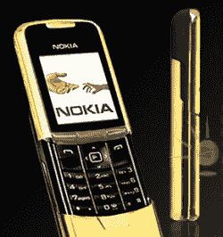

# 诺基亚第三季度利润超出预期，公司计划裁员 1800 人 TechCrunch

> 原文：<https://web.archive.org/web/https://techcrunch.com/2010/10/21/nokias-q3-profit-beats-estimates-company-plans-to-cut-1800-jobs/>

# 诺基亚第三季度利润超过预期，公司计划裁员 1800 人

[诺基亚](https://web.archive.org/web/20221007145845/http://www.crunchbase.com/company/nokia)今晨[报道](https://web.archive.org/web/20221007145845/http://www.nokia.com/press/press-releases/showpressrelease?newsid=1453008)第三季度利润轻松超过分析师[预期](https://web.archive.org/web/20221007145845/http://www.businessweek.com/news/2010-10-19/nokia-may-report-shrinking-profit-pressuring-elop-for-change.html)。该公司还表示，将在全球范围内裁员 1800 人，导致股价飙升。

自从公司[任命](https://web.archive.org/web/20221007145845/http://eu.beta.techcrunch.com/2010/09/10/nokias-new-ceo-has-a-mobile-mountain-to-climb/) [史蒂芬·埃洛普](https://web.archive.org/web/20221007145845/http://www.crunchbase.com/person/stephen-elop)为首席执行官以来，诺基亚公布了 5 . 29 亿欧元的净收入，而去年同期为亏损 5 . 59 亿欧元。

销售额从 98.1 亿欧元上升到 103 亿欧元，公司售出了大约 1.104 亿台设备。

在另一份声明中，诺基亚表示，它将从此[专注于 Qt 框架](https://web.archive.org/web/20221007145845/http://www.marketwire.com/press-release/Nokia-further-refines-development-strategy-unify-environments-Symbian-MeeGo-1338790.htm)框架和对 HTML5 的支持。

诺基亚表示，专注于 Qt 作为唯一开发框架的决定将确保应用程序继续兼容 Symbian 的未来发展以及即将推出的 MeeGo 产品。

负责 MeeGo 设备的副总裁诺基亚·阿里·雅克西[最近从公司辞职](https://web.archive.org/web/20221007145845/http://eu.beta.techcrunch.com/2010/10/05/meego-home-another-nokia-vp-quits/)，追随诺基亚前智能手机冠军[安西·万约基](https://web.archive.org/web/20221007145845/http://eu.beta.techcrunch.com/2010/09/13/anssi-vanjoki-nokias-smartphone-champion-resigns-one-day-before-nokia-world/)的脚步。

诺基亚还宣布，它将在诺基亚的塞班智能手机部门、诺基亚的服务部门和某些公司职能部门中“精简运营”。这些计划预计将导致全球裁员 1800 人。

截至 2010 年 9 月 30 日，诺基亚称其员工总数为 131，553 人，其中 66，090 人受雇于诺基亚西门子网络公司。

在 Symbian 智能手机方面，诺基亚表示，它计划提高对消费者需求的响应能力，并缩短上市时间:

> 这包括扩大应用程序开发常用工具的使用，简化软件开发，简化和整合操作，以及更加注重为消费者增加价值。这些变化旨在提高竞争力，并支持为应用程序开发人员构建一个有吸引力且可持续的平台。

此外，该公司的服务组织今后将专注于在其所有设备上提供集成的 Ovi 体验，以努力向消费者提供更具吸引力的 Ovi 服务。

由于计划停止和整合某些活动，诺基亚表示，它还将削减某些公司职能和公司研究活动。

你可能知道，诺基亚继续努力与苹果和安卓设备制造商等竞争对手保持同步，在安卓增长和微软的 Windows Phone 7 刚刚进入该领域的时候，它仍然专注于 Symbian。最近，该公司开始发售基于升级版 Symbian^3 的新智能手机[系列](https://web.archive.org/web/20221007145845/http://eu.beta.techcrunch.com/2010/09/14/nokia-world-we-are-back-claims-handset-maker-with-thee-new-devices-but-meego-is-m-i-a/)，包括旗舰手机[诺基亚 N8](https://web.archive.org/web/20221007145845/http://www.mobilecrunch.com/2010/09/29/nokia-n8-starts-shipping-worldwide/) 。

需要大的改变，但是今天的声明提出了十亿美元的问题:太少，太晚？

最后，这里引用诺基亚新任首席执行官史蒂芬·埃洛普的话:

> “在加入诺基亚的五个星期里，我发现了一家公司，它拥有许多强大的优势和成就历史，在业内首屈一指。然而，我们公司在行业中面临着一个显著的破坏性时期，最近的结果表明，我们必须重新评估我们在这个行业中的作用和我们的方法。
> 
> 我们最近发布的一些产品表明，我们有人才、创新能力和必要的资源来度过这段混乱时期。我们将进行必要的战略和运营改进，以确保我们继续取悦客户，并为股东提供卓越的财务业绩。"