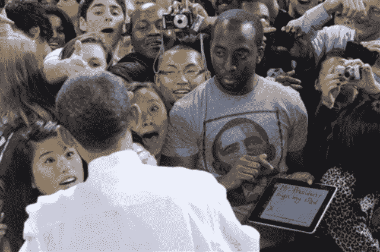
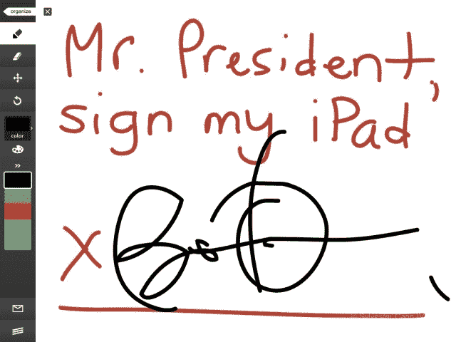

# 如果你从未见过奥巴马总统在 iPad 上签名，请点击此处 TechCrunch

> 原文：<https://web.archive.org/web/https://techcrunch.com/2010/10/22/obama-signing-ipad/>

# 如果你以前从未见过奥巴马总统在 iPad 上签名，请点击这里

你会注意到这张照片的第一件事是，与他周围的人相比，穿着巴拉克·奥巴马 t 恤、拿着 iPad 的年轻人看起来是多么放松。你会注意到的第二件事是，他似乎在指着他的 iPad，同时平静地观察着美国总统走近他。

在他的 iPad 上，这个年轻人——从现在开始我们就叫他西尔威斯特·坎四世，因为那是他的名字——启动了 Adobe 的 [Ideas 应用程序](https://web.archive.org/web/20221218010437/http://blogs.adobe.com/designandweb/2010/04/adobe_ideas.html),并用它为奥巴马总统写了一个请求。

上面写着:“总统先生，在我的 iPad 上签名”。

尽管在请求中没有“请”这个词，可能是因为空间问题，但这正是奥巴马总统所做的，正如你从下面的截图和视频中可以看到的。

西尔维斯特·坎四世告诉我们:

> 在华盛顿州西雅图华盛顿大学的一次集会上，总统用我 iPad 上的触摸屏给我签名。特勤局对这个想法持怀疑态度，但他们对这个想法很感兴趣，总统认为这很酷。
> 
> 他看起来有点惊讶，但还是继续用手指在 iPad 上用 Adobe Ideas 应用程序涂鸦。
> 
> 我也有这个活动的视频。这一定是 iPad 第一次收到总统亲笔签名。

我也可以为此建立一个迷你网站，恰如其分地命名为[“我想，为什么不问问呢？”](https://web.archive.org/web/20221218010437/https://sites.google.com/site/obamasigningipad/)。

感谢分享，西尔维斯特！

PS:巧合的是，奥巴马总统昨天在旧金山会见了苹果公司首席执行官史蒂夫·乔布斯。我想奥巴马对这个人的第一个问题可能是，为什么 iPad 似乎可以很好地运行 Adobe 的 Ideas 应用程序，而不能处理 Flash 网站。

【YouTube = http://www . YouTube . com/watch？v = mK-5s uxag & w = 640 & h = 380 & fs = 1 & HL = en _ US]