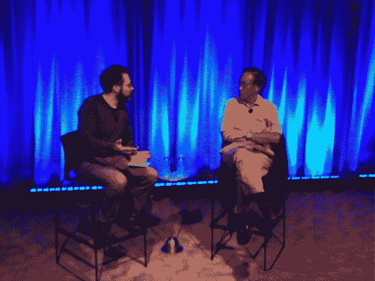

# 美国能源部长朱:我们已经把我们的技术领先地位视为理所当然

> 原文：<https://web.archive.org/web/http://techcrunch.com/2010/10/22/secretary-of-energy-chu-we-have-taken-our-technological-leadership-for-granted/>

# 美国能源部长朱:我们认为我们的技术领先地位是理所当然的

 [能源部长](https://web.archive.org/web/20230202232445/http://www.energy.gov/)和诺贝尔奖获得者[朱棣文](https://web.archive.org/web/20230202232445/http://www.crunchbase.com/person/steven-chu)周五来到谷歌总部，就可再生能源和美国绿色科技产业的现状进行了一次炉边谈话。

在与谷歌运营部 SVP 的谈话中，朱棣文告诉一屋子的谷歌人，尽管他对美国的绿色未来很乐观，但他对美国的落后程度以及“我们把自己的技术领先地位视为理所当然”感到沮丧

在整个会议期间，朱棣文多次提到中国的例子，这个国家在资助绿色倡议方面非常积极。他列举了无数例子来说明他们肆无忌惮的野心，包括中国建造 25 座核电站的计划，以及安装“世界上输送可再生能源的最高电压线路——他们现在可以输送电力 1900 公里，而损失 6%。”

朱棣文说，相比之下，美国发明了世界上许多绿色技术，但却明显落后，因为竞争对手已经赶上，在某些情况下甚至超过了我们的努力。他提到了核反应堆、电力电子设备和太阳能电池(这些最初是由贝尔实验室发明的，但美国现在只占 6%的市场份额)。

尽管目前前景黯淡，但朱棣文说他已经看到了一些希望的曙光。在抽象的形式中，他从绿色科技的企业家精神中得到安慰。更具体地说，他对陷入困境的汽车行业出现的进步感到鼓舞。Chu 表示，该行业“不仅仅”经历了一次濒死体验，“这是一次死亡体验”，但最近福特在初始车主缺陷方面通过了丰田的评级，并且(引用《纽约时报》最近的一篇文章)也因显然制造了更好的产品而给消费者留下了深刻印象。

“为了竞争，你不去国会要求更好的住所，你制造更好的东西，”他说。

在问答的最后，霍尔茨勒还问朱棣文，他是否认为谷歌在绿色科技领域做得足够多。

朱棣文基本上是同意的，称赞谷歌的能源举措，并以务实的资本主义心态对待它。尽管他并不贬低利他主义，但他表示，真正的、可持续的转变将来自出于自私原因也具有吸引力的解决方案。“我一直告诉我的家人，或者任何愿意听我说的人……节约能源是你不应该做的事情，因为这是一件好的、正确的事情……你节约能源是因为你要省钱……你可以让所有的人都这样做，因为这对你有好处。”"

炉边谈话结束后，朱棣文很快被带去会见谷歌的主要能源领导(运营、投资、工程等)。)进行几次闭门会议。